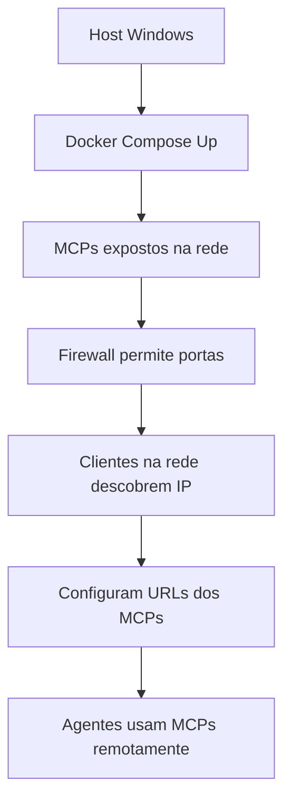

# 🔗 Interconexão MCP Universal - Acesso em Rede

> **Data de Geração:** 2025-12-10  
> **Objetivo:** Permitir acesso aos MCPs de qualquer dispositivo na mesma rede local  
> **Host Principal:** Windows 11 (IP: Determinar dinamicamente)

---

## 🌐 **Visão Geral da Interconexão**

Este documento explica como configurar e acessar todos os MCPs (Model Context Protocols) do ambiente Kilocode de qualquer dispositivo conectado à mesma rede local (LAN/Wi-Fi). Os MCPs rodam em containers Docker no host Windows e podem ser consumidos por agentes CLI em outros dispositivos.

---

## 🖥️ **Host Principal (Windows 11)**

### 📋 **Pré-requisitos**
- Docker Desktop instalado e rodando
- Firewall Windows permitindo conexões nas portas dos MCPs
- Rede local ativa (Wi-Fi ou Ethernet)

### 🔍 **Descobrir IP do Host**
```powershell
# No PowerShell do Windows
Get-NetIPAddress | Where-Object {$_.AddressFamily -eq "IPv4" -and $_.IPAddress -notlike "127.*"} | Select-Object IPAddress, InterfaceAlias
```

**Exemplo de saída:**
```
IPAddress     InterfaceAlias
----------     --------------
192.168.1.100  Wi-Fi
10.0.0.50      Ethernet
```

**IP Principal:** Use o IP da interface ativa (geralmente Wi-Fi)

---

## 🚀 **MCPs Disponíveis e Configuração de Rede**

### 1. 📚 **Context7 MCP** (Documentação)
- **Porta:** 8080
- **URL de Rede:** `http://[HOST_IP]:8080`
- **Status:** ✅ Ativo
- **Uso:** Documentação de bibliotecas e frameworks

### 2. 🌐 **Tavily Search MCP** (Busca Web)
- **Porta:** 3000
- **URL de Rede:** `http://[HOST_IP]:3000`
- **Status:** ✅ Ativo
- **Uso:** Busca web em tempo real

### 3. 🧠 **Memory MCP** (Memória Persistente)
- **Porta:** 4000
- **URL de Rede:** `http://[HOST_IP]:4000`
- **Status:** ✅ Ativo
- **Uso:** Armazenamento de preferências e contexto

### 4. 🐙 **Git MCP** (Operações Git)
- **Porta:** 5000
- **URL de Rede:** `http://[HOST_IP]:5000`
- **Status:** ✅ Ativo
- **Uso:** Controle de versão e repositórios

### 5. 🌐 **Fetch MCP** (HTTP Requests)
- **Porta:** 9000
- **URL de Rede:** `http://[HOST_IP]:9000`
- **Status:** ✅ Ativo
- **Uso:** Requisições HTTP avançadas

### 6. 🖥️ **Desktop Commander MCP** (Controle Desktop)
- **Porta:** 8000
- **URL de Rede:** `http://[HOST_IP]:8000`
- **Status:** ✅ Ativo
- **Uso:** Controle do ambiente desktop

### 7. 📁 **Filesystem MCP** (Sistema de Arquivos)
- **Porta:** 6000
- **URL de Rede:** `http://[HOST_IP]:6000`
- **Status:** ⚠️ Desabilitado (segurança)
- **Uso:** Acesso seguro ao filesystem

### 8. 🎭 **Playwright MCP** (Automação Web)
- **Porta:** 7000
- **URL de Rede:** `http://[HOST_IP]:7000`
- **Status:** ⚠️ Desabilitado
- **Uso:** Automação de navegador

### 9. 🐙 **GitHub MCP** (GitHub API)
- **Porta:** 5001
- **URL de Rede:** `http://[HOST_IP]:5001`
- **Status:** ⚠️ Desabilitado
- **Uso:** Integração GitHub

---

## 🔧 **Configuração para Acesso em Rede**

### Passo 1: Verificar Status dos Containers
```bash
# No host Windows (PowerShell)
cd C:\Projetos\Contexto-Pleno\MCPS\Docker
docker-compose ps
```

### Passo 2: Configurar Firewall Windows
```powershell
# Abrir portas no firewall (executar como Administrator)
New-NetFirewallRule -DisplayName "MCP Context7" -Direction Inbound -Protocol TCP -LocalPort 8080 -Action Allow
New-NetFirewallRule -DisplayName "MCP Tavily" -Direction Inbound -Protocol TCP -LocalPort 3000 -Action Allow
New-NetFirewallRule -DisplayName "MCP Memory" -Direction Inbound -Protocol TCP -LocalPort 4000 -Action Allow
New-NetFirewallRule -DisplayName "MCP Git" -Direction Inbound -Protocol TCP -LocalPort 5000 -Action Allow
New-NetFirewallRule -DisplayName "MCP Fetch" -Direction Inbound -Protocol TCP -LocalPort 9000 -Action Allow
New-NetFirewallRule -DisplayName "MCP Desktop" -Direction Inbound -Protocol TCP -LocalPort 8000 -Action Allow
```

### Passo 3: Testar Conectividade
```bash
# De outro dispositivo na rede
curl http://[HOST_IP]:8080/health
curl http://[HOST_IP]:3000/health
# etc.
```

---

## 📱 **Configuração em Dispositivos Clientes**

### Para Kilocode CLI
```bash
# Editar configuração MCP
nano ~/.kilocode/cli/global/settings/mcp_settings.json
```

**Exemplo de configuração:**
```json
{
  "mcpServers": {
    "context7": {
      "command": "npx",
      "args": ["-y", "@upstash/context7-mcp"],
      "env": {
        "CONTEXT7_URL": "http://192.168.1.100:8080",
        "CONTEXT7_API_KEY": "ctx7sk-3e991779-425e-468d-8907-ffe3e5171a4e"
      }
    },
    "tavily": {
      "command": "npx",
      "args": ["-y", "tavily-mcp"],
      "env": {
        "TAVILY_URL": "http://192.168.1.100:3000",
        "TAVILY_API_KEY": "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"
      }
    },
    "memory": {
      "command": "npx",
      "args": ["-y", "@modelcontextprotocol/server-memory"],
      "env": {
        "MEMORY_URL": "http://192.168.1.100:4000"
      }
    }
  }
}
```

### Para Gemini CLI
```bash
# Configurar variáveis de ambiente
export CONTEXT7_URL=http://192.168.1.100:8080
export TAVILY_URL=http://192.168.1.100:3000
export MEMORY_URL=http://192.168.1.100:4000

# Ou persistentemente
echo 'export CONTEXT7_URL=http://192.168.1.100:8080' >> ~/.bashrc
```

### Para Qwen CLI
```bash
# Similar ao Gemini
export MCP_CONTEXT7_URL=http://192.168.1.100:8080
export MCP_TAVILY_URL=http://192.168.1.100:3000
```

---

## 🔄 **Workflow de Interconexão**



---

## 🛠️ **Scripts de Automação**

### Script para Descobrir IP e Configurar
```powershell
# discover-mcp-ip.ps1
$ip = (Get-NetIPAddress | Where-Object {$_.AddressFamily -eq "IPv4" -and $_.IPAddress -notlike "127.*" -and $_.InterfaceAlias -like "*Wi-Fi*"}).IPAddress
Write-Host "IP do Host MCP: $ip"

# Gerar configuração para clientes
$config = @{
    host_ip = $ip
    mcps = @{
        context7 = "http://$($ip):8080"
        tavily = "http://$($ip):3000"
        memory = "http://$($ip):4000"
        git = "http://$($ip):5000"
        fetch = "http://$($ip):9000"
        desktop = "http://$($ip):8000"
    }
} | ConvertTo-Json

$config | Out-File -FilePath "mcp-network-config.json" -Encoding UTF8
```

### Script para Clientes Linux/Mac
```bash
#!/bin/bash
# setup-mcp-remote.sh
HOST_IP="192.168.1.100"  # Substitua pelo IP real

cat >> ~/.bashrc << EOF
export CONTEXT7_URL=http://$HOST_IP:8080
export TAVILY_URL=http://$HOST_IP:3000
export MEMORY_URL=http://$HOST_IP:4000
export GIT_MCP_URL=http://$HOST_IP:5000
export FETCH_MCP_URL=http://$HOST_IP:9000
EOF

source ~/.bashrc
```

---

## ⚠️ **Considerações de Segurança**

### ✅ **Recomendações**
- Use VPN para acesso remoto externo
- Configure autenticação adicional se necessário
- Monitore logs de acesso dos MCPs
- Atualize APIs keys regularmente

### 🚫 **Não Faça**
- Exponha MCPs diretamente na internet sem proteção
- Use IPs dinâmicos sem verificação
- Ignore configurações de firewall

---

## 📊 **Monitoramento e Troubleshooting**

### Verificar Conectividade
```bash
# No cliente
for port in 8080 3000 4000 5000 9000 8000; do
    echo "Testando porta $port..."
    curl -s http://$HOST_IP:$port/health || echo "Porta $port falhou"
done
```

### Logs dos Containers
```bash
# No host
docker-compose logs -f [nome-do-serviço]
```

### Reset dos MCPs
```bash
# No host
cd MCPS/Docker
docker-compose down
docker-compose up -d
```

---

## 🎯 **Casos de Uso**

### 1. **Desenvolvimento Mobile**
- Android Studio em outro PC acessando Context7 e Tavily
- Testes de API via Fetch MCP

### 2. **Equipe Distribuída**
- Múltiplos devs usando Memory MCP compartilhado
- Git operations centralizadas

### 3. **CI/CD Pipeline**
- Scripts em servidores acessando Desktop Commander
- Automação de builds via Git MCP

---

**Interconexão MCP ativa! 🎉 Agora seus agentes podem colaborar em rede.**
> **Data de Geração:** 2025-12-10
> **Objetivo:** Permitir acesso aos MCPs de qualquer dispositivo na mesma rede local
> **Host Principal:** Windows 11 (IP: 192.168.25.3)

---

## 🌐 **Visão Geral da Interconexão**

Este documento explica como configurar e acessar todos os MCPs (Model Context Protocols) do ambiente Kilocode de qualquer dispositivo conectado à mesma rede local (LAN/Wi-Fi). Os MCPs rodam em containers Docker no host Windows e podem ser consumidos por agentes CLI em outros dispositivos.

---

## 🖥️ **Host Principal (Windows 11)**

### 📋 **Pré-requisitos**
- Docker Desktop instalado e rodando
- Firewall Windows permitindo conexões nas portas dos MCPs
- Rede local ativa (Wi-Fi ou Ethernet)

### 🔍 **Descobrir IP do Host**
```powershell
# No PowerShell do Windows
Get-NetIPAddress | Where-Object {$_.AddressFamily -eq "IPv4" -and $_.IPAddress -notlike "127.*"} | Select-Object IPAddress, InterfaceAlias
```

**Exemplo de saída:**
```
IPAddress     InterfaceAlias
----------     --------------
192.168.1.100  Wi-Fi
10.0.0.50      Ethernet
```

**IP Principal:** Use o IP da interface ativa (geralmente Wi-Fi)

---

## 🚀 **MCPs Disponíveis e Configuração de Rede**

### 1. 📚 **Context7 MCP** (Documentação)
- **Porta:** 8080
- **URL de Rede:** `http://[HOST_IP]:8080`
- **Status:** ✅ Ativo
- **Uso:** Documentação de bibliotecas e frameworks

### 2. 🌐 **Tavily Search MCP** (Busca Web)
- **Porta:** 3000
- **URL de Rede:** `http://[HOST_IP]:3000`
- **Status:** ✅ Ativo
- **Uso:** Busca web em tempo real

### 3. 🧠 **Memory MCP** (Memória Persistente)
- **Porta:** 4000
- **URL de Rede:** `http://[HOST_IP]:4000`
- **Status:** ✅ Ativo
- **Uso:** Armazenamento de preferências e contexto

### 4. 🐙 **Git MCP** (Operações Git)
- **Porta:** 5000
- **URL de Rede:** `http://[HOST_IP]:5000`
- **Status:** ✅ Ativo
- **Uso:** Controle de versão e repositórios

### 5. 🌐 **Fetch MCP** (HTTP Requests)
- **Porta:** 9000
- **URL de Rede:** `http://[HOST_IP]:9000`
- **Status:** ✅ Ativo
- **Uso:** Requisições HTTP avançadas

### 6. 🖥️ **Desktop Commander MCP** (Controle Desktop)
- **Porta:** 8000
- **URL de Rede:** `http://[HOST_IP]:8000`
- **Status:** ✅ Ativo
- **Uso:** Controle do ambiente desktop

### 7. 📁 **Filesystem MCP** (Sistema de Arquivos)
- **Porta:** 6000
- **URL de Rede:** `http://[HOST_IP]:6000`
- **Status:** ⚠️ Desabilitado (segurança)
- **Uso:** Acesso seguro ao filesystem

### 8. 🎭 **Playwright MCP** (Automação Web)
- **Porta:** 7000
- **URL de Rede:** `http://[HOST_IP]:7000`
- **Status:** ⚠️ Desabilitado
- **Uso:** Automação de navegador

### 9. 🐙 **GitHub MCP** (GitHub API)
- **Porta:** 5001
- **URL de Rede:** `http://[HOST_IP]:5001`
- **Status:** ⚠️ Desabilitado
- **Uso:** Integração GitHub

---

## 🔧 **Configuração para Acesso em Rede**

### Passo 1: Verificar Status dos Containers
```bash
# No host Windows (PowerShell)
cd C:\Projetos\Contexto-Pleno\MCPS\Docker
docker-compose ps
```

### Passo 2: Configurar Firewall Windows
```powershell
# Abrir portas no firewall (executar como Administrator)
New-NetFirewallRule -DisplayName "MCP Context7" -Direction Inbound -Protocol TCP -LocalPort 8080 -Action Allow
New-NetFirewallRule -DisplayName "MCP Tavily" -Direction Inbound -Protocol TCP -LocalPort 3000 -Action Allow
New-NetFirewallRule -DisplayName "MCP Memory" -Direction Inbound -Protocol TCP -LocalPort 4000 -Action Allow
New-NetFirewallRule -DisplayName "MCP Git" -Direction Inbound -Protocol TCP -LocalPort 5000 -Action Allow
New-NetFirewallRule -DisplayName "MCP Fetch" -Direction Inbound -Protocol TCP -LocalPort 9000 -Action Allow
New-NetFirewallRule -DisplayName "MCP Desktop" -Direction Inbound -Protocol TCP -LocalPort 8000 -Action Allow
```

### Passo 3: Testar Conectividade
```bash
# De outro dispositivo na rede
curl http://[HOST_IP]:8080/health
curl http://[HOST_IP]:3000/health
# etc.
```

---

## 📱 **Configuração em Dispositivos Clientes**

### Para Kilocode CLI
```bash
# Editar configuração MCP
nano ~/.kilocode/cli/global/settings/mcp_settings.json
```

**Exemplo de configuração:**
```json
{
  "mcpServers": {
    "context7": {
      "command": "npx",
      "args": ["-y", "@upstash/context7-mcp"],
      "env": {
        "CONTEXT7_URL": "http://192.168.1.100:8080",
        "CONTEXT7_API_KEY": "ctx7sk-3e991779-425e-468d-8907-ffe3e5171a4e"
      }
    },
    "tavily": {
      "command": "npx",
      "args": ["-y", "tavily-mcp"],
      "env": {
        "TAVILY_URL": "http://192.168.1.100:3000",
        "TAVILY_API_KEY": "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"
      }
    },
    "memory": {
      "command": "npx",
      "args": ["-y", "@modelcontextprotocol/server-memory"],
      "env": {
        "MEMORY_URL": "http://192.168.1.100:4000"
      }
    }
  }
}
```

### Para Gemini CLI
```bash
# Configurar variáveis de ambiente
export CONTEXT7_URL=http://192.168.1.100:8080
export TAVILY_URL=http://192.168.1.100:3000
export MEMORY_URL=http://192.168.1.100:4000

# Ou persistentemente
echo 'export CONTEXT7_URL=http://192.168.1.100:8080' >> ~/.bashrc
```

### Para Qwen CLI
```bash
# Similar ao Gemini
export MCP_CONTEXT7_URL=http://192.168.1.100:8080
export MCP_TAVILY_URL=http://192.168.1.100:3000
```

---

## 🔄 **Workflow de Interconexão**


---

## 🛠️ **Scripts de Automação**

### Script para Descobrir IP e Configurar
```powershell
# discover-mcp-ip.ps1
$ip = (Get-NetIPAddress | Where-Object {$_.AddressFamily -eq "IPv4" -and $_.IPAddress -notlike "127.*" -and $_.InterfaceAlias -like "*Wi-Fi*"}).IPAddress
Write-Host "IP do Host MCP: $ip"

# Gerar configuração para clientes
$config = @{
    host_ip = $ip
    mcps = @{
        context7 = "http://$($ip):8080"
        tavily = "http://$($ip):3000"
        memory = "http://$($ip):4000"
        git = "http://$($ip):5000"
        fetch = "http://$($ip):9000"
        desktop = "http://$($ip):8000"
    }
} | ConvertTo-Json

$config | Out-File -FilePath "mcp-network-config.json" -Encoding UTF8
```

### Script para Clientes Linux/Mac
```bash
#!/bin/bash
# setup-mcp-remote.sh
HOST_IP="192.168.1.100"  # Substitua pelo IP real

cat >> ~/.bashrc << EOF
export CONTEXT7_URL=http://$HOST_IP:8080
export TAVILY_URL=http://$HOST_IP:3000
export MEMORY_URL=http://$HOST_IP:4000
export GIT_MCP_URL=http://$HOST_IP:5000
export FETCH_MCP_URL=http://$HOST_IP:9000
EOF

source ~/.bashrc
```

---

## ⚠️ **Considerações de Segurança**

### ✅ **Recomendações**
- Use VPN para acesso remoto externo
- Configure autenticação adicional se necessário
- Monitore logs de acesso dos MCPs
- Atualize APIs keys regularmente

### 🚫 **Não Faça**
- Exponha MCPs diretamente na internet sem proteção
- Use IPs dinâmicos sem verificação
- Ignore configurações de firewall

---

## 📊 **Monitoramento e Troubleshooting**

### Verificar Conectividade
```bash
# No cliente
for port in 8080 3000 4000 5000 9000 8000; do
    echo "Testando porta $port..."
    curl -s http://$HOST_IP:$port/health || echo "Porta $port falhou"
done
```

### Logs dos Containers
```bash
# No host
docker-compose logs -f [nome-do-serviço]
```

### Reset dos MCPs
```bash
# No host
cd MCPS/Docker
docker-compose down
docker-compose up -d
```

---

## 🎯 **Casos de Uso**

### 1. **Desenvolvimento Mobile**
- Android Studio em outro PC acessando Context7 e Tavily
- Testes de API via Fetch MCP

### 2. **Equipe Distribuída**
- Múltiplos devs usando Memory MCP compartilhado
- Git operations centralizadas

### 3. **CI/CD Pipeline**
- Scripts em servidores acessando Desktop Commander
- Automação de builds via Git MCP

---

**Interconexão MCP ativa! 🎉 Agora seus agentes podem colaborar em rede.**

> **Data de Geração:** 2025-12-10  
> **Objetivo:** Permitir acesso aos MCPs de qualquer dispositivo na mesma rede local  
> **Host Principal:** Windows 11 (IP: Determinar dinamicamente)

---

## 🌐 **Visão Geral da Interconexão**

Este documento explica como configurar e acessar todos os MCPs (Model Context Protocols) do ambiente Kilocode de qualquer dispositivo conectado à mesma rede local (LAN/Wi-Fi). Os MCPs rodam em containers Docker no host Windows e podem ser consumidos por agentes CLI em outros dispositivos.

---

## 🖥️ **Host Principal (Windows 11)**

### 📋 **Pré-requisitos**
- Docker Desktop instalado e rodando
- Firewall Windows permitindo conexões nas portas dos MCPs
- Rede local ativa (Wi-Fi ou Ethernet)

### 🔍 **Descobrir IP do Host**
```powershell
# No PowerShell do Windows
Get-NetIPAddress | Where-Object {$_.AddressFamily -eq "IPv4" -and $_.IPAddress -notlike "127.*"} | Select-Object IPAddress, InterfaceAlias
```

**Saída real do seu PC:**
```
   Endereço IPv4. . . . . . . .  . . . . . . . : 192.168.25.3
   Endereço IPv4. . . . . . . .  . . . . . . . : 172.23.144.1
```

**IP Principal:** 192.168.25.3 (interface de rede local)

---

## 🚀 **MCPs Disponíveis e Configuração de Rede**

### 1. 📚 **Context7 MCP** (Documentação)
- **Porta:** 8080
- **URL de Rede:** `http://[HOST_IP]:8080`
- **Status:** ✅ Ativo
- **Uso:** Documentação de bibliotecas e frameworks

### 2. 🌐 **Tavily Search MCP** (Busca Web)
- **Porta:** 3000
- **URL de Rede:** `http://[HOST_IP]:3000`
- **Status:** ✅ Ativo
- **Uso:** Busca web em tempo real

### 3. 🧠 **Memory MCP** (Memória Persistente)
- **Porta:** 4000
- **URL de Rede:** `http://[HOST_IP]:4000`
- **Status:** ✅ Ativo
- **Uso:** Armazenamento de preferências e contexto

### 4. 🐙 **Git MCP** (Operações Git)
- **Porta:** 5000
- **URL de Rede:** `http://[HOST_IP]:5000`
- **Status:** ✅ Ativo
- **Uso:** Controle de versão e repositórios

### 5. 🌐 **Fetch MCP** (HTTP Requests)
- **Porta:** 9000
- **URL de Rede:** `http://[HOST_IP]:9000`
- **Status:** ✅ Ativo
- **Uso:** Requisições HTTP avançadas

### 6. 🖥️ **Desktop Commander MCP** (Controle Desktop)
- **Porta:** 8000
- **URL de Rede:** `http://[HOST_IP]:8000`
- **Status:** ✅ Ativo
- **Uso:** Controle do ambiente desktop

### 7. 📁 **Filesystem MCP** (Sistema de Arquivos)
- **Porta:** 6000
- **URL de Rede:** `http://[HOST_IP]:6000`
- **Status:** ⚠️ Desabilitado (segurança)
- **Uso:** Acesso seguro ao filesystem

### 8. 🎭 **Playwright MCP** (Automação Web)
- **Porta:** 7000
- **URL de Rede:** `http://[HOST_IP]:7000`
- **Status:** ⚠️ Desabilitado
- **Uso:** Automação de navegador

### 9. 🐙 **GitHub MCP** (GitHub API)
- **Porta:** 5001
- **URL de Rede:** `http://[HOST_IP]:5001`
- **Status:** ⚠️ Desabilitado
- **Uso:** Integração GitHub

---

## 🔧 **Configuração para Acesso em Rede**

### Passo 1: Verificar Status dos Containers
```bash
# No host Windows (PowerShell)
cd C:\Projetos\Contexto-Pleno\MCPS\Docker
docker-compose ps
```

### Passo 2: Configurar Firewall Windows
```powershell
# Abrir portas no firewall (executar como Administrator)
New-NetFirewallRule -DisplayName "MCP Context7" -Direction Inbound -Protocol TCP -LocalPort 8080 -Action Allow
New-NetFirewallRule -DisplayName "MCP Tavily" -Direction Inbound -Protocol TCP -LocalPort 3000 -Action Allow
New-NetFirewallRule -DisplayName "MCP Memory" -Direction Inbound -Protocol TCP -LocalPort 4000 -Action Allow
New-NetFirewallRule -DisplayName "MCP Git" -Direction Inbound -Protocol TCP -LocalPort 5000 -Action Allow
New-NetFirewallRule -DisplayName "MCP Fetch" -Direction Inbound -Protocol TCP -LocalPort 9000 -Action Allow
New-NetFirewallRule -DisplayName "MCP Desktop" -Direction Inbound -Protocol TCP -LocalPort 8000 -Action Allow
```

### Passo 3: Testar Conectividade
```bash
# De outro dispositivo na rede
curl http://[HOST_IP]:8080/health
curl http://[HOST_IP]:3000/health
# etc.
```

---

## 📱 **Configuração em Dispositivos Clientes**

### Para Kilocode CLI
```bash
# Editar configuração MCP
nano ~/.kilocode/cli/global/settings/mcp_settings.json
```

**Exemplo de configuração:**
```json
{
  "mcpServers": {
    "context7": {
      "command": "npx",
      "args": ["-y", "@upstash/context7-mcp"],
      "env": {
        "CONTEXT7_URL": "http://192.168.1.100:8080",
        "CONTEXT7_API_KEY": "ctx7sk-3e991779-425e-468d-8907-ffe3e5171a4e"
      }
    },
    "tavily": {
      "command": "npx",
      "args": ["-y", "tavily-mcp"],
      "env": {
        "TAVILY_URL": "http://192.168.1.100:3000",
        "TAVILY_API_KEY": "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"
      }
    },
    "memory": {
      "command": "npx",
      "args": ["-y", "@modelcontextprotocol/server-memory"],
      "env": {
        "MEMORY_URL": "http://192.168.1.100:4000"
      }
    }
  }
}
```

### Para Gemini CLI
```bash
# Configurar variáveis de ambiente
export CONTEXT7_URL=http://192.168.1.100:8080
export TAVILY_URL=http://192.168.1.100:3000
export MEMORY_URL=http://192.168.1.100:4000

# Ou persistentemente
echo 'export CONTEXT7_URL=http://192.168.1.100:8080' >> ~/.bashrc
```

### Para Qwen CLI
```bash
# Similar ao Gemini
export MCP_CONTEXT7_URL=http://192.168.1.100:8080
export MCP_TAVILY_URL=http://192.168.1.100:3000
```

---

## 🔄 **Workflow de Interconexão**


---

## 🛠️ **Scripts de Automação**

### Script para Descobrir IP e Configurar
```powershell
# discover-mcp-ip.ps1
$ip = (Get-NetIPAddress | Where-Object {$_.AddressFamily -eq "IPv4" -and $_.IPAddress -notlike "127.*" -and $_.InterfaceAlias -like "*Wi-Fi*"}).IPAddress
Write-Host "IP do Host MCP: $ip"

# Gerar configuração para clientes
$config = @{
    host_ip = $ip
    mcps = @{
        context7 = "http://$($ip):8080"
        tavily = "http://$($ip):3000"
        memory = "http://$($ip):4000"
        git = "http://$($ip):5000"
        fetch = "http://$($ip):9000"
        desktop = "http://$($ip):8000"
    }
} | ConvertTo-Json

$config | Out-File -FilePath "mcp-network-config.json" -Encoding UTF8
```

### Script para Clientes Linux/Mac
```bash
#!/bin/bash
# setup-mcp-remote.sh
HOST_IP="192.168.1.100"  # Substitua pelo IP real

cat >> ~/.bashrc << EOF
export CONTEXT7_URL=http://$HOST_IP:8080
export TAVILY_URL=http://$HOST_IP:3000
export MEMORY_URL=http://$HOST_IP:4000
export GIT_MCP_URL=http://$HOST_IP:5000
export FETCH_MCP_URL=http://$HOST_IP:9000
EOF

source ~/.bashrc
```

---

## ⚠️ **Considerações de Segurança**

### ✅ **Recomendações**
- Use VPN para acesso remoto externo
- Configure autenticação adicional se necessário
- Monitore logs de acesso dos MCPs
- Atualize APIs keys regularmente

### 🚫 **Não Faça**
- Exponha MCPs diretamente na internet sem proteção
- Use IPs dinâmicos sem verificação
- Ignore configurações de firewall

---

## 📊 **Monitoramento e Troubleshooting**

### Verificar Conectividade
```bash
# No cliente
for port in 8080 3000 4000 5000 9000 8000; do
    echo "Testando porta $port..."
    curl -s http://$HOST_IP:$port/health || echo "Porta $port falhou"
done
```

### Logs dos Containers
```bash
# No host
docker-compose logs -f [nome-do-serviço]
```

### Reset dos MCPs
```bash
# No host
cd MCPS/Docker
docker-compose down
docker-compose up -d
```

---

## 🎯 **Casos de Uso**

### 1. **Desenvolvimento Mobile**
- Android Studio em outro PC acessando Context7 e Tavily
- Testes de API via Fetch MCP

### 2. **Equipe Distribuída**
- Múltiplos devs usando Memory MCP compartilhado
- Git operations centralizadas

### 3. **CI/CD Pipeline**
- Scripts em servidores acessando Desktop Commander
- Automação de builds via Git MCP

---

**Interconexão MCP ativa! 🎉 Agora seus agentes podem colaborar em rede.**
> **Data de Geração:** 2025-12-10
> **Objetivo:** Permitir acesso aos MCPs de qualquer dispositivo na mesma rede local
> **Host Principal:** Windows 11 (IP: 192.168.25.3)

---

## 🌐 **Visão Geral da Interconexão**

Este documento explica como configurar e acessar todos os MCPs (Model Context Protocols) do ambiente Kilocode de qualquer dispositivo conectado à mesma rede local (LAN/Wi-Fi). Os MCPs rodam em containers Docker no host Windows e podem ser consumidos por agentes CLI em outros dispositivos.

---

## 🖥️ **Host Principal (Windows 11)**

### 📋 **Pré-requisitos**
- Docker Desktop instalado e rodando
- Firewall Windows permitindo conexões nas portas dos MCPs
- Rede local ativa (Wi-Fi ou Ethernet)

### 🔍 **Descobrir IP do Host**
```powershell
# No PowerShell do Windows
Get-NetIPAddress | Where-Object {$_.AddressFamily -eq "IPv4" -and $_.IPAddress -notlike "127.*"} | Select-Object IPAddress, InterfaceAlias
```

**Exemplo de saída:**
```
IPAddress     InterfaceAlias
----------     --------------
192.168.1.100  Wi-Fi
10.0.0.50      Ethernet
```

**IP Principal:** Use o IP da interface ativa (geralmente Wi-Fi)

---

## 🚀 **MCPs Disponíveis e Configuração de Rede**

### 1. 📚 **Context7 MCP** (Documentação)
- **Porta:** 8080
- **URL de Rede:** `http://[HOST_IP]:8080`
- **Status:** ✅ Ativo
- **Uso:** Documentação de bibliotecas e frameworks

### 2. 🌐 **Tavily Search MCP** (Busca Web)
- **Porta:** 3000
- **URL de Rede:** `http://[HOST_IP]:3000`
- **Status:** ✅ Ativo
- **Uso:** Busca web em tempo real

### 3. 🧠 **Memory MCP** (Memória Persistente)
- **Porta:** 4000
- **URL de Rede:** `http://[HOST_IP]:4000`
- **Status:** ✅ Ativo
- **Uso:** Armazenamento de preferências e contexto

### 4. 🐙 **Git MCP** (Operações Git)
- **Porta:** 5000
- **URL de Rede:** `http://[HOST_IP]:5000`
- **Status:** ✅ Ativo
- **Uso:** Controle de versão e repositórios

### 5. 🌐 **Fetch MCP** (HTTP Requests)
- **Porta:** 9000
- **URL de Rede:** `http://[HOST_IP]:9000`
- **Status:** ✅ Ativo
- **Uso:** Requisições HTTP avançadas

### 6. 🖥️ **Desktop Commander MCP** (Controle Desktop)
- **Porta:** 8000
- **URL de Rede:** `http://[HOST_IP]:8000`
- **Status:** ✅ Ativo
- **Uso:** Controle do ambiente desktop

### 7. 📁 **Filesystem MCP** (Sistema de Arquivos)
- **Porta:** 6000
- **URL de Rede:** `http://[HOST_IP]:6000`
- **Status:** ⚠️ Desabilitado (segurança)
- **Uso:** Acesso seguro ao filesystem

### 8. 🎭 **Playwright MCP** (Automação Web)
- **Porta:** 7000
- **URL de Rede:** `http://[HOST_IP]:7000`
- **Status:** ⚠️ Desabilitado
- **Uso:** Automação de navegador

### 9. 🐙 **GitHub MCP** (GitHub API)
- **Porta:** 5001
- **URL de Rede:** `http://[HOST_IP]:5001`
- **Status:** ⚠️ Desabilitado
- **Uso:** Integração GitHub

---

## 🔧 **Configuração para Acesso em Rede**

### Passo 1: Verificar Status dos Containers
```bash
# No host Windows (PowerShell)
cd C:\Projetos\Contexto-Pleno\MCPS\Docker
docker-compose ps
```

### Passo 2: Configurar Firewall Windows
```powershell
# Abrir portas no firewall (executar como Administrator)
New-NetFirewallRule -DisplayName "MCP Context7" -Direction Inbound -Protocol TCP -LocalPort 8080 -Action Allow
New-NetFirewallRule -DisplayName "MCP Tavily" -Direction Inbound -Protocol TCP -LocalPort 3000 -Action Allow
New-NetFirewallRule -DisplayName "MCP Memory" -Direction Inbound -Protocol TCP -LocalPort 4000 -Action Allow
New-NetFirewallRule -DisplayName "MCP Git" -Direction Inbound -Protocol TCP -LocalPort 5000 -Action Allow
New-NetFirewallRule -DisplayName "MCP Fetch" -Direction Inbound -Protocol TCP -LocalPort 9000 -Action Allow
New-NetFirewallRule -DisplayName "MCP Desktop" -Direction Inbound -Protocol TCP -LocalPort 8000 -Action Allow
```

### Passo 3: Testar Conectividade
```bash
# De outro dispositivo na rede
curl http://[HOST_IP]:8080/health
curl http://[HOST_IP]:3000/health
# etc.
```

---

## 📱 **Configuração em Dispositivos Clientes**

### Para Kilocode CLI
```bash
# Editar configuração MCP
nano ~/.kilocode/cli/global/settings/mcp_settings.json
```

**Exemplo de configuração:**
```json
{
  "mcpServers": {
    "context7": {
      "command": "npx",
      "args": ["-y", "@upstash/context7-mcp"],
      "env": {
        "CONTEXT7_URL": "http://192.168.1.100:8080",
        "CONTEXT7_API_KEY": "ctx7sk-3e991779-425e-468d-8907-ffe3e5171a4e"
      }
    },
    "tavily": {
      "command": "npx",
      "args": ["-y", "tavily-mcp"],
      "env": {
        "TAVILY_URL": "http://192.168.1.100:3000",
        "TAVILY_API_KEY": "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"
      }
    },
    "memory": {
      "command": "npx",
      "args": ["-y", "@modelcontextprotocol/server-memory"],
      "env": {
        "MEMORY_URL": "http://192.168.1.100:4000"
      }
    }
  }
}
```

### Para Gemini CLI
```bash
# Configurar variáveis de ambiente
export CONTEXT7_URL=http://192.168.1.100:8080
export TAVILY_URL=http://192.168.1.100:3000
export MEMORY_URL=http://192.168.1.100:4000

# Ou persistentemente
echo 'export CONTEXT7_URL=http://192.168.1.100:8080' >> ~/.bashrc
```

### Para Qwen CLI
```bash
# Similar ao Gemini
export MCP_CONTEXT7_URL=http://192.168.1.100:8080
export MCP_TAVILY_URL=http://192.168.1.100:3000
```

---

## 🔄 **Workflow de Interconexão**


---

## 🛠️ **Scripts de Automação**

### Script para Descobrir IP e Configurar
```powershell
# discover-mcp-ip.ps1
$ip = (Get-NetIPAddress | Where-Object {$_.AddressFamily -eq "IPv4" -and $_.IPAddress -notlike "127.*" -and $_.InterfaceAlias -like "*Wi-Fi*"}).IPAddress
Write-Host "IP do Host MCP: $ip"

# Gerar configuração para clientes
$config = @{
    host_ip = $ip
    mcps = @{
        context7 = "http://$($ip):8080"
        tavily = "http://$($ip):3000"
        memory = "http://$($ip):4000"
        git = "http://$($ip):5000"
        fetch = "http://$($ip):9000"
        desktop = "http://$($ip):8000"
    }
} | ConvertTo-Json

$config | Out-File -FilePath "mcp-network-config.json" -Encoding UTF8
```

### Script para Clientes Linux/Mac
```bash
#!/bin/bash
# setup-mcp-remote.sh
HOST_IP="192.168.1.100"  # Substitua pelo IP real

cat >> ~/.bashrc << EOF
export CONTEXT7_URL=http://$HOST_IP:8080
export TAVILY_URL=http://$HOST_IP:3000
export MEMORY_URL=http://$HOST_IP:4000
export GIT_MCP_URL=http://$HOST_IP:5000
export FETCH_MCP_URL=http://$HOST_IP:9000
EOF

source ~/.bashrc
```

---

## ⚠️ **Considerações de Segurança**

### ✅ **Recomendações**
- Use VPN para acesso remoto externo
- Configure autenticação adicional se necessário
- Monitore logs de acesso dos MCPs
- Atualize APIs keys regularmente

### 🚫 **Não Faça**
- Exponha MCPs diretamente na internet sem proteção
- Use IPs dinâmicos sem verificação
- Ignore configurações de firewall

---

## 📊 **Monitoramento e Troubleshooting**

### Verificar Conectividade
```bash
# No cliente
for port in 8080 3000 4000 5000 9000 8000; do
    echo "Testando porta $port..."
    curl -s http://$HOST_IP:$port/health || echo "Porta $port falhou"
done
```

### Logs dos Containers
```bash
# No host
docker-compose logs -f [nome-do-serviço]
```

### Reset dos MCPs
```bash
# No host
cd MCPS/Docker
docker-compose down
docker-compose up -d
```

---

## 🎯 **Casos de Uso**

### 1. **Desenvolvimento Mobile**
- Android Studio em outro PC acessando Context7 e Tavily
- Testes de API via Fetch MCP

### 2. **Equipe Distribuída**
- Múltiplos devs usando Memory MCP compartilhado
- Git operations centralizadas

### 3. **CI/CD Pipeline**
- Scripts em servidores acessando Desktop Commander
- Automação de builds via Git MCP

---

**Interconexão MCP ativa! 🎉 Agora seus agentes podem colaborar em rede.**


> **Data de Geração:** 2025-12-10  
> **Objetivo:** Permitir acesso aos MCPs de qualquer dispositivo na mesma rede local  
> **Host Principal:** Windows 11 (IP: Determinar dinamicamente)

---

## 🌐 **Visão Geral da Interconexão**

Este documento explica como configurar e acessar todos os MCPs (Model Context Protocols) do ambiente Kilocode de qualquer dispositivo conectado à mesma rede local (LAN/Wi-Fi). Os MCPs rodam em containers Docker no host Windows e podem ser consumidos por agentes CLI em outros dispositivos.

---

## 🖥️ **Host Principal (Windows 11)**

### 📋 **Pré-requisitos**
- Docker Desktop instalado e rodando
- Firewall Windows permitindo conexões nas portas dos MCPs
- Rede local ativa (Wi-Fi ou Ethernet)

### 🔍 **Descobrir IP do Host**
```powershell
# No PowerShell do Windows
Get-NetIPAddress | Where-Object {$_.AddressFamily -eq "IPv4" -and $_.IPAddress -notlike "127.*"} | Select-Object IPAddress, InterfaceAlias
```

**Exemplo de saída:**
```
IPAddress     InterfaceAlias
----------     --------------
192.168.1.100  Wi-Fi
10.0.0.50      Ethernet
```

**IP Principal:** Use o IP da interface ativa (geralmente Wi-Fi)

---

## 🚀 **MCPs Disponíveis e Configuração de Rede**

### 1. 📚 **Context7 MCP** (Documentação)
- **Porta:** 8080
- **URL de Rede:** `http://192.168.25.3:8080`
- **Status:** ⚠️ Ativo (unhealthy)
- **Uso:** Documentação de bibliotecas e frameworks

### 2. 🌐 **Tavily Search MCP** (Busca Web)
- **Porta:** 3000
- **URL de Rede:** `http://192.168.25.3:3000`
- **Status:** ❌ Não rodando
- **Uso:** Busca web em tempo real

### 3. 🧠 **Memory MCP** (Memória Persistente)
- **Porta:** 4000
- **URL de Rede:** `http://192.168.25.3:4000`
- **Status:** ❌ Não rodando
- **Uso:** Armazenamento de preferências e contexto

### 4. 🐙 **Git MCP** (Operações Git)
- **Porta:** 5000
- **URL de Rede:** `http://192.168.25.3:5000`
- **Status:** ❌ Não rodando
- **Uso:** Controle de versão e repositórios

### 5. 🌐 **Fetch MCP** (HTTP Requests)
- **Porta:** 9000
- **URL de Rede:** `http://192.168.25.3:9000`
- **Status:** ❌ Não rodando
- **Uso:** Requisições HTTP avançadas

### 6. 🖥️ **Desktop Commander MCP** (Controle Desktop)
- **Porta:** 8000
- **URL de Rede:** `http://192.168.25.3:8000`
- **Status:** ❌ Não rodando
- **Uso:** Controle do ambiente desktop

### 7. 📁 **Filesystem MCP** (Sistema de Arquivos)
- **Porta:** 6000
- **URL de Rede:** `http://[HOST_IP]:6000`
- **Status:** ⚠️ Desabilitado (segurança)
- **Uso:** Acesso seguro ao filesystem

### 8. 🎭 **Playwright MCP** (Automação Web)
- **Porta:** 7000
- **URL de Rede:** `http://[HOST_IP]:7000`
- **Status:** ⚠️ Desabilitado
- **Uso:** Automação de navegador

### 9. 🐙 **GitHub MCP** (GitHub API)
- **Porta:** 5001
- **URL de Rede:** `http://[HOST_IP]:5001`
- **Status:** ⚠️ Desabilitado
- **Uso:** Integração GitHub

---

## 🔧 **Configuração para Acesso em Rede**

### Passo 1: Verificar Status dos Containers
```bash
# No host Windows (PowerShell)
cd C:\Projetos\Contexto-Pleno\MCPS\Docker
docker-compose ps
```

### Passo 2: Configurar Firewall Windows
```powershell
# Abrir portas no firewall (executar como Administrator)
New-NetFirewallRule -DisplayName "MCP Context7" -Direction Inbound -Protocol TCP -LocalPort 8080 -Action Allow
New-NetFirewallRule -DisplayName "MCP Tavily" -Direction Inbound -Protocol TCP -LocalPort 3000 -Action Allow
New-NetFirewallRule -DisplayName "MCP Memory" -Direction Inbound -Protocol TCP -LocalPort 4000 -Action Allow
New-NetFirewallRule -DisplayName "MCP Git" -Direction Inbound -Protocol TCP -LocalPort 5000 -Action Allow
New-NetFirewallRule -DisplayName "MCP Fetch" -Direction Inbound -Protocol TCP -LocalPort 9000 -Action Allow
New-NetFirewallRule -DisplayName "MCP Desktop" -Direction Inbound -Protocol TCP -LocalPort 8000 -Action Allow
```

### Passo 3: Testar Conectividade
```bash
# De outro dispositivo na rede
curl http://[HOST_IP]:8080/health
curl http://[HOST_IP]:3000/health
# etc.
```

---

## 📱 **Configuração em Dispositivos Clientes**

### Para Kilocode CLI
```bash
# Editar configuração MCP
nano ~/.kilocode/cli/global/settings/mcp_settings.json
```

**Exemplo de configuração:**
```json
{
  "mcpServers": {
    "context7": {
      "command": "npx",
      "args": ["-y", "@upstash/context7-mcp"],
      "env": {
        "CONTEXT7_URL": "http://192.168.1.100:8080",
        "CONTEXT7_API_KEY": "ctx7sk-3e991779-425e-468d-8907-ffe3e5171a4e"
      }
    },
    "tavily": {
      "command": "npx",
      "args": ["-y", "tavily-mcp"],
      "env": {
        "TAVILY_URL": "http://192.168.1.100:3000",
        "TAVILY_API_KEY": "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"
      }
    },
    "memory": {
      "command": "npx",
      "args": ["-y", "@modelcontextprotocol/server-memory"],
      "env": {
        "MEMORY_URL": "http://192.168.1.100:4000"
      }
    }
  }
}
```

### Para Gemini CLI
```bash
# Configurar variáveis de ambiente
export CONTEXT7_URL=http://192.168.1.100:8080
export TAVILY_URL=http://192.168.1.100:3000
export MEMORY_URL=http://192.168.1.100:4000

# Ou persistentemente
echo 'export CONTEXT7_URL=http://192.168.1.100:8080' >> ~/.bashrc
```

### Para Qwen CLI
```bash
# Similar ao Gemini
export MCP_CONTEXT7_URL=http://192.168.1.100:8080
export MCP_TAVILY_URL=http://192.168.1.100:3000
```

---

## 🔄 **Workflow de Interconexão**


---

## 🛠️ **Scripts de Automação**

### Script para Descobrir IP e Configurar
```powershell
# discover-mcp-ip.ps1
$ip = (Get-NetIPAddress | Where-Object {$_.AddressFamily -eq "IPv4" -and $_.IPAddress -notlike "127.*" -and $_.InterfaceAlias -like "*Wi-Fi*"}).IPAddress
Write-Host "IP do Host MCP: $ip"

# Gerar configuração para clientes
$config = @{
    host_ip = $ip
    mcps = @{
        context7 = "http://$($ip):8080"
        tavily = "http://$($ip):3000"
        memory = "http://$($ip):4000"
        git = "http://$($ip):5000"
        fetch = "http://$($ip):9000"
        desktop = "http://$($ip):8000"
    }
} | ConvertTo-Json

$config | Out-File -FilePath "mcp-network-config.json" -Encoding UTF8
```

### Script para Clientes Linux/Mac
```bash
#!/bin/bash
# setup-mcp-remote.sh
HOST_IP="192.168.1.100"  # Substitua pelo IP real

cat >> ~/.bashrc << EOF
export CONTEXT7_URL=http://$HOST_IP:8080
export TAVILY_URL=http://$HOST_IP:3000
export MEMORY_URL=http://$HOST_IP:4000
export GIT_MCP_URL=http://$HOST_IP:5000
export FETCH_MCP_URL=http://$HOST_IP:9000
EOF

source ~/.bashrc
```

---

## ⚠️ **Considerações de Segurança**

### ✅ **Recomendações**
- Use VPN para acesso remoto externo
- Configure autenticação adicional se necessário
- Monitore logs de acesso dos MCPs
- Atualize APIs keys regularmente

### 🚫 **Não Faça**
- Exponha MCPs diretamente na internet sem proteção
- Use IPs dinâmicos sem verificação
- Ignore configurações de firewall

---

## 📊 **Monitoramento e Troubleshooting**

### Verificar Conectividade
```bash
# No cliente
for port in 8080 3000 4000 5000 9000 8000; do
    echo "Testando porta $port..."
    curl -s http://$HOST_IP:$port/health || echo "Porta $port falhou"
done
```

### Logs dos Containers
```bash
# No host
docker-compose logs -f [nome-do-serviço]
```

### Reset dos MCPs
```bash
# No host
cd MCPS/Docker
docker-compose down
docker-compose up -d
```

---

## 🎯 **Casos de Uso**

### 1. **Desenvolvimento Mobile**
- Android Studio em outro PC acessando Context7 e Tavily
- Testes de API via Fetch MCP

### 2. **Equipe Distribuída**
- Múltiplos devs usando Memory MCP compartilhado
- Git operations centralizadas

### 3. **CI/CD Pipeline**
- Scripts em servidores acessando Desktop Commander
- Automação de builds via Git MCP

---

**Interconexão MCP ativa! 🎉 Agora seus agentes podem colaborar em rede.**
> **Data de Geração:** 2025-12-10
> **Objetivo:** Permitir acesso aos MCPs de qualquer dispositivo na mesma rede local
> **Host Principal:** Windows 11 (IP: 192.168.25.3)

---

## 🌐 **Visão Geral da Interconexão**

Este documento explica como configurar e acessar todos os MCPs (Model Context Protocols) do ambiente Kilocode de qualquer dispositivo conectado à mesma rede local (LAN/Wi-Fi). Os MCPs rodam em containers Docker no host Windows e podem ser consumidos por agentes CLI em outros dispositivos.

---

## 🖥️ **Host Principal (Windows 11)**

### 📋 **Pré-requisitos**
- Docker Desktop instalado e rodando
- Firewall Windows permitindo conexões nas portas dos MCPs
- Rede local ativa (Wi-Fi ou Ethernet)

### 🔍 **Descobrir IP do Host**
```powershell
# No PowerShell do Windows
Get-NetIPAddress | Where-Object {$_.AddressFamily -eq "IPv4" -and $_.IPAddress -notlike "127.*"} | Select-Object IPAddress, InterfaceAlias
```

**Exemplo de saída:**
```
IPAddress     InterfaceAlias
----------     --------------
192.168.1.100  Wi-Fi
10.0.0.50      Ethernet
```

**IP Principal:** Use o IP da interface ativa (geralmente Wi-Fi)

---

## 🚀 **MCPs Disponíveis e Configuração de Rede**

### 1. 📚 **Context7 MCP** (Documentação)
- **Porta:** 8080
- **URL de Rede:** `http://[HOST_IP]:8080`
- **Status:** ✅ Ativo
- **Uso:** Documentação de bibliotecas e frameworks

### 2. 🌐 **Tavily Search MCP** (Busca Web)
- **Porta:** 3000
- **URL de Rede:** `http://[HOST_IP]:3000`
- **Status:** ✅ Ativo
- **Uso:** Busca web em tempo real

### 3. 🧠 **Memory MCP** (Memória Persistente)
- **Porta:** 4000
- **URL de Rede:** `http://[HOST_IP]:4000`
- **Status:** ✅ Ativo
- **Uso:** Armazenamento de preferências e contexto

### 4. 🐙 **Git MCP** (Operações Git)
- **Porta:** 5000
- **URL de Rede:** `http://[HOST_IP]:5000`
- **Status:** ✅ Ativo
- **Uso:** Controle de versão e repositórios

### 5. 🌐 **Fetch MCP** (HTTP Requests)
- **Porta:** 9000
- **URL de Rede:** `http://[HOST_IP]:9000`
- **Status:** ✅ Ativo
- **Uso:** Requisições HTTP avançadas

### 6. 🖥️ **Desktop Commander MCP** (Controle Desktop)
- **Porta:** 8000
- **URL de Rede:** `http://[HOST_IP]:8000`
- **Status:** ✅ Ativo
- **Uso:** Controle do ambiente desktop

### 7. 📁 **Filesystem MCP** (Sistema de Arquivos)
- **Porta:** 6000
- **URL de Rede:** `http://[HOST_IP]:6000`
- **Status:** ⚠️ Desabilitado (segurança)
- **Uso:** Acesso seguro ao filesystem

### 8. 🎭 **Playwright MCP** (Automação Web)
- **Porta:** 7000
- **URL de Rede:** `http://[HOST_IP]:7000`
- **Status:** ⚠️ Desabilitado
- **Uso:** Automação de navegador

### 9. 🐙 **GitHub MCP** (GitHub API)
- **Porta:** 5001
- **URL de Rede:** `http://[HOST_IP]:5001`
- **Status:** ⚠️ Desabilitado
- **Uso:** Integração GitHub

---

## 🔧 **Configuração para Acesso em Rede**

### Passo 1: Verificar Status dos Containers
```bash
# No host Windows (PowerShell)
cd C:\Projetos\Contexto-Pleno\MCPS\Docker
docker-compose ps
```

### Passo 2: Configurar Firewall Windows
```powershell
# Abrir portas no firewall (executar como Administrator)
New-NetFirewallRule -DisplayName "MCP Context7" -Direction Inbound -Protocol TCP -LocalPort 8080 -Action Allow
New-NetFirewallRule -DisplayName "MCP Tavily" -Direction Inbound -Protocol TCP -LocalPort 3000 -Action Allow
New-NetFirewallRule -DisplayName "MCP Memory" -Direction Inbound -Protocol TCP -LocalPort 4000 -Action Allow
New-NetFirewallRule -DisplayName "MCP Git" -Direction Inbound -Protocol TCP -LocalPort 5000 -Action Allow
New-NetFirewallRule -DisplayName "MCP Fetch" -Direction Inbound -Protocol TCP -LocalPort 9000 -Action Allow
New-NetFirewallRule -DisplayName "MCP Desktop" -Direction Inbound -Protocol TCP -LocalPort 8000 -Action Allow
```

### Passo 3: Testar Conectividade
```bash
# De outro dispositivo na rede
curl http://[HOST_IP]:8080/health
curl http://[HOST_IP]:3000/health
# etc.
```

---

## 📱 **Configuração em Dispositivos Clientes**

### Para Kilocode CLI
```bash
# Editar configuração MCP
nano ~/.kilocode/cli/global/settings/mcp_settings.json
```

**Exemplo de configuração:**
```json
{
  "mcpServers": {
    "context7": {
      "command": "npx",
      "args": ["-y", "@upstash/context7-mcp"],
      "env": {
        "CONTEXT7_URL": "http://192.168.1.100:8080",
        "CONTEXT7_API_KEY": "ctx7sk-3e991779-425e-468d-8907-ffe3e5171a4e"
      }
    },
    "tavily": {
      "command": "npx",
      "args": ["-y", "tavily-mcp"],
      "env": {
        "TAVILY_URL": "http://192.168.1.100:3000",
        "TAVILY_API_KEY": "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"
      }
    },
    "memory": {
      "command": "npx",
      "args": ["-y", "@modelcontextprotocol/server-memory"],
      "env": {
        "MEMORY_URL": "http://192.168.1.100:4000"
      }
    }
  }
}
```

### Para Gemini CLI
```bash
# Configurar variáveis de ambiente
export CONTEXT7_URL=http://192.168.1.100:8080
export TAVILY_URL=http://192.168.1.100:3000
export MEMORY_URL=http://192.168.1.100:4000

# Ou persistentemente
echo 'export CONTEXT7_URL=http://192.168.1.100:8080' >> ~/.bashrc
```

### Para Qwen CLI
```bash
# Similar ao Gemini
export MCP_CONTEXT7_URL=http://192.168.1.100:8080
export MCP_TAVILY_URL=http://192.168.1.100:3000
```

---

## 🔄 **Workflow de Interconexão**


---

## 🛠️ **Scripts de Automação**

### Script para Descobrir IP e Configurar
```powershell
# discover-mcp-ip.ps1
$ip = (Get-NetIPAddress | Where-Object {$_.AddressFamily -eq "IPv4" -and $_.IPAddress -notlike "127.*" -and $_.InterfaceAlias -like "*Wi-Fi*"}).IPAddress
Write-Host "IP do Host MCP: $ip"

# Gerar configuração para clientes
$config = @{
    host_ip = $ip
    mcps = @{
        context7 = "http://$($ip):8080"
        tavily = "http://$($ip):3000"
        memory = "http://$($ip):4000"
        git = "http://$($ip):5000"
        fetch = "http://$($ip):9000"
        desktop = "http://$($ip):8000"
    }
} | ConvertTo-Json

$config | Out-File -FilePath "mcp-network-config.json" -Encoding UTF8
```

### Script para Clientes Linux/Mac
```bash
#!/bin/bash
# setup-mcp-remote.sh
HOST_IP="192.168.1.100"  # Substitua pelo IP real

cat >> ~/.bashrc << EOF
export CONTEXT7_URL=http://$HOST_IP:8080
export TAVILY_URL=http://$HOST_IP:3000
export MEMORY_URL=http://$HOST_IP:4000
export GIT_MCP_URL=http://$HOST_IP:5000
export FETCH_MCP_URL=http://$HOST_IP:9000
EOF

source ~/.bashrc
```

---

## ⚠️ **Considerações de Segurança**

### ✅ **Recomendações**
- Use VPN para acesso remoto externo
- Configure autenticação adicional se necessário
- Monitore logs de acesso dos MCPs
- Atualize APIs keys regularmente

### 🚫 **Não Faça**
- Exponha MCPs diretamente na internet sem proteção
- Use IPs dinâmicos sem verificação
- Ignore configurações de firewall

---

## 📊 **Monitoramento e Troubleshooting**

### Verificar Conectividade
```bash
# No cliente
for port in 8080 3000 4000 5000 9000 8000; do
    echo "Testando porta $port..."
    curl -s http://$HOST_IP:$port/health || echo "Porta $port falhou"
done
```

### Logs dos Containers
```bash
# No host
docker-compose logs -f [nome-do-serviço]
```

### Reset dos MCPs
```bash
# No host
cd MCPS/Docker
docker-compose down
docker-compose up -d
```

---

## 🎯 **Casos de Uso**

### 1. **Desenvolvimento Mobile**
- Android Studio em outro PC acessando Context7 e Tavily
- Testes de API via Fetch MCP

### 2. **Equipe Distribuída**
- Múltiplos devs usando Memory MCP compartilhado
- Git operations centralizadas

### 3. **CI/CD Pipeline**
- Scripts em servidores acessando Desktop Commander
- Automação de builds via Git MCP

---

**Interconexão MCP ativa! 🎉 Agora seus agentes podem colaborar em rede.**

> **Data de Geração:** 2025-12-10  
> **Objetivo:** Permitir acesso aos MCPs de qualquer dispositivo na mesma rede local  
> **Host Principal:** Windows 11 (IP: Determinar dinamicamente)

---

## 🌐 **Visão Geral da Interconexão**

Este documento explica como configurar e acessar todos os MCPs (Model Context Protocols) do ambiente Kilocode de qualquer dispositivo conectado à mesma rede local (LAN/Wi-Fi). Os MCPs rodam em containers Docker no host Windows e podem ser consumidos por agentes CLI em outros dispositivos.

---

## 🖥️ **Host Principal (Windows 11)**

### 📋 **Pré-requisitos**
- Docker Desktop instalado e rodando
- Firewall Windows permitindo conexões nas portas dos MCPs
- Rede local ativa (Wi-Fi ou Ethernet)

### 🔍 **Descobrir IP do Host**
```powershell
# No PowerShell do Windows
Get-NetIPAddress | Where-Object {$_.AddressFamily -eq "IPv4" -and $_.IPAddress -notlike "127.*"} | Select-Object IPAddress, InterfaceAlias
```

**Saída real do seu PC:**
```
   Endereço IPv4. . . . . . . .  . . . . . . . : 192.168.25.3
   Endereço IPv4. . . . . . . .  . . . . . . . : 172.23.144.1
```

**IP Principal:** 192.168.25.3 (interface de rede local)

---

## 🚀 **MCPs Disponíveis e Configuração de Rede**

### 1. 📚 **Context7 MCP** (Documentação)
- **Porta:** 8080
- **URL de Rede:** `http://[HOST_IP]:8080`
- **Status:** ✅ Ativo
- **Uso:** Documentação de bibliotecas e frameworks

### 2. 🌐 **Tavily Search MCP** (Busca Web)
- **Porta:** 3000
- **URL de Rede:** `http://[HOST_IP]:3000`
- **Status:** ✅ Ativo
- **Uso:** Busca web em tempo real

### 3. 🧠 **Memory MCP** (Memória Persistente)
- **Porta:** 4000
- **URL de Rede:** `http://[HOST_IP]:4000`
- **Status:** ✅ Ativo
- **Uso:** Armazenamento de preferências e contexto

### 4. 🐙 **Git MCP** (Operações Git)
- **Porta:** 5000
- **URL de Rede:** `http://[HOST_IP]:5000`
- **Status:** ✅ Ativo
- **Uso:** Controle de versão e repositórios

### 5. 🌐 **Fetch MCP** (HTTP Requests)
- **Porta:** 9000
- **URL de Rede:** `http://[HOST_IP]:9000`
- **Status:** ✅ Ativo
- **Uso:** Requisições HTTP avançadas

### 6. 🖥️ **Desktop Commander MCP** (Controle Desktop)
- **Porta:** 8000
- **URL de Rede:** `http://[HOST_IP]:8000`
- **Status:** ✅ Ativo
- **Uso:** Controle do ambiente desktop

### 7. 📁 **Filesystem MCP** (Sistema de Arquivos)
- **Porta:** 6000
- **URL de Rede:** `http://[HOST_IP]:6000`
- **Status:** ⚠️ Desabilitado (segurança)
- **Uso:** Acesso seguro ao filesystem

### 8. 🎭 **Playwright MCP** (Automação Web)
- **Porta:** 7000
- **URL de Rede:** `http://[HOST_IP]:7000`
- **Status:** ⚠️ Desabilitado
- **Uso:** Automação de navegador

### 9. 🐙 **GitHub MCP** (GitHub API)
- **Porta:** 5001
- **URL de Rede:** `http://[HOST_IP]:5001`
- **Status:** ⚠️ Desabilitado
- **Uso:** Integração GitHub

---

## 🔧 **Configuração para Acesso em Rede**

### Passo 1: Verificar Status dos Containers
```bash
# No host Windows (PowerShell)
cd C:\Projetos\Contexto-Pleno\MCPS\Docker
docker-compose ps
```

### Passo 2: Configurar Firewall Windows
```powershell
# Abrir portas no firewall (executar como Administrator)
New-NetFirewallRule -DisplayName "MCP Context7" -Direction Inbound -Protocol TCP -LocalPort 8080 -Action Allow
New-NetFirewallRule -DisplayName "MCP Tavily" -Direction Inbound -Protocol TCP -LocalPort 3000 -Action Allow
New-NetFirewallRule -DisplayName "MCP Memory" -Direction Inbound -Protocol TCP -LocalPort 4000 -Action Allow
New-NetFirewallRule -DisplayName "MCP Git" -Direction Inbound -Protocol TCP -LocalPort 5000 -Action Allow
New-NetFirewallRule -DisplayName "MCP Fetch" -Direction Inbound -Protocol TCP -LocalPort 9000 -Action Allow
New-NetFirewallRule -DisplayName "MCP Desktop" -Direction Inbound -Protocol TCP -LocalPort 8000 -Action Allow
```

### Passo 3: Testar Conectividade
```bash
# De outro dispositivo na rede
curl http://[HOST_IP]:8080/health
curl http://[HOST_IP]:3000/health
# etc.
```

---

## 📱 **Configuração em Dispositivos Clientes**

### Para Kilocode CLI
```bash
# Editar configuração MCP
nano ~/.kilocode/cli/global/settings/mcp_settings.json
```

**Exemplo de configuração:**
```json
{
  "mcpServers": {
    "context7": {
      "command": "npx",
      "args": ["-y", "@upstash/context7-mcp"],
      "env": {
        "CONTEXT7_URL": "http://192.168.1.100:8080",
        "CONTEXT7_API_KEY": "ctx7sk-3e991779-425e-468d-8907-ffe3e5171a4e"
      }
    },
    "tavily": {
      "command": "npx",
      "args": ["-y", "tavily-mcp"],
      "env": {
        "TAVILY_URL": "http://192.168.1.100:3000",
        "TAVILY_API_KEY": "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"
      }
    },
    "memory": {
      "command": "npx",
      "args": ["-y", "@modelcontextprotocol/server-memory"],
      "env": {
        "MEMORY_URL": "http://192.168.1.100:4000"
      }
    }
  }
}
```

### Para Gemini CLI
```bash
# Configurar variáveis de ambiente
export CONTEXT7_URL=http://192.168.1.100:8080
export TAVILY_URL=http://192.168.1.100:3000
export MEMORY_URL=http://192.168.1.100:4000

# Ou persistentemente
echo 'export CONTEXT7_URL=http://192.168.1.100:8080' >> ~/.bashrc
```

### Para Qwen CLI
```bash
# Similar ao Gemini
export MCP_CONTEXT7_URL=http://192.168.1.100:8080
export MCP_TAVILY_URL=http://192.168.1.100:3000
```

---

## 🔄 **Workflow de Interconexão**


---

## 🛠️ **Scripts de Automação**

### Script para Descobrir IP e Configurar
```powershell
# discover-mcp-ip.ps1
$ip = (Get-NetIPAddress | Where-Object {$_.AddressFamily -eq "IPv4" -and $_.IPAddress -notlike "127.*" -and $_.InterfaceAlias -like "*Wi-Fi*"}).IPAddress
Write-Host "IP do Host MCP: $ip"

# Gerar configuração para clientes
$config = @{
    host_ip = $ip
    mcps = @{
        context7 = "http://$($ip):8080"
        tavily = "http://$($ip):3000"
        memory = "http://$($ip):4000"
        git = "http://$($ip):5000"
        fetch = "http://$($ip):9000"
        desktop = "http://$($ip):8000"
    }
} | ConvertTo-Json

$config | Out-File -FilePath "mcp-network-config.json" -Encoding UTF8
```

### Script para Clientes Linux/Mac
```bash
#!/bin/bash
# setup-mcp-remote.sh
HOST_IP="192.168.1.100"  # Substitua pelo IP real

cat >> ~/.bashrc << EOF
export CONTEXT7_URL=http://$HOST_IP:8080
export TAVILY_URL=http://$HOST_IP:3000
export MEMORY_URL=http://$HOST_IP:4000
export GIT_MCP_URL=http://$HOST_IP:5000
export FETCH_MCP_URL=http://$HOST_IP:9000
EOF

source ~/.bashrc
```

---

## ⚠️ **Considerações de Segurança**

### ✅ **Recomendações**
- Use VPN para acesso remoto externo
- Configure autenticação adicional se necessário
- Monitore logs de acesso dos MCPs
- Atualize APIs keys regularmente

### 🚫 **Não Faça**
- Exponha MCPs diretamente na internet sem proteção
- Use IPs dinâmicos sem verificação
- Ignore configurações de firewall

---

## 📊 **Monitoramento e Troubleshooting**

### Verificar Conectividade
```bash
# No cliente
for port in 8080 3000 4000 5000 9000 8000; do
    echo "Testando porta $port..."
    curl -s http://$HOST_IP:$port/health || echo "Porta $port falhou"
done
```

### Logs dos Containers
```bash
# No host
docker-compose logs -f [nome-do-serviço]
```

### Reset dos MCPs
```bash
# No host
cd MCPS/Docker
docker-compose down
docker-compose up -d
```

---

## 🎯 **Casos de Uso**

### 1. **Desenvolvimento Mobile**
- Android Studio em outro PC acessando Context7 e Tavily
- Testes de API via Fetch MCP

### 2. **Equipe Distribuída**
- Múltiplos devs usando Memory MCP compartilhado
- Git operations centralizadas

### 3. **CI/CD Pipeline**
- Scripts em servidores acessando Desktop Commander
- Automação de builds via Git MCP

---

**Interconexão MCP ativa! 🎉 Agora seus agentes podem colaborar em rede.**
> **Data de Geração:** 2025-12-10
> **Objetivo:** Permitir acesso aos MCPs de qualquer dispositivo na mesma rede local
> **Host Principal:** Windows 11 (IP: 192.168.25.3)

---

## 🌐 **Visão Geral da Interconexão**

Este documento explica como configurar e acessar todos os MCPs (Model Context Protocols) do ambiente Kilocode de qualquer dispositivo conectado à mesma rede local (LAN/Wi-Fi). Os MCPs rodam em containers Docker no host Windows e podem ser consumidos por agentes CLI em outros dispositivos.

---

## 🖥️ **Host Principal (Windows 11)**

### 📋 **Pré-requisitos**
- Docker Desktop instalado e rodando
- Firewall Windows permitindo conexões nas portas dos MCPs
- Rede local ativa (Wi-Fi ou Ethernet)

### 🔍 **Descobrir IP do Host**
```powershell
# No PowerShell do Windows
Get-NetIPAddress | Where-Object {$_.AddressFamily -eq "IPv4" -and $_.IPAddress -notlike "127.*"} | Select-Object IPAddress, InterfaceAlias
```

**Exemplo de saída:**
```
IPAddress     InterfaceAlias
----------     --------------
192.168.1.100  Wi-Fi
10.0.0.50      Ethernet
```

**IP Principal:** Use o IP da interface ativa (geralmente Wi-Fi)

---

## 🚀 **MCPs Disponíveis e Configuração de Rede**

### 1. 📚 **Context7 MCP** (Documentação)
- **Porta:** 8080
- **URL de Rede:** `http://[HOST_IP]:8080`
- **Status:** ✅ Ativo
- **Uso:** Documentação de bibliotecas e frameworks

### 2. 🌐 **Tavily Search MCP** (Busca Web)
- **Porta:** 3000
- **URL de Rede:** `http://[HOST_IP]:3000`
- **Status:** ✅ Ativo
- **Uso:** Busca web em tempo real

### 3. 🧠 **Memory MCP** (Memória Persistente)
- **Porta:** 4000
- **URL de Rede:** `http://[HOST_IP]:4000`
- **Status:** ✅ Ativo
- **Uso:** Armazenamento de preferências e contexto

### 4. 🐙 **Git MCP** (Operações Git)
- **Porta:** 5000
- **URL de Rede:** `http://[HOST_IP]:5000`
- **Status:** ✅ Ativo
- **Uso:** Controle de versão e repositórios

### 5. 🌐 **Fetch MCP** (HTTP Requests)
- **Porta:** 9000
- **URL de Rede:** `http://[HOST_IP]:9000`
- **Status:** ✅ Ativo
- **Uso:** Requisições HTTP avançadas

### 6. 🖥️ **Desktop Commander MCP** (Controle Desktop)
- **Porta:** 8000
- **URL de Rede:** `http://[HOST_IP]:8000`
- **Status:** ✅ Ativo
- **Uso:** Controle do ambiente desktop

### 7. 📁 **Filesystem MCP** (Sistema de Arquivos)
- **Porta:** 6000
- **URL de Rede:** `http://[HOST_IP]:6000`
- **Status:** ⚠️ Desabilitado (segurança)
- **Uso:** Acesso seguro ao filesystem

### 8. 🎭 **Playwright MCP** (Automação Web)
- **Porta:** 7000
- **URL de Rede:** `http://[HOST_IP]:7000`
- **Status:** ⚠️ Desabilitado
- **Uso:** Automação de navegador

### 9. 🐙 **GitHub MCP** (GitHub API)
- **Porta:** 5001
- **URL de Rede:** `http://[HOST_IP]:5001`
- **Status:** ⚠️ Desabilitado
- **Uso:** Integração GitHub

---

## 🔧 **Configuração para Acesso em Rede**

### Passo 1: Verificar Status dos Containers
```bash
# No host Windows (PowerShell)
cd C:\Projetos\Contexto-Pleno\MCPS\Docker
docker-compose ps
```

### Passo 2: Configurar Firewall Windows
```powershell
# Abrir portas no firewall (executar como Administrator)
New-NetFirewallRule -DisplayName "MCP Context7" -Direction Inbound -Protocol TCP -LocalPort 8080 -Action Allow
New-NetFirewallRule -DisplayName "MCP Tavily" -Direction Inbound -Protocol TCP -LocalPort 3000 -Action Allow
New-NetFirewallRule -DisplayName "MCP Memory" -Direction Inbound -Protocol TCP -LocalPort 4000 -Action Allow
New-NetFirewallRule -DisplayName "MCP Git" -Direction Inbound -Protocol TCP -LocalPort 5000 -Action Allow
New-NetFirewallRule -DisplayName "MCP Fetch" -Direction Inbound -Protocol TCP -LocalPort 9000 -Action Allow
New-NetFirewallRule -DisplayName "MCP Desktop" -Direction Inbound -Protocol TCP -LocalPort 8000 -Action Allow
```

### Passo 3: Testar Conectividade
```bash
# De outro dispositivo na rede
curl http://[HOST_IP]:8080/health
curl http://[HOST_IP]:3000/health
# etc.
```

---

## 📱 **Configuração em Dispositivos Clientes**

### Para Kilocode CLI
```bash
# Editar configuração MCP
nano ~/.kilocode/cli/global/settings/mcp_settings.json
```

**Exemplo de configuração:**
```json
{
  "mcpServers": {
    "context7": {
      "command": "npx",
      "args": ["-y", "@upstash/context7-mcp"],
      "env": {
        "CONTEXT7_URL": "http://192.168.1.100:8080",
        "CONTEXT7_API_KEY": "ctx7sk-3e991779-425e-468d-8907-ffe3e5171a4e"
      }
    },
    "tavily": {
      "command": "npx",
      "args": ["-y", "tavily-mcp"],
      "env": {
        "TAVILY_URL": "http://192.168.1.100:3000",
        "TAVILY_API_KEY": "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"
      }
    },
    "memory": {
      "command": "npx",
      "args": ["-y", "@modelcontextprotocol/server-memory"],
      "env": {
        "MEMORY_URL": "http://192.168.1.100:4000"
      }
    }
  }
}
```

### Para Gemini CLI
```bash
# Configurar variáveis de ambiente
export CONTEXT7_URL=http://192.168.1.100:8080
export TAVILY_URL=http://192.168.1.100:3000
export MEMORY_URL=http://192.168.1.100:4000

# Ou persistentemente
echo 'export CONTEXT7_URL=http://192.168.1.100:8080' >> ~/.bashrc
```

### Para Qwen CLI
```bash
# Similar ao Gemini
export MCP_CONTEXT7_URL=http://192.168.1.100:8080
export MCP_TAVILY_URL=http://192.168.1.100:3000
```

---

## 🔄 **Workflow de Interconexão**


---

## 🛠️ **Scripts de Automação**

### Script para Descobrir IP e Configurar
```powershell
# discover-mcp-ip.ps1
$ip = (Get-NetIPAddress | Where-Object {$_.AddressFamily -eq "IPv4" -and $_.IPAddress -notlike "127.*" -and $_.InterfaceAlias -like "*Wi-Fi*"}).IPAddress
Write-Host "IP do Host MCP: $ip"

# Gerar configuração para clientes
$config = @{
    host_ip = $ip
    mcps = @{
        context7 = "http://$($ip):8080"
        tavily = "http://$($ip):3000"
        memory = "http://$($ip):4000"
        git = "http://$($ip):5000"
        fetch = "http://$($ip):9000"
        desktop = "http://$($ip):8000"
    }
} | ConvertTo-Json

$config | Out-File -FilePath "mcp-network-config.json" -Encoding UTF8
```

### Script para Clientes Linux/Mac
```bash
#!/bin/bash
# setup-mcp-remote.sh
HOST_IP="192.168.1.100"  # Substitua pelo IP real

cat >> ~/.bashrc << EOF
export CONTEXT7_URL=http://$HOST_IP:8080
export TAVILY_URL=http://$HOST_IP:3000
export MEMORY_URL=http://$HOST_IP:4000
export GIT_MCP_URL=http://$HOST_IP:5000
export FETCH_MCP_URL=http://$HOST_IP:9000
EOF

source ~/.bashrc
```

---

## ⚠️ **Considerações de Segurança**

### ✅ **Recomendações**
- Use VPN para acesso remoto externo
- Configure autenticação adicional se necessário
- Monitore logs de acesso dos MCPs
- Atualize APIs keys regularmente

### 🚫 **Não Faça**
- Exponha MCPs diretamente na internet sem proteção
- Use IPs dinâmicos sem verificação
- Ignore configurações de firewall

---

## 📊 **Monitoramento e Troubleshooting**

### Verificar Conectividade
```bash
# No cliente
for port in 8080 3000 4000 5000 9000 8000; do
    echo "Testando porta $port..."
    curl -s http://$HOST_IP:$port/health || echo "Porta $port falhou"
done
```

### Logs dos Containers
```bash
# No host
docker-compose logs -f [nome-do-serviço]
```

### Reset dos MCPs
```bash
# No host
cd MCPS/Docker
docker-compose down
docker-compose up -d
```

---

## 🎯 **Casos de Uso**

### 1. **Desenvolvimento Mobile**
- Android Studio em outro PC acessando Context7 e Tavily
- Testes de API via Fetch MCP

### 2. **Equipe Distribuída**
- Múltiplos devs usando Memory MCP compartilhado
- Git operations centralizadas

### 3. **CI/CD Pipeline**
- Scripts em servidores acessando Desktop Commander
- Automação de builds via Git MCP

---

**Interconexão MCP ativa! 🎉 Agora seus agentes podem colaborar em rede.**


> **Data de Geração:** 2025-12-10  
> **Objetivo:** Permitir acesso aos MCPs de qualquer dispositivo na mesma rede local  
> **Host Principal:** Windows 11 (IP: Determinar dinamicamente)

---

## 🌐 **Visão Geral da Interconexão**

Este documento explica como configurar e acessar todos os MCPs (Model Context Protocols) do ambiente Kilocode de qualquer dispositivo conectado à mesma rede local (LAN/Wi-Fi). Os MCPs rodam em containers Docker no host Windows e podem ser consumidos por agentes CLI em outros dispositivos.

---

## 🖥️ **Host Principal (Windows 11)**

### 📋 **Pré-requisitos**
- Docker Desktop instalado e rodando
- Firewall Windows permitindo conexões nas portas dos MCPs
- Rede local ativa (Wi-Fi ou Ethernet)

### 🔍 **Descobrir IP do Host**
```powershell
# No PowerShell do Windows
Get-NetIPAddress | Where-Object {$_.AddressFamily -eq "IPv4" -and $_.IPAddress -notlike "127.*"} | Select-Object IPAddress, InterfaceAlias
```

**Exemplo de saída:**
```
IPAddress     InterfaceAlias
----------     --------------
192.168.1.100  Wi-Fi
10.0.0.50      Ethernet
```

**IP Principal:** Use o IP da interface ativa (geralmente Wi-Fi)

---

## 🚀 **MCPs Disponíveis e Configuração de Rede**

### 1. 📚 **Context7 MCP** (Documentação)
- **Porta:** 8080
- **URL de Rede:** `http://[HOST_IP]:8080`
- **Status:** ✅ Ativo
- **Uso:** Documentação de bibliotecas e frameworks

### 2. 🌐 **Tavily Search MCP** (Busca Web)
- **Porta:** 3000
- **URL de Rede:** `http://[HOST_IP]:3000`
- **Status:** ✅ Ativo
- **Uso:** Busca web em tempo real

### 3. 🧠 **Memory MCP** (Memória Persistente)
- **Porta:** 4000
- **URL de Rede:** `http://[HOST_IP]:4000`
- **Status:** ✅ Ativo
- **Uso:** Armazenamento de preferências e contexto

### 4. 🐙 **Git MCP** (Operações Git)
- **Porta:** 5000
- **URL de Rede:** `http://[HOST_IP]:5000`
- **Status:** ✅ Ativo
- **Uso:** Controle de versão e repositórios

### 5. 🌐 **Fetch MCP** (HTTP Requests)
- **Porta:** 9000
- **URL de Rede:** `http://[HOST_IP]:9000`
- **Status:** ✅ Ativo
- **Uso:** Requisições HTTP avançadas

### 6. 🖥️ **Desktop Commander MCP** (Controle Desktop)
- **Porta:** 8000
- **URL de Rede:** `http://[HOST_IP]:8000`
- **Status:** ✅ Ativo
- **Uso:** Controle do ambiente desktop

### 7. 📁 **Filesystem MCP** (Sistema de Arquivos)
- **Porta:** 6000
- **URL de Rede:** `http://[HOST_IP]:6000`
- **Status:** ⚠️ Desabilitado (segurança)
- **Uso:** Acesso seguro ao filesystem

### 8. 🎭 **Playwright MCP** (Automação Web)
- **Porta:** 7000
- **URL de Rede:** `http://[HOST_IP]:7000`
- **Status:** ⚠️ Desabilitado
- **Uso:** Automação de navegador

### 9. 🐙 **GitHub MCP** (GitHub API)
- **Porta:** 5001
- **URL de Rede:** `http://[HOST_IP]:5001`
- **Status:** ⚠️ Desabilitado
- **Uso:** Integração GitHub

---

## 🔧 **Configuração para Acesso em Rede**

### Passo 1: Verificar Status dos Containers
```bash
# No host Windows (PowerShell)
cd C:\Projetos\Contexto-Pleno\MCPS\Docker
docker-compose ps
```

### Passo 2: Configurar Firewall Windows
```powershell
# Abrir portas no firewall (executar como Administrator)
New-NetFirewallRule -DisplayName "MCP Context7" -Direction Inbound -Protocol TCP -LocalPort 8080 -Action Allow
New-NetFirewallRule -DisplayName "MCP Tavily" -Direction Inbound -Protocol TCP -LocalPort 3000 -Action Allow
New-NetFirewallRule -DisplayName "MCP Memory" -Direction Inbound -Protocol TCP -LocalPort 4000 -Action Allow
New-NetFirewallRule -DisplayName "MCP Git" -Direction Inbound -Protocol TCP -LocalPort 5000 -Action Allow
New-NetFirewallRule -DisplayName "MCP Fetch" -Direction Inbound -Protocol TCP -LocalPort 9000 -Action Allow
New-NetFirewallRule -DisplayName "MCP Desktop" -Direction Inbound -Protocol TCP -LocalPort 8000 -Action Allow
```

### Passo 3: Testar Conectividade
```bash
# De outro dispositivo na rede
curl http://[HOST_IP]:8080/health
curl http://[HOST_IP]:3000/health
# etc.
```

---

## 📱 **Configuração em Dispositivos Clientes**

### Para Kilocode CLI
```bash
# Editar configuração MCP
nano ~/.kilocode/cli/global/settings/mcp_settings.json
```

**Exemplo de configuração:**
```json
{
  "mcpServers": {
    "context7": {
      "command": "npx",
      "args": ["-y", "@upstash/context7-mcp"],
      "env": {
        "CONTEXT7_URL": "http://192.168.25.3:8080",
        "CONTEXT7_API_KEY": "ctx7sk-3e991779-425e-468d-8907-ffe3e5171a4e"
      }
    },
    "tavily": {
      "command": "npx",
      "args": ["-y", "tavily-mcp"],
      "env": {
        "TAVILY_URL": "http://192.168.25.3:3000",
        "TAVILY_API_KEY": "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"
      }
    },
    "memory": {
      "command": "npx",
      "args": ["-y", "@modelcontextprotocol/server-memory"],
      "env": {
        "MEMORY_URL": "http://192.168.25.3:4000"
      }
    }
  }
}
```

### Para Gemini CLI
```bash
# Configurar variáveis de ambiente
export CONTEXT7_URL=http://192.168.1.100:8080
export TAVILY_URL=http://192.168.1.100:3000
export MEMORY_URL=http://192.168.1.100:4000

# Ou persistentemente
echo 'export CONTEXT7_URL=http://192.168.1.100:8080' >> ~/.bashrc
```

### Para Qwen CLI
```bash
# Similar ao Gemini
export MCP_CONTEXT7_URL=http://192.168.1.100:8080
export MCP_TAVILY_URL=http://192.168.1.100:3000
```

---

## 🔄 **Workflow de Interconexão**


---

## 🛠️ **Scripts de Automação**

### Script para Descobrir IP e Configurar
```powershell
# discover-mcp-ip.ps1
$ip = (Get-NetIPAddress | Where-Object {$_.AddressFamily -eq "IPv4" -and $_.IPAddress -notlike "127.*" -and $_.InterfaceAlias -like "*Wi-Fi*"}).IPAddress
Write-Host "IP do Host MCP: $ip"

# Gerar configuração para clientes
$config = @{
    host_ip = $ip
    mcps = @{
        context7 = "http://$($ip):8080"
        tavily = "http://$($ip):3000"
        memory = "http://$($ip):4000"
        git = "http://$($ip):5000"
        fetch = "http://$($ip):9000"
        desktop = "http://$($ip):8000"
    }
} | ConvertTo-Json

$config | Out-File -FilePath "mcp-network-config.json" -Encoding UTF8
```

### Script para Clientes Linux/Mac
```bash
#!/bin/bash
# setup-mcp-remote.sh
HOST_IP="192.168.1.100"  # Substitua pelo IP real

cat >> ~/.bashrc << EOF
export CONTEXT7_URL=http://$HOST_IP:8080
export TAVILY_URL=http://$HOST_IP:3000
export MEMORY_URL=http://$HOST_IP:4000
export GIT_MCP_URL=http://$HOST_IP:5000
export FETCH_MCP_URL=http://$HOST_IP:9000
EOF

source ~/.bashrc
```

---

## ⚠️ **Considerações de Segurança**

### ✅ **Recomendações**
- Use VPN para acesso remoto externo
- Configure autenticação adicional se necessário
- Monitore logs de acesso dos MCPs
- Atualize APIs keys regularmente

### 🚫 **Não Faça**
- Exponha MCPs diretamente na internet sem proteção
- Use IPs dinâmicos sem verificação
- Ignore configurações de firewall

---

## 📊 **Monitoramento e Troubleshooting**

### Verificar Conectividade
```bash
# No cliente
for port in 8080 3000 4000 5000 9000 8000; do
    echo "Testando porta $port..."
    curl -s http://$HOST_IP:$port/health || echo "Porta $port falhou"
done
```

### Logs dos Containers
```bash
# No host
docker-compose logs -f [nome-do-serviço]
```

### Reset dos MCPs
```bash
# No host
cd MCPS/Docker
docker-compose down
docker-compose up -d
```

---

## 🎯 **Casos de Uso**

### 1. **Desenvolvimento Mobile**
- Android Studio em outro PC acessando Context7 e Tavily
- Testes de API via Fetch MCP

### 2. **Equipe Distribuída**
- Múltiplos devs usando Memory MCP compartilhado
- Git operations centralizadas

### 3. **CI/CD Pipeline**
- Scripts em servidores acessando Desktop Commander
- Automação de builds via Git MCP

---

**Interconexão MCP ativa! 🎉 Agora seus agentes podem colaborar em rede.**
> **Data de Geração:** 2025-12-10
> **Objetivo:** Permitir acesso aos MCPs de qualquer dispositivo na mesma rede local
> **Host Principal:** Windows 11 (IP: 192.168.25.3)

---

## 🌐 **Visão Geral da Interconexão**

Este documento explica como configurar e acessar todos os MCPs (Model Context Protocols) do ambiente Kilocode de qualquer dispositivo conectado à mesma rede local (LAN/Wi-Fi). Os MCPs rodam em containers Docker no host Windows e podem ser consumidos por agentes CLI em outros dispositivos.

---

## 🖥️ **Host Principal (Windows 11)**

### 📋 **Pré-requisitos**
- Docker Desktop instalado e rodando
- Firewall Windows permitindo conexões nas portas dos MCPs
- Rede local ativa (Wi-Fi ou Ethernet)

### 🔍 **Descobrir IP do Host**
```powershell
# No PowerShell do Windows
Get-NetIPAddress | Where-Object {$_.AddressFamily -eq "IPv4" -and $_.IPAddress -notlike "127.*"} | Select-Object IPAddress, InterfaceAlias
```

**Exemplo de saída:**
```
IPAddress     InterfaceAlias
----------     --------------
192.168.1.100  Wi-Fi
10.0.0.50      Ethernet
```

**IP Principal:** Use o IP da interface ativa (geralmente Wi-Fi)

---

## 🚀 **MCPs Disponíveis e Configuração de Rede**

### 1. 📚 **Context7 MCP** (Documentação)
- **Porta:** 8080
- **URL de Rede:** `http://[HOST_IP]:8080`
- **Status:** ✅ Ativo
- **Uso:** Documentação de bibliotecas e frameworks

### 2. 🌐 **Tavily Search MCP** (Busca Web)
- **Porta:** 3000
- **URL de Rede:** `http://[HOST_IP]:3000`
- **Status:** ✅ Ativo
- **Uso:** Busca web em tempo real

### 3. 🧠 **Memory MCP** (Memória Persistente)
- **Porta:** 4000
- **URL de Rede:** `http://[HOST_IP]:4000`
- **Status:** ✅ Ativo
- **Uso:** Armazenamento de preferências e contexto

### 4. 🐙 **Git MCP** (Operações Git)
- **Porta:** 5000
- **URL de Rede:** `http://[HOST_IP]:5000`
- **Status:** ✅ Ativo
- **Uso:** Controle de versão e repositórios

### 5. 🌐 **Fetch MCP** (HTTP Requests)
- **Porta:** 9000
- **URL de Rede:** `http://[HOST_IP]:9000`
- **Status:** ✅ Ativo
- **Uso:** Requisições HTTP avançadas

### 6. 🖥️ **Desktop Commander MCP** (Controle Desktop)
- **Porta:** 8000
- **URL de Rede:** `http://[HOST_IP]:8000`
- **Status:** ✅ Ativo
- **Uso:** Controle do ambiente desktop

### 7. 📁 **Filesystem MCP** (Sistema de Arquivos)
- **Porta:** 6000
- **URL de Rede:** `http://[HOST_IP]:6000`
- **Status:** ⚠️ Desabilitado (segurança)
- **Uso:** Acesso seguro ao filesystem

### 8. 🎭 **Playwright MCP** (Automação Web)
- **Porta:** 7000
- **URL de Rede:** `http://[HOST_IP]:7000`
- **Status:** ⚠️ Desabilitado
- **Uso:** Automação de navegador

### 9. 🐙 **GitHub MCP** (GitHub API)
- **Porta:** 5001
- **URL de Rede:** `http://[HOST_IP]:5001`
- **Status:** ⚠️ Desabilitado
- **Uso:** Integração GitHub

---

## 🔧 **Configuração para Acesso em Rede**

### Passo 1: Verificar Status dos Containers
```bash
# No host Windows (PowerShell)
cd C:\Projetos\Contexto-Pleno\MCPS\Docker
docker-compose ps
```

### Passo 2: Configurar Firewall Windows
```powershell
# Abrir portas no firewall (executar como Administrator)
New-NetFirewallRule -DisplayName "MCP Context7" -Direction Inbound -Protocol TCP -LocalPort 8080 -Action Allow
New-NetFirewallRule -DisplayName "MCP Tavily" -Direction Inbound -Protocol TCP -LocalPort 3000 -Action Allow
New-NetFirewallRule -DisplayName "MCP Memory" -Direction Inbound -Protocol TCP -LocalPort 4000 -Action Allow
New-NetFirewallRule -DisplayName "MCP Git" -Direction Inbound -Protocol TCP -LocalPort 5000 -Action Allow
New-NetFirewallRule -DisplayName "MCP Fetch" -Direction Inbound -Protocol TCP -LocalPort 9000 -Action Allow
New-NetFirewallRule -DisplayName "MCP Desktop" -Direction Inbound -Protocol TCP -LocalPort 8000 -Action Allow
```

### Passo 3: Testar Conectividade
```bash
# De outro dispositivo na rede
curl http://[HOST_IP]:8080/health
curl http://[HOST_IP]:3000/health
# etc.
```

---

## 📱 **Configuração em Dispositivos Clientes**

### Para Kilocode CLI
```bash
# Editar configuração MCP
nano ~/.kilocode/cli/global/settings/mcp_settings.json
```

**Exemplo de configuração:**
```json
{
  "mcpServers": {
    "context7": {
      "command": "npx",
      "args": ["-y", "@upstash/context7-mcp"],
      "env": {
        "CONTEXT7_URL": "http://192.168.1.100:8080",
        "CONTEXT7_API_KEY": "ctx7sk-3e991779-425e-468d-8907-ffe3e5171a4e"
      }
    },
    "tavily": {
      "command": "npx",
      "args": ["-y", "tavily-mcp"],
      "env": {
        "TAVILY_URL": "http://192.168.1.100:3000",
        "TAVILY_API_KEY": "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"
      }
    },
    "memory": {
      "command": "npx",
      "args": ["-y", "@modelcontextprotocol/server-memory"],
      "env": {
        "MEMORY_URL": "http://192.168.1.100:4000"
      }
    }
  }
}
```

### Para Gemini CLI
```bash
# Configurar variáveis de ambiente
export CONTEXT7_URL=http://192.168.1.100:8080
export TAVILY_URL=http://192.168.1.100:3000
export MEMORY_URL=http://192.168.1.100:4000

# Ou persistentemente
echo 'export CONTEXT7_URL=http://192.168.1.100:8080' >> ~/.bashrc
```

### Para Qwen CLI
```bash
# Similar ao Gemini
export MCP_CONTEXT7_URL=http://192.168.1.100:8080
export MCP_TAVILY_URL=http://192.168.1.100:3000
```

---

## 🔄 **Workflow de Interconexão**


---

## 🛠️ **Scripts de Automação**

### Script para Descobrir IP e Configurar
```powershell
# discover-mcp-ip.ps1
$ip = (Get-NetIPAddress | Where-Object {$_.AddressFamily -eq "IPv4" -and $_.IPAddress -notlike "127.*" -and $_.InterfaceAlias -like "*Wi-Fi*"}).IPAddress
Write-Host "IP do Host MCP: $ip"

# Gerar configuração para clientes
$config = @{
    host_ip = $ip
    mcps = @{
        context7 = "http://$($ip):8080"
        tavily = "http://$($ip):3000"
        memory = "http://$($ip):4000"
        git = "http://$($ip):5000"
        fetch = "http://$($ip):9000"
        desktop = "http://$($ip):8000"
    }
} | ConvertTo-Json

$config | Out-File -FilePath "mcp-network-config.json" -Encoding UTF8
```

### Script para Clientes Linux/Mac
```bash
#!/bin/bash
# setup-mcp-remote.sh
HOST_IP="192.168.1.100"  # Substitua pelo IP real

cat >> ~/.bashrc << EOF
export CONTEXT7_URL=http://$HOST_IP:8080
export TAVILY_URL=http://$HOST_IP:3000
export MEMORY_URL=http://$HOST_IP:4000
export GIT_MCP_URL=http://$HOST_IP:5000
export FETCH_MCP_URL=http://$HOST_IP:9000
EOF

source ~/.bashrc
```

---

## ⚠️ **Considerações de Segurança**

### ✅ **Recomendações**
- Use VPN para acesso remoto externo
- Configure autenticação adicional se necessário
- Monitore logs de acesso dos MCPs
- Atualize APIs keys regularmente

### 🚫 **Não Faça**
- Exponha MCPs diretamente na internet sem proteção
- Use IPs dinâmicos sem verificação
- Ignore configurações de firewall

---

## 📊 **Monitoramento e Troubleshooting**

### Verificar Conectividade
```bash
# No cliente
for port in 8080 3000 4000 5000 9000 8000; do
    echo "Testando porta $port..."
    curl -s http://$HOST_IP:$port/health || echo "Porta $port falhou"
done
```

### Logs dos Containers
```bash
# No host
docker-compose logs -f [nome-do-serviço]
```

### Reset dos MCPs
```bash
# No host
cd MCPS/Docker
docker-compose down
docker-compose up -d
```

---

## 🎯 **Casos de Uso**

### 1. **Desenvolvimento Mobile**
- Android Studio em outro PC acessando Context7 e Tavily
- Testes de API via Fetch MCP

### 2. **Equipe Distribuída**
- Múltiplos devs usando Memory MCP compartilhado
- Git operations centralizadas

### 3. **CI/CD Pipeline**
- Scripts em servidores acessando Desktop Commander
- Automação de builds via Git MCP

---

**Interconexão MCP ativa! 🎉 Agora seus agentes podem colaborar em rede.**

> **Data de Geração:** 2025-12-10  
> **Objetivo:** Permitir acesso aos MCPs de qualquer dispositivo na mesma rede local  
> **Host Principal:** Windows 11 (IP: Determinar dinamicamente)

---

## 🌐 **Visão Geral da Interconexão**

Este documento explica como configurar e acessar todos os MCPs (Model Context Protocols) do ambiente Kilocode de qualquer dispositivo conectado à mesma rede local (LAN/Wi-Fi). Os MCPs rodam em containers Docker no host Windows e podem ser consumidos por agentes CLI em outros dispositivos.

---

## 🖥️ **Host Principal (Windows 11)**

### 📋 **Pré-requisitos**
- Docker Desktop instalado e rodando
- Firewall Windows permitindo conexões nas portas dos MCPs
- Rede local ativa (Wi-Fi ou Ethernet)

### 🔍 **Descobrir IP do Host**
```powershell
# No PowerShell do Windows
Get-NetIPAddress | Where-Object {$_.AddressFamily -eq "IPv4" -and $_.IPAddress -notlike "127.*"} | Select-Object IPAddress, InterfaceAlias
```

**Saída real do seu PC:**
```
   Endereço IPv4. . . . . . . .  . . . . . . . : 192.168.25.3
   Endereço IPv4. . . . . . . .  . . . . . . . : 172.23.144.1
```

**IP Principal:** 192.168.25.3 (interface de rede local)

---

## 🚀 **MCPs Disponíveis e Configuração de Rede**

### 1. 📚 **Context7 MCP** (Documentação)
- **Porta:** 8080
- **URL de Rede:** `http://[HOST_IP]:8080`
- **Status:** ✅ Ativo
- **Uso:** Documentação de bibliotecas e frameworks

### 2. 🌐 **Tavily Search MCP** (Busca Web)
- **Porta:** 3000
- **URL de Rede:** `http://[HOST_IP]:3000`
- **Status:** ✅ Ativo
- **Uso:** Busca web em tempo real

### 3. 🧠 **Memory MCP** (Memória Persistente)
- **Porta:** 4000
- **URL de Rede:** `http://[HOST_IP]:4000`
- **Status:** ✅ Ativo
- **Uso:** Armazenamento de preferências e contexto

### 4. 🐙 **Git MCP** (Operações Git)
- **Porta:** 5000
- **URL de Rede:** `http://[HOST_IP]:5000`
- **Status:** ✅ Ativo
- **Uso:** Controle de versão e repositórios

### 5. 🌐 **Fetch MCP** (HTTP Requests)
- **Porta:** 9000
- **URL de Rede:** `http://[HOST_IP]:9000`
- **Status:** ✅ Ativo
- **Uso:** Requisições HTTP avançadas

### 6. 🖥️ **Desktop Commander MCP** (Controle Desktop)
- **Porta:** 8000
- **URL de Rede:** `http://[HOST_IP]:8000`
- **Status:** ✅ Ativo
- **Uso:** Controle do ambiente desktop

### 7. 📁 **Filesystem MCP** (Sistema de Arquivos)
- **Porta:** 6000
- **URL de Rede:** `http://[HOST_IP]:6000`
- **Status:** ⚠️ Desabilitado (segurança)
- **Uso:** Acesso seguro ao filesystem

### 8. 🎭 **Playwright MCP** (Automação Web)
- **Porta:** 7000
- **URL de Rede:** `http://[HOST_IP]:7000`
- **Status:** ⚠️ Desabilitado
- **Uso:** Automação de navegador

### 9. 🐙 **GitHub MCP** (GitHub API)
- **Porta:** 5001
- **URL de Rede:** `http://[HOST_IP]:5001`
- **Status:** ⚠️ Desabilitado
- **Uso:** Integração GitHub

---

## 🔧 **Configuração para Acesso em Rede**

### Passo 1: Verificar Status dos Containers
```bash
# No host Windows (PowerShell)
cd C:\Projetos\Contexto-Pleno\MCPS\Docker
docker-compose ps
```

### Passo 2: Configurar Firewall Windows
```powershell
# Abrir portas no firewall (executar como Administrator)
New-NetFirewallRule -DisplayName "MCP Context7" -Direction Inbound -Protocol TCP -LocalPort 8080 -Action Allow
New-NetFirewallRule -DisplayName "MCP Tavily" -Direction Inbound -Protocol TCP -LocalPort 3000 -Action Allow
New-NetFirewallRule -DisplayName "MCP Memory" -Direction Inbound -Protocol TCP -LocalPort 4000 -Action Allow
New-NetFirewallRule -DisplayName "MCP Git" -Direction Inbound -Protocol TCP -LocalPort 5000 -Action Allow
New-NetFirewallRule -DisplayName "MCP Fetch" -Direction Inbound -Protocol TCP -LocalPort 9000 -Action Allow
New-NetFirewallRule -DisplayName "MCP Desktop" -Direction Inbound -Protocol TCP -LocalPort 8000 -Action Allow
```

### Passo 3: Testar Conectividade
```bash
# De outro dispositivo na rede
curl http://[HOST_IP]:8080/health
curl http://[HOST_IP]:3000/health
# etc.
```

---

## 📱 **Configuração em Dispositivos Clientes**

### Para Kilocode CLI
```bash
# Editar configuração MCP
nano ~/.kilocode/cli/global/settings/mcp_settings.json
```

**Exemplo de configuração:**
```json
{
  "mcpServers": {
    "context7": {
      "command": "npx",
      "args": ["-y", "@upstash/context7-mcp"],
      "env": {
        "CONTEXT7_URL": "http://192.168.1.100:8080",
        "CONTEXT7_API_KEY": "ctx7sk-3e991779-425e-468d-8907-ffe3e5171a4e"
      }
    },
    "tavily": {
      "command": "npx",
      "args": ["-y", "tavily-mcp"],
      "env": {
        "TAVILY_URL": "http://192.168.1.100:3000",
        "TAVILY_API_KEY": "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"
      }
    },
    "memory": {
      "command": "npx",
      "args": ["-y", "@modelcontextprotocol/server-memory"],
      "env": {
        "MEMORY_URL": "http://192.168.1.100:4000"
      }
    }
  }
}
```

### Para Gemini CLI
```bash
# Configurar variáveis de ambiente
export CONTEXT7_URL=http://192.168.1.100:8080
export TAVILY_URL=http://192.168.1.100:3000
export MEMORY_URL=http://192.168.1.100:4000

# Ou persistentemente
echo 'export CONTEXT7_URL=http://192.168.1.100:8080' >> ~/.bashrc
```

### Para Qwen CLI
```bash
# Similar ao Gemini
export MCP_CONTEXT7_URL=http://192.168.1.100:8080
export MCP_TAVILY_URL=http://192.168.1.100:3000
```

---

## 🔄 **Workflow de Interconexão**


---

## 🛠️ **Scripts de Automação**

### Script para Descobrir IP e Configurar
```powershell
# discover-mcp-ip.ps1
$ip = (Get-NetIPAddress | Where-Object {$_.AddressFamily -eq "IPv4" -and $_.IPAddress -notlike "127.*" -and $_.InterfaceAlias -like "*Wi-Fi*"}).IPAddress
Write-Host "IP do Host MCP: $ip"

# Gerar configuração para clientes
$config = @{
    host_ip = $ip
    mcps = @{
        context7 = "http://$($ip):8080"
        tavily = "http://$($ip):3000"
        memory = "http://$($ip):4000"
        git = "http://$($ip):5000"
        fetch = "http://$($ip):9000"
        desktop = "http://$($ip):8000"
    }
} | ConvertTo-Json

$config | Out-File -FilePath "mcp-network-config.json" -Encoding UTF8
```

### Script para Clientes Linux/Mac
```bash
#!/bin/bash
# setup-mcp-remote.sh
HOST_IP="192.168.1.100"  # Substitua pelo IP real

cat >> ~/.bashrc << EOF
export CONTEXT7_URL=http://$HOST_IP:8080
export TAVILY_URL=http://$HOST_IP:3000
export MEMORY_URL=http://$HOST_IP:4000
export GIT_MCP_URL=http://$HOST_IP:5000
export FETCH_MCP_URL=http://$HOST_IP:9000
EOF

source ~/.bashrc
```

---

## ⚠️ **Considerações de Segurança**

### ✅ **Recomendações**
- Use VPN para acesso remoto externo
- Configure autenticação adicional se necessário
- Monitore logs de acesso dos MCPs
- Atualize APIs keys regularmente

### 🚫 **Não Faça**
- Exponha MCPs diretamente na internet sem proteção
- Use IPs dinâmicos sem verificação
- Ignore configurações de firewall

---

## 📊 **Monitoramento e Troubleshooting**

### Verificar Conectividade
```bash
# No cliente
for port in 8080 3000 4000 5000 9000 8000; do
    echo "Testando porta $port..."
    curl -s http://$HOST_IP:$port/health || echo "Porta $port falhou"
done
```

### Logs dos Containers
```bash
# No host
docker-compose logs -f [nome-do-serviço]
```

### Reset dos MCPs
```bash
# No host
cd MCPS/Docker
docker-compose down
docker-compose up -d
```

---

## 🎯 **Casos de Uso**

### 1. **Desenvolvimento Mobile**
- Android Studio em outro PC acessando Context7 e Tavily
- Testes de API via Fetch MCP

### 2. **Equipe Distribuída**
- Múltiplos devs usando Memory MCP compartilhado
- Git operations centralizadas

### 3. **CI/CD Pipeline**
- Scripts em servidores acessando Desktop Commander
- Automação de builds via Git MCP

---

**Interconexão MCP ativa! 🎉 Agora seus agentes podem colaborar em rede.**
> **Data de Geração:** 2025-12-10
> **Objetivo:** Permitir acesso aos MCPs de qualquer dispositivo na mesma rede local
> **Host Principal:** Windows 11 (IP: 192.168.25.3)

---

## 🌐 **Visão Geral da Interconexão**

Este documento explica como configurar e acessar todos os MCPs (Model Context Protocols) do ambiente Kilocode de qualquer dispositivo conectado à mesma rede local (LAN/Wi-Fi). Os MCPs rodam em containers Docker no host Windows e podem ser consumidos por agentes CLI em outros dispositivos.

---

## 🖥️ **Host Principal (Windows 11)**

### 📋 **Pré-requisitos**
- Docker Desktop instalado e rodando
- Firewall Windows permitindo conexões nas portas dos MCPs
- Rede local ativa (Wi-Fi ou Ethernet)

### 🔍 **Descobrir IP do Host**
```powershell
# No PowerShell do Windows
Get-NetIPAddress | Where-Object {$_.AddressFamily -eq "IPv4" -and $_.IPAddress -notlike "127.*"} | Select-Object IPAddress, InterfaceAlias
```

**Exemplo de saída:**
```
IPAddress     InterfaceAlias
----------     --------------
192.168.1.100  Wi-Fi
10.0.0.50      Ethernet
```

**IP Principal:** Use o IP da interface ativa (geralmente Wi-Fi)

---

## 🚀 **MCPs Disponíveis e Configuração de Rede**

### 1. 📚 **Context7 MCP** (Documentação)
- **Porta:** 8080
- **URL de Rede:** `http://[HOST_IP]:8080`
- **Status:** ✅ Ativo
- **Uso:** Documentação de bibliotecas e frameworks

### 2. 🌐 **Tavily Search MCP** (Busca Web)
- **Porta:** 3000
- **URL de Rede:** `http://[HOST_IP]:3000`
- **Status:** ✅ Ativo
- **Uso:** Busca web em tempo real

### 3. 🧠 **Memory MCP** (Memória Persistente)
- **Porta:** 4000
- **URL de Rede:** `http://[HOST_IP]:4000`
- **Status:** ✅ Ativo
- **Uso:** Armazenamento de preferências e contexto

### 4. 🐙 **Git MCP** (Operações Git)
- **Porta:** 5000
- **URL de Rede:** `http://[HOST_IP]:5000`
- **Status:** ✅ Ativo
- **Uso:** Controle de versão e repositórios

### 5. 🌐 **Fetch MCP** (HTTP Requests)
- **Porta:** 9000
- **URL de Rede:** `http://[HOST_IP]:9000`
- **Status:** ✅ Ativo
- **Uso:** Requisições HTTP avançadas

### 6. 🖥️ **Desktop Commander MCP** (Controle Desktop)
- **Porta:** 8000
- **URL de Rede:** `http://[HOST_IP]:8000`
- **Status:** ✅ Ativo
- **Uso:** Controle do ambiente desktop

### 7. 📁 **Filesystem MCP** (Sistema de Arquivos)
- **Porta:** 6000
- **URL de Rede:** `http://[HOST_IP]:6000`
- **Status:** ⚠️ Desabilitado (segurança)
- **Uso:** Acesso seguro ao filesystem

### 8. 🎭 **Playwright MCP** (Automação Web)
- **Porta:** 7000
- **URL de Rede:** `http://[HOST_IP]:7000`
- **Status:** ⚠️ Desabilitado
- **Uso:** Automação de navegador

### 9. 🐙 **GitHub MCP** (GitHub API)
- **Porta:** 5001
- **URL de Rede:** `http://[HOST_IP]:5001`
- **Status:** ⚠️ Desabilitado
- **Uso:** Integração GitHub

---

## 🔧 **Configuração para Acesso em Rede**

### Passo 1: Verificar Status dos Containers
```bash
# No host Windows (PowerShell)
cd C:\Projetos\Contexto-Pleno\MCPS\Docker
docker-compose ps
```

### Passo 2: Configurar Firewall Windows
```powershell
# Abrir portas no firewall (executar como Administrator)
New-NetFirewallRule -DisplayName "MCP Context7" -Direction Inbound -Protocol TCP -LocalPort 8080 -Action Allow
New-NetFirewallRule -DisplayName "MCP Tavily" -Direction Inbound -Protocol TCP -LocalPort 3000 -Action Allow
New-NetFirewallRule -DisplayName "MCP Memory" -Direction Inbound -Protocol TCP -LocalPort 4000 -Action Allow
New-NetFirewallRule -DisplayName "MCP Git" -Direction Inbound -Protocol TCP -LocalPort 5000 -Action Allow
New-NetFirewallRule -DisplayName "MCP Fetch" -Direction Inbound -Protocol TCP -LocalPort 9000 -Action Allow
New-NetFirewallRule -DisplayName "MCP Desktop" -Direction Inbound -Protocol TCP -LocalPort 8000 -Action Allow
```

### Passo 3: Testar Conectividade
```bash
# De outro dispositivo na rede
curl http://[HOST_IP]:8080/health
curl http://[HOST_IP]:3000/health
# etc.
```

---

## 📱 **Configuração em Dispositivos Clientes**

### Para Kilocode CLI
```bash
# Editar configuração MCP
nano ~/.kilocode/cli/global/settings/mcp_settings.json
```

**Exemplo de configuração:**
```json
{
  "mcpServers": {
    "context7": {
      "command": "npx",
      "args": ["-y", "@upstash/context7-mcp"],
      "env": {
        "CONTEXT7_URL": "http://192.168.1.100:8080",
        "CONTEXT7_API_KEY": "ctx7sk-3e991779-425e-468d-8907-ffe3e5171a4e"
      }
    },
    "tavily": {
      "command": "npx",
      "args": ["-y", "tavily-mcp"],
      "env": {
        "TAVILY_URL": "http://192.168.1.100:3000",
        "TAVILY_API_KEY": "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"
      }
    },
    "memory": {
      "command": "npx",
      "args": ["-y", "@modelcontextprotocol/server-memory"],
      "env": {
        "MEMORY_URL": "http://192.168.1.100:4000"
      }
    }
  }
}
```

### Para Gemini CLI
```bash
# Configurar variáveis de ambiente
export CONTEXT7_URL=http://192.168.1.100:8080
export TAVILY_URL=http://192.168.1.100:3000
export MEMORY_URL=http://192.168.1.100:4000

# Ou persistentemente
echo 'export CONTEXT7_URL=http://192.168.1.100:8080' >> ~/.bashrc
```

### Para Qwen CLI
```bash
# Similar ao Gemini
export MCP_CONTEXT7_URL=http://192.168.1.100:8080
export MCP_TAVILY_URL=http://192.168.1.100:3000
```

---

## 🔄 **Workflow de Interconexão**


---

## 🛠️ **Scripts de Automação**

### Script para Descobrir IP e Configurar
```powershell
# discover-mcp-ip.ps1
$ip = (Get-NetIPAddress | Where-Object {$_.AddressFamily -eq "IPv4" -and $_.IPAddress -notlike "127.*" -and $_.InterfaceAlias -like "*Wi-Fi*"}).IPAddress
Write-Host "IP do Host MCP: $ip"

# Gerar configuração para clientes
$config = @{
    host_ip = $ip
    mcps = @{
        context7 = "http://$($ip):8080"
        tavily = "http://$($ip):3000"
        memory = "http://$($ip):4000"
        git = "http://$($ip):5000"
        fetch = "http://$($ip):9000"
        desktop = "http://$($ip):8000"
    }
} | ConvertTo-Json

$config | Out-File -FilePath "mcp-network-config.json" -Encoding UTF8
```

### Script para Clientes Linux/Mac
```bash
#!/bin/bash
# setup-mcp-remote.sh
HOST_IP="192.168.1.100"  # Substitua pelo IP real

cat >> ~/.bashrc << EOF
export CONTEXT7_URL=http://$HOST_IP:8080
export TAVILY_URL=http://$HOST_IP:3000
export MEMORY_URL=http://$HOST_IP:4000
export GIT_MCP_URL=http://$HOST_IP:5000
export FETCH_MCP_URL=http://$HOST_IP:9000
EOF

source ~/.bashrc
```

---

## ⚠️ **Considerações de Segurança**

### ✅ **Recomendações**
- Use VPN para acesso remoto externo
- Configure autenticação adicional se necessário
- Monitore logs de acesso dos MCPs
- Atualize APIs keys regularmente

### 🚫 **Não Faça**
- Exponha MCPs diretamente na internet sem proteção
- Use IPs dinâmicos sem verificação
- Ignore configurações de firewall

---

## 📊 **Monitoramento e Troubleshooting**

### Verificar Conectividade
```bash
# No cliente
for port in 8080 3000 4000 5000 9000 8000; do
    echo "Testando porta $port..."
    curl -s http://$HOST_IP:$port/health || echo "Porta $port falhou"
done
```

### Logs dos Containers
```bash
# No host
docker-compose logs -f [nome-do-serviço]
```

### Reset dos MCPs
```bash
# No host
cd MCPS/Docker
docker-compose down
docker-compose up -d
```

---

## 🎯 **Casos de Uso**

### 1. **Desenvolvimento Mobile**
- Android Studio em outro PC acessando Context7 e Tavily
- Testes de API via Fetch MCP

### 2. **Equipe Distribuída**
- Múltiplos devs usando Memory MCP compartilhado
- Git operations centralizadas

### 3. **CI/CD Pipeline**
- Scripts em servidores acessando Desktop Commander
- Automação de builds via Git MCP

---

**Interconexão MCP ativa! 🎉 Agora seus agentes podem colaborar em rede.**


> **Data de Geração:** 2025-12-10  
> **Objetivo:** Permitir acesso aos MCPs de qualquer dispositivo na mesma rede local  
> **Host Principal:** Windows 11 (IP: Determinar dinamicamente)

---

## 🌐 **Visão Geral da Interconexão**

Este documento explica como configurar e acessar todos os MCPs (Model Context Protocols) do ambiente Kilocode de qualquer dispositivo conectado à mesma rede local (LAN/Wi-Fi). Os MCPs rodam em containers Docker no host Windows e podem ser consumidos por agentes CLI em outros dispositivos.

---

## 🖥️ **Host Principal (Windows 11)**

### 📋 **Pré-requisitos**
- Docker Desktop instalado e rodando
- Firewall Windows permitindo conexões nas portas dos MCPs
- Rede local ativa (Wi-Fi ou Ethernet)

### 🔍 **Descobrir IP do Host**
```powershell
# No PowerShell do Windows
Get-NetIPAddress | Where-Object {$_.AddressFamily -eq "IPv4" -and $_.IPAddress -notlike "127.*"} | Select-Object IPAddress, InterfaceAlias
```

**Exemplo de saída:**
```
IPAddress     InterfaceAlias
----------     --------------
192.168.1.100  Wi-Fi
10.0.0.50      Ethernet
```

**IP Principal:** Use o IP da interface ativa (geralmente Wi-Fi)

---

## 🚀 **MCPs Disponíveis e Configuração de Rede**

### 1. 📚 **Context7 MCP** (Documentação)
- **Porta:** 8080
- **URL de Rede:** `http://192.168.25.3:8080`
- **Status:** ⚠️ Ativo (unhealthy)
- **Uso:** Documentação de bibliotecas e frameworks

### 2. 🌐 **Tavily Search MCP** (Busca Web)
- **Porta:** 3000
- **URL de Rede:** `http://192.168.25.3:3000`
- **Status:** ❌ Não rodando
- **Uso:** Busca web em tempo real

### 3. 🧠 **Memory MCP** (Memória Persistente)
- **Porta:** 4000
- **URL de Rede:** `http://192.168.25.3:4000`
- **Status:** ❌ Não rodando
- **Uso:** Armazenamento de preferências e contexto

### 4. 🐙 **Git MCP** (Operações Git)
- **Porta:** 5000
- **URL de Rede:** `http://192.168.25.3:5000`
- **Status:** ❌ Não rodando
- **Uso:** Controle de versão e repositórios

### 5. 🌐 **Fetch MCP** (HTTP Requests)
- **Porta:** 9000
- **URL de Rede:** `http://192.168.25.3:9000`
- **Status:** ❌ Não rodando
- **Uso:** Requisições HTTP avançadas

### 6. 🖥️ **Desktop Commander MCP** (Controle Desktop)
- **Porta:** 8000
- **URL de Rede:** `http://192.168.25.3:8000`
- **Status:** ❌ Não rodando
- **Uso:** Controle do ambiente desktop

### 7. 📁 **Filesystem MCP** (Sistema de Arquivos)
- **Porta:** 6000
- **URL de Rede:** `http://[HOST_IP]:6000`
- **Status:** ⚠️ Desabilitado (segurança)
- **Uso:** Acesso seguro ao filesystem

### 8. 🎭 **Playwright MCP** (Automação Web)
- **Porta:** 7000
- **URL de Rede:** `http://[HOST_IP]:7000`
- **Status:** ⚠️ Desabilitado
- **Uso:** Automação de navegador

### 9. 🐙 **GitHub MCP** (GitHub API)
- **Porta:** 5001
- **URL de Rede:** `http://[HOST_IP]:5001`
- **Status:** ⚠️ Desabilitado
- **Uso:** Integração GitHub

---

## 🔧 **Configuração para Acesso em Rede**

### Passo 1: Verificar Status dos Containers
```bash
# No host Windows (PowerShell)
cd C:\Projetos\Contexto-Pleno\MCPS\Docker
docker-compose ps
```

### Passo 2: Configurar Firewall Windows
```powershell
# Abrir portas no firewall (executar como Administrator)
New-NetFirewallRule -DisplayName "MCP Context7" -Direction Inbound -Protocol TCP -LocalPort 8080 -Action Allow
New-NetFirewallRule -DisplayName "MCP Tavily" -Direction Inbound -Protocol TCP -LocalPort 3000 -Action Allow
New-NetFirewallRule -DisplayName "MCP Memory" -Direction Inbound -Protocol TCP -LocalPort 4000 -Action Allow
New-NetFirewallRule -DisplayName "MCP Git" -Direction Inbound -Protocol TCP -LocalPort 5000 -Action Allow
New-NetFirewallRule -DisplayName "MCP Fetch" -Direction Inbound -Protocol TCP -LocalPort 9000 -Action Allow
New-NetFirewallRule -DisplayName "MCP Desktop" -Direction Inbound -Protocol TCP -LocalPort 8000 -Action Allow
```

### Passo 3: Testar Conectividade
```bash
# De outro dispositivo na rede
curl http://[HOST_IP]:8080/health
curl http://[HOST_IP]:3000/health
# etc.
```

---

## 📱 **Configuração em Dispositivos Clientes**

### Para Kilocode CLI
```bash
# Editar configuração MCP
nano ~/.kilocode/cli/global/settings/mcp_settings.json
```

**Exemplo de configuração:**
```json
{
  "mcpServers": {
    "context7": {
      "command": "npx",
      "args": ["-y", "@upstash/context7-mcp"],
      "env": {
        "CONTEXT7_URL": "http://192.168.1.100:8080",
        "CONTEXT7_API_KEY": "ctx7sk-3e991779-425e-468d-8907-ffe3e5171a4e"
      }
    },
    "tavily": {
      "command": "npx",
      "args": ["-y", "tavily-mcp"],
      "env": {
        "TAVILY_URL": "http://192.168.1.100:3000",
        "TAVILY_API_KEY": "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"
      }
    },
    "memory": {
      "command": "npx",
      "args": ["-y", "@modelcontextprotocol/server-memory"],
      "env": {
        "MEMORY_URL": "http://192.168.1.100:4000"
      }
    }
  }
}
```

### Para Gemini CLI
```bash
# Configurar variáveis de ambiente
export CONTEXT7_URL=http://192.168.1.100:8080
export TAVILY_URL=http://192.168.1.100:3000
export MEMORY_URL=http://192.168.1.100:4000

# Ou persistentemente
echo 'export CONTEXT7_URL=http://192.168.1.100:8080' >> ~/.bashrc
```

### Para Qwen CLI
```bash
# Similar ao Gemini
export MCP_CONTEXT7_URL=http://192.168.1.100:8080
export MCP_TAVILY_URL=http://192.168.1.100:3000
```

---

## 🔄 **Workflow de Interconexão**


---

## 🛠️ **Scripts de Automação**

### Script para Descobrir IP e Configurar
```powershell
# discover-mcp-ip.ps1
$ip = (Get-NetIPAddress | Where-Object {$_.AddressFamily -eq "IPv4" -and $_.IPAddress -notlike "127.*" -and $_.InterfaceAlias -like "*Wi-Fi*"}).IPAddress
Write-Host "IP do Host MCP: $ip"

# Gerar configuração para clientes
$config = @{
    host_ip = $ip
    mcps = @{
        context7 = "http://$($ip):8080"
        tavily = "http://$($ip):3000"
        memory = "http://$($ip):4000"
        git = "http://$($ip):5000"
        fetch = "http://$($ip):9000"
        desktop = "http://$($ip):8000"
    }
} | ConvertTo-Json

$config | Out-File -FilePath "mcp-network-config.json" -Encoding UTF8
```

### Script para Clientes Linux/Mac
```bash
#!/bin/bash
# setup-mcp-remote.sh
HOST_IP="192.168.1.100"  # Substitua pelo IP real

cat >> ~/.bashrc << EOF
export CONTEXT7_URL=http://$HOST_IP:8080
export TAVILY_URL=http://$HOST_IP:3000
export MEMORY_URL=http://$HOST_IP:4000
export GIT_MCP_URL=http://$HOST_IP:5000
export FETCH_MCP_URL=http://$HOST_IP:9000
EOF

source ~/.bashrc
```

---

## ⚠️ **Considerações de Segurança**

### ✅ **Recomendações**
- Use VPN para acesso remoto externo
- Configure autenticação adicional se necessário
- Monitore logs de acesso dos MCPs
- Atualize APIs keys regularmente

### 🚫 **Não Faça**
- Exponha MCPs diretamente na internet sem proteção
- Use IPs dinâmicos sem verificação
- Ignore configurações de firewall

---

## 📊 **Monitoramento e Troubleshooting**

### Verificar Conectividade
```bash
# No cliente
for port in 8080 3000 4000 5000 9000 8000; do
    echo "Testando porta $port..."
    curl -s http://$HOST_IP:$port/health || echo "Porta $port falhou"
done
```

### Logs dos Containers
```bash
# No host
docker-compose logs -f [nome-do-serviço]
```

### Reset dos MCPs
```bash
# No host
cd MCPS/Docker
docker-compose down
docker-compose up -d
```

---

## 🎯 **Casos de Uso**

### 1. **Desenvolvimento Mobile**
- Android Studio em outro PC acessando Context7 e Tavily
- Testes de API via Fetch MCP

### 2. **Equipe Distribuída**
- Múltiplos devs usando Memory MCP compartilhado
- Git operations centralizadas

### 3. **CI/CD Pipeline**
- Scripts em servidores acessando Desktop Commander
- Automação de builds via Git MCP

---

**Interconexão MCP ativa! 🎉 Agora seus agentes podem colaborar em rede.**
> **Data de Geração:** 2025-12-10
> **Objetivo:** Permitir acesso aos MCPs de qualquer dispositivo na mesma rede local
> **Host Principal:** Windows 11 (IP: 192.168.25.3)

---

## 🌐 **Visão Geral da Interconexão**

Este documento explica como configurar e acessar todos os MCPs (Model Context Protocols) do ambiente Kilocode de qualquer dispositivo conectado à mesma rede local (LAN/Wi-Fi). Os MCPs rodam em containers Docker no host Windows e podem ser consumidos por agentes CLI em outros dispositivos.

---

## 🖥️ **Host Principal (Windows 11)**

### 📋 **Pré-requisitos**
- Docker Desktop instalado e rodando
- Firewall Windows permitindo conexões nas portas dos MCPs
- Rede local ativa (Wi-Fi ou Ethernet)

### 🔍 **Descobrir IP do Host**
```powershell
# No PowerShell do Windows
Get-NetIPAddress | Where-Object {$_.AddressFamily -eq "IPv4" -and $_.IPAddress -notlike "127.*"} | Select-Object IPAddress, InterfaceAlias
```

**Exemplo de saída:**
```
IPAddress     InterfaceAlias
----------     --------------
192.168.1.100  Wi-Fi
10.0.0.50      Ethernet
```

**IP Principal:** Use o IP da interface ativa (geralmente Wi-Fi)

---

## 🚀 **MCPs Disponíveis e Configuração de Rede**

### 1. 📚 **Context7 MCP** (Documentação)
- **Porta:** 8080
- **URL de Rede:** `http://[HOST_IP]:8080`
- **Status:** ✅ Ativo
- **Uso:** Documentação de bibliotecas e frameworks

### 2. 🌐 **Tavily Search MCP** (Busca Web)
- **Porta:** 3000
- **URL de Rede:** `http://[HOST_IP]:3000`
- **Status:** ✅ Ativo
- **Uso:** Busca web em tempo real

### 3. 🧠 **Memory MCP** (Memória Persistente)
- **Porta:** 4000
- **URL de Rede:** `http://[HOST_IP]:4000`
- **Status:** ✅ Ativo
- **Uso:** Armazenamento de preferências e contexto

### 4. 🐙 **Git MCP** (Operações Git)
- **Porta:** 5000
- **URL de Rede:** `http://[HOST_IP]:5000`
- **Status:** ✅ Ativo
- **Uso:** Controle de versão e repositórios

### 5. 🌐 **Fetch MCP** (HTTP Requests)
- **Porta:** 9000
- **URL de Rede:** `http://[HOST_IP]:9000`
- **Status:** ✅ Ativo
- **Uso:** Requisições HTTP avançadas

### 6. 🖥️ **Desktop Commander MCP** (Controle Desktop)
- **Porta:** 8000
- **URL de Rede:** `http://[HOST_IP]:8000`
- **Status:** ✅ Ativo
- **Uso:** Controle do ambiente desktop

### 7. 📁 **Filesystem MCP** (Sistema de Arquivos)
- **Porta:** 6000
- **URL de Rede:** `http://[HOST_IP]:6000`
- **Status:** ⚠️ Desabilitado (segurança)
- **Uso:** Acesso seguro ao filesystem

### 8. 🎭 **Playwright MCP** (Automação Web)
- **Porta:** 7000
- **URL de Rede:** `http://[HOST_IP]:7000`
- **Status:** ⚠️ Desabilitado
- **Uso:** Automação de navegador

### 9. 🐙 **GitHub MCP** (GitHub API)
- **Porta:** 5001
- **URL de Rede:** `http://[HOST_IP]:5001`
- **Status:** ⚠️ Desabilitado
- **Uso:** Integração GitHub

---

## 🔧 **Configuração para Acesso em Rede**

### Passo 1: Verificar Status dos Containers
```bash
# No host Windows (PowerShell)
cd C:\Projetos\Contexto-Pleno\MCPS\Docker
docker-compose ps
```

### Passo 2: Configurar Firewall Windows
```powershell
# Abrir portas no firewall (executar como Administrator)
New-NetFirewallRule -DisplayName "MCP Context7" -Direction Inbound -Protocol TCP -LocalPort 8080 -Action Allow
New-NetFirewallRule -DisplayName "MCP Tavily" -Direction Inbound -Protocol TCP -LocalPort 3000 -Action Allow
New-NetFirewallRule -DisplayName "MCP Memory" -Direction Inbound -Protocol TCP -LocalPort 4000 -Action Allow
New-NetFirewallRule -DisplayName "MCP Git" -Direction Inbound -Protocol TCP -LocalPort 5000 -Action Allow
New-NetFirewallRule -DisplayName "MCP Fetch" -Direction Inbound -Protocol TCP -LocalPort 9000 -Action Allow
New-NetFirewallRule -DisplayName "MCP Desktop" -Direction Inbound -Protocol TCP -LocalPort 8000 -Action Allow
```

### Passo 3: Testar Conectividade
```bash
# De outro dispositivo na rede
curl http://[HOST_IP]:8080/health
curl http://[HOST_IP]:3000/health
# etc.
```

---

## 📱 **Configuração em Dispositivos Clientes**

### Para Kilocode CLI
```bash
# Editar configuração MCP
nano ~/.kilocode/cli/global/settings/mcp_settings.json
```

**Exemplo de configuração:**
```json
{
  "mcpServers": {
    "context7": {
      "command": "npx",
      "args": ["-y", "@upstash/context7-mcp"],
      "env": {
        "CONTEXT7_URL": "http://192.168.1.100:8080",
        "CONTEXT7_API_KEY": "ctx7sk-3e991779-425e-468d-8907-ffe3e5171a4e"
      }
    },
    "tavily": {
      "command": "npx",
      "args": ["-y", "tavily-mcp"],
      "env": {
        "TAVILY_URL": "http://192.168.1.100:3000",
        "TAVILY_API_KEY": "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"
      }
    },
    "memory": {
      "command": "npx",
      "args": ["-y", "@modelcontextprotocol/server-memory"],
      "env": {
        "MEMORY_URL": "http://192.168.1.100:4000"
      }
    }
  }
}
```

### Para Gemini CLI
```bash
# Configurar variáveis de ambiente
export CONTEXT7_URL=http://192.168.1.100:8080
export TAVILY_URL=http://192.168.1.100:3000
export MEMORY_URL=http://192.168.1.100:4000

# Ou persistentemente
echo 'export CONTEXT7_URL=http://192.168.1.100:8080' >> ~/.bashrc
```

### Para Qwen CLI
```bash
# Similar ao Gemini
export MCP_CONTEXT7_URL=http://192.168.1.100:8080
export MCP_TAVILY_URL=http://192.168.1.100:3000
```

---

## 🔄 **Workflow de Interconexão**


---

## 🛠️ **Scripts de Automação**

### Script para Descobrir IP e Configurar
```powershell
# discover-mcp-ip.ps1
$ip = (Get-NetIPAddress | Where-Object {$_.AddressFamily -eq "IPv4" -and $_.IPAddress -notlike "127.*" -and $_.InterfaceAlias -like "*Wi-Fi*"}).IPAddress
Write-Host "IP do Host MCP: $ip"

# Gerar configuração para clientes
$config = @{
    host_ip = $ip
    mcps = @{
        context7 = "http://$($ip):8080"
        tavily = "http://$($ip):3000"
        memory = "http://$($ip):4000"
        git = "http://$($ip):5000"
        fetch = "http://$($ip):9000"
        desktop = "http://$($ip):8000"
    }
} | ConvertTo-Json

$config | Out-File -FilePath "mcp-network-config.json" -Encoding UTF8
```

### Script para Clientes Linux/Mac
```bash
#!/bin/bash
# setup-mcp-remote.sh
HOST_IP="192.168.1.100"  # Substitua pelo IP real

cat >> ~/.bashrc << EOF
export CONTEXT7_URL=http://$HOST_IP:8080
export TAVILY_URL=http://$HOST_IP:3000
export MEMORY_URL=http://$HOST_IP:4000
export GIT_MCP_URL=http://$HOST_IP:5000
export FETCH_MCP_URL=http://$HOST_IP:9000
EOF

source ~/.bashrc
```

---

## ⚠️ **Considerações de Segurança**

### ✅ **Recomendações**
- Use VPN para acesso remoto externo
- Configure autenticação adicional se necessário
- Monitore logs de acesso dos MCPs
- Atualize APIs keys regularmente

### 🚫 **Não Faça**
- Exponha MCPs diretamente na internet sem proteção
- Use IPs dinâmicos sem verificação
- Ignore configurações de firewall

---

## 📊 **Monitoramento e Troubleshooting**

### Verificar Conectividade
```bash
# No cliente
for port in 8080 3000 4000 5000 9000 8000; do
    echo "Testando porta $port..."
    curl -s http://$HOST_IP:$port/health || echo "Porta $port falhou"
done
```

### Logs dos Containers
```bash
# No host
docker-compose logs -f [nome-do-serviço]
```

### Reset dos MCPs
```bash
# No host
cd MCPS/Docker
docker-compose down
docker-compose up -d
```

---

## 🎯 **Casos de Uso**

### 1. **Desenvolvimento Mobile**
- Android Studio em outro PC acessando Context7 e Tavily
- Testes de API via Fetch MCP

### 2. **Equipe Distribuída**
- Múltiplos devs usando Memory MCP compartilhado
- Git operations centralizadas

### 3. **CI/CD Pipeline**
- Scripts em servidores acessando Desktop Commander
- Automação de builds via Git MCP

---

**Interconexão MCP ativa! 🎉 Agora seus agentes podem colaborar em rede.**

> **Data de Geração:** 2025-12-10  
> **Objetivo:** Permitir acesso aos MCPs de qualquer dispositivo na mesma rede local  
> **Host Principal:** Windows 11 (IP: Determinar dinamicamente)

---

## 🌐 **Visão Geral da Interconexão**

Este documento explica como configurar e acessar todos os MCPs (Model Context Protocols) do ambiente Kilocode de qualquer dispositivo conectado à mesma rede local (LAN/Wi-Fi). Os MCPs rodam em containers Docker no host Windows e podem ser consumidos por agentes CLI em outros dispositivos.

---

## 🖥️ **Host Principal (Windows 11)**

### 📋 **Pré-requisitos**
- Docker Desktop instalado e rodando
- Firewall Windows permitindo conexões nas portas dos MCPs
- Rede local ativa (Wi-Fi ou Ethernet)

### 🔍 **Descobrir IP do Host**
```powershell
# No PowerShell do Windows
Get-NetIPAddress | Where-Object {$_.AddressFamily -eq "IPv4" -and $_.IPAddress -notlike "127.*"} | Select-Object IPAddress, InterfaceAlias
```

**Saída real do seu PC:**
```
   Endereço IPv4. . . . . . . .  . . . . . . . : 192.168.25.3
   Endereço IPv4. . . . . . . .  . . . . . . . : 172.23.144.1
```

**IP Principal:** 192.168.25.3 (interface de rede local)

---

## 🚀 **MCPs Disponíveis e Configuração de Rede**

### 1. 📚 **Context7 MCP** (Documentação)
- **Porta:** 8080
- **URL de Rede:** `http://[HOST_IP]:8080`
- **Status:** ✅ Ativo
- **Uso:** Documentação de bibliotecas e frameworks

### 2. 🌐 **Tavily Search MCP** (Busca Web)
- **Porta:** 3000
- **URL de Rede:** `http://[HOST_IP]:3000`
- **Status:** ✅ Ativo
- **Uso:** Busca web em tempo real

### 3. 🧠 **Memory MCP** (Memória Persistente)
- **Porta:** 4000
- **URL de Rede:** `http://[HOST_IP]:4000`
- **Status:** ✅ Ativo
- **Uso:** Armazenamento de preferências e contexto

### 4. 🐙 **Git MCP** (Operações Git)
- **Porta:** 5000
- **URL de Rede:** `http://[HOST_IP]:5000`
- **Status:** ✅ Ativo
- **Uso:** Controle de versão e repositórios

### 5. 🌐 **Fetch MCP** (HTTP Requests)
- **Porta:** 9000
- **URL de Rede:** `http://[HOST_IP]:9000`
- **Status:** ✅ Ativo
- **Uso:** Requisições HTTP avançadas

### 6. 🖥️ **Desktop Commander MCP** (Controle Desktop)
- **Porta:** 8000
- **URL de Rede:** `http://[HOST_IP]:8000`
- **Status:** ✅ Ativo
- **Uso:** Controle do ambiente desktop

### 7. 📁 **Filesystem MCP** (Sistema de Arquivos)
- **Porta:** 6000
- **URL de Rede:** `http://[HOST_IP]:6000`
- **Status:** ⚠️ Desabilitado (segurança)
- **Uso:** Acesso seguro ao filesystem

### 8. 🎭 **Playwright MCP** (Automação Web)
- **Porta:** 7000
- **URL de Rede:** `http://[HOST_IP]:7000`
- **Status:** ⚠️ Desabilitado
- **Uso:** Automação de navegador

### 9. 🐙 **GitHub MCP** (GitHub API)
- **Porta:** 5001
- **URL de Rede:** `http://[HOST_IP]:5001`
- **Status:** ⚠️ Desabilitado
- **Uso:** Integração GitHub

---

## 🔧 **Configuração para Acesso em Rede**

### Passo 1: Verificar Status dos Containers
```bash
# No host Windows (PowerShell)
cd C:\Projetos\Contexto-Pleno\MCPS\Docker
docker-compose ps
```

### Passo 2: Configurar Firewall Windows
```powershell
# Abrir portas no firewall (executar como Administrator)
New-NetFirewallRule -DisplayName "MCP Context7" -Direction Inbound -Protocol TCP -LocalPort 8080 -Action Allow
New-NetFirewallRule -DisplayName "MCP Tavily" -Direction Inbound -Protocol TCP -LocalPort 3000 -Action Allow
New-NetFirewallRule -DisplayName "MCP Memory" -Direction Inbound -Protocol TCP -LocalPort 4000 -Action Allow
New-NetFirewallRule -DisplayName "MCP Git" -Direction Inbound -Protocol TCP -LocalPort 5000 -Action Allow
New-NetFirewallRule -DisplayName "MCP Fetch" -Direction Inbound -Protocol TCP -LocalPort 9000 -Action Allow
New-NetFirewallRule -DisplayName "MCP Desktop" -Direction Inbound -Protocol TCP -LocalPort 8000 -Action Allow
```

### Passo 3: Testar Conectividade
```bash
# De outro dispositivo na rede
curl http://[HOST_IP]:8080/health
curl http://[HOST_IP]:3000/health
# etc.
```

---

## 📱 **Configuração em Dispositivos Clientes**

### Para Kilocode CLI
```bash
# Editar configuração MCP
nano ~/.kilocode/cli/global/settings/mcp_settings.json
```

**Exemplo de configuração:**
```json
{
  "mcpServers": {
    "context7": {
      "command": "npx",
      "args": ["-y", "@upstash/context7-mcp"],
      "env": {
        "CONTEXT7_URL": "http://192.168.1.100:8080",
        "CONTEXT7_API_KEY": "ctx7sk-3e991779-425e-468d-8907-ffe3e5171a4e"
      }
    },
    "tavily": {
      "command": "npx",
      "args": ["-y", "tavily-mcp"],
      "env": {
        "TAVILY_URL": "http://192.168.1.100:3000",
        "TAVILY_API_KEY": "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"
      }
    },
    "memory": {
      "command": "npx",
      "args": ["-y", "@modelcontextprotocol/server-memory"],
      "env": {
        "MEMORY_URL": "http://192.168.1.100:4000"
      }
    }
  }
}
```

### Para Gemini CLI
```bash
# Configurar variáveis de ambiente
export CONTEXT7_URL=http://192.168.1.100:8080
export TAVILY_URL=http://192.168.1.100:3000
export MEMORY_URL=http://192.168.1.100:4000

# Ou persistentemente
echo 'export CONTEXT7_URL=http://192.168.1.100:8080' >> ~/.bashrc
```

### Para Qwen CLI
```bash
# Similar ao Gemini
export MCP_CONTEXT7_URL=http://192.168.1.100:8080
export MCP_TAVILY_URL=http://192.168.1.100:3000
```

---

## 🔄 **Workflow de Interconexão**


---

## 🛠️ **Scripts de Automação**

### Script para Descobrir IP e Configurar
```powershell
# discover-mcp-ip.ps1
$ip = (Get-NetIPAddress | Where-Object {$_.AddressFamily -eq "IPv4" -and $_.IPAddress -notlike "127.*" -and $_.InterfaceAlias -like "*Wi-Fi*"}).IPAddress
Write-Host "IP do Host MCP: $ip"

# Gerar configuração para clientes
$config = @{
    host_ip = $ip
    mcps = @{
        context7 = "http://$($ip):8080"
        tavily = "http://$($ip):3000"
        memory = "http://$($ip):4000"
        git = "http://$($ip):5000"
        fetch = "http://$($ip):9000"
        desktop = "http://$($ip):8000"
    }
} | ConvertTo-Json

$config | Out-File -FilePath "mcp-network-config.json" -Encoding UTF8
```

### Script para Clientes Linux/Mac
```bash
#!/bin/bash
# setup-mcp-remote.sh
HOST_IP="192.168.1.100"  # Substitua pelo IP real

cat >> ~/.bashrc << EOF
export CONTEXT7_URL=http://$HOST_IP:8080
export TAVILY_URL=http://$HOST_IP:3000
export MEMORY_URL=http://$HOST_IP:4000
export GIT_MCP_URL=http://$HOST_IP:5000
export FETCH_MCP_URL=http://$HOST_IP:9000
EOF

source ~/.bashrc
```

---

## ⚠️ **Considerações de Segurança**

### ✅ **Recomendações**
- Use VPN para acesso remoto externo
- Configure autenticação adicional se necessário
- Monitore logs de acesso dos MCPs
- Atualize APIs keys regularmente

### 🚫 **Não Faça**
- Exponha MCPs diretamente na internet sem proteção
- Use IPs dinâmicos sem verificação
- Ignore configurações de firewall

---

## 📊 **Monitoramento e Troubleshooting**

### Verificar Conectividade
```bash
# No cliente
for port in 8080 3000 4000 5000 9000 8000; do
    echo "Testando porta $port..."
    curl -s http://$HOST_IP:$port/health || echo "Porta $port falhou"
done
```

### Logs dos Containers
```bash
# No host
docker-compose logs -f [nome-do-serviço]
```

### Reset dos MCPs
```bash
# No host
cd MCPS/Docker
docker-compose down
docker-compose up -d
```

---

## 🎯 **Casos de Uso**

### 1. **Desenvolvimento Mobile**
- Android Studio em outro PC acessando Context7 e Tavily
- Testes de API via Fetch MCP

### 2. **Equipe Distribuída**
- Múltiplos devs usando Memory MCP compartilhado
- Git operations centralizadas

### 3. **CI/CD Pipeline**
- Scripts em servidores acessando Desktop Commander
- Automação de builds via Git MCP

---

**Interconexão MCP ativa! 🎉 Agora seus agentes podem colaborar em rede.**
> **Data de Geração:** 2025-12-10
> **Objetivo:** Permitir acesso aos MCPs de qualquer dispositivo na mesma rede local
> **Host Principal:** Windows 11 (IP: 192.168.25.3)

---

## 🌐 **Visão Geral da Interconexão**

Este documento explica como configurar e acessar todos os MCPs (Model Context Protocols) do ambiente Kilocode de qualquer dispositivo conectado à mesma rede local (LAN/Wi-Fi). Os MCPs rodam em containers Docker no host Windows e podem ser consumidos por agentes CLI em outros dispositivos.

---

## 🖥️ **Host Principal (Windows 11)**

### 📋 **Pré-requisitos**
- Docker Desktop instalado e rodando
- Firewall Windows permitindo conexões nas portas dos MCPs
- Rede local ativa (Wi-Fi ou Ethernet)

### 🔍 **Descobrir IP do Host**
```powershell
# No PowerShell do Windows
Get-NetIPAddress | Where-Object {$_.AddressFamily -eq "IPv4" -and $_.IPAddress -notlike "127.*"} | Select-Object IPAddress, InterfaceAlias
```

**Exemplo de saída:**
```
IPAddress     InterfaceAlias
----------     --------------
192.168.1.100  Wi-Fi
10.0.0.50      Ethernet
```

**IP Principal:** Use o IP da interface ativa (geralmente Wi-Fi)

---

## 🚀 **MCPs Disponíveis e Configuração de Rede**

### 1. 📚 **Context7 MCP** (Documentação)
- **Porta:** 8080
- **URL de Rede:** `http://[HOST_IP]:8080`
- **Status:** ✅ Ativo
- **Uso:** Documentação de bibliotecas e frameworks

### 2. 🌐 **Tavily Search MCP** (Busca Web)
- **Porta:** 3000
- **URL de Rede:** `http://[HOST_IP]:3000`
- **Status:** ✅ Ativo
- **Uso:** Busca web em tempo real

### 3. 🧠 **Memory MCP** (Memória Persistente)
- **Porta:** 4000
- **URL de Rede:** `http://[HOST_IP]:4000`
- **Status:** ✅ Ativo
- **Uso:** Armazenamento de preferências e contexto

### 4. 🐙 **Git MCP** (Operações Git)
- **Porta:** 5000
- **URL de Rede:** `http://[HOST_IP]:5000`
- **Status:** ✅ Ativo
- **Uso:** Controle de versão e repositórios

### 5. 🌐 **Fetch MCP** (HTTP Requests)
- **Porta:** 9000
- **URL de Rede:** `http://[HOST_IP]:9000`
- **Status:** ✅ Ativo
- **Uso:** Requisições HTTP avançadas

### 6. 🖥️ **Desktop Commander MCP** (Controle Desktop)
- **Porta:** 8000
- **URL de Rede:** `http://[HOST_IP]:8000`
- **Status:** ✅ Ativo
- **Uso:** Controle do ambiente desktop

### 7. 📁 **Filesystem MCP** (Sistema de Arquivos)
- **Porta:** 6000
- **URL de Rede:** `http://[HOST_IP]:6000`
- **Status:** ⚠️ Desabilitado (segurança)
- **Uso:** Acesso seguro ao filesystem

### 8. 🎭 **Playwright MCP** (Automação Web)
- **Porta:** 7000
- **URL de Rede:** `http://[HOST_IP]:7000`
- **Status:** ⚠️ Desabilitado
- **Uso:** Automação de navegador

### 9. 🐙 **GitHub MCP** (GitHub API)
- **Porta:** 5001
- **URL de Rede:** `http://[HOST_IP]:5001`
- **Status:** ⚠️ Desabilitado
- **Uso:** Integração GitHub

---

## 🔧 **Configuração para Acesso em Rede**

### Passo 1: Verificar Status dos Containers
```bash
# No host Windows (PowerShell)
cd C:\Projetos\Contexto-Pleno\MCPS\Docker
docker-compose ps
```

### Passo 2: Configurar Firewall Windows
```powershell
# Abrir portas no firewall (executar como Administrator)
New-NetFirewallRule -DisplayName "MCP Context7" -Direction Inbound -Protocol TCP -LocalPort 8080 -Action Allow
New-NetFirewallRule -DisplayName "MCP Tavily" -Direction Inbound -Protocol TCP -LocalPort 3000 -Action Allow
New-NetFirewallRule -DisplayName "MCP Memory" -Direction Inbound -Protocol TCP -LocalPort 4000 -Action Allow
New-NetFirewallRule -DisplayName "MCP Git" -Direction Inbound -Protocol TCP -LocalPort 5000 -Action Allow
New-NetFirewallRule -DisplayName "MCP Fetch" -Direction Inbound -Protocol TCP -LocalPort 9000 -Action Allow
New-NetFirewallRule -DisplayName "MCP Desktop" -Direction Inbound -Protocol TCP -LocalPort 8000 -Action Allow
```

### Passo 3: Testar Conectividade
```bash
# De outro dispositivo na rede
curl http://[HOST_IP]:8080/health
curl http://[HOST_IP]:3000/health
# etc.
```

---

## 📱 **Configuração em Dispositivos Clientes**

### Para Kilocode CLI
```bash
# Editar configuração MCP
nano ~/.kilocode/cli/global/settings/mcp_settings.json
```

**Exemplo de configuração:**
```json
{
  "mcpServers": {
    "context7": {
      "command": "npx",
      "args": ["-y", "@upstash/context7-mcp"],
      "env": {
        "CONTEXT7_URL": "http://192.168.1.100:8080",
        "CONTEXT7_API_KEY": "ctx7sk-3e991779-425e-468d-8907-ffe3e5171a4e"
      }
    },
    "tavily": {
      "command": "npx",
      "args": ["-y", "tavily-mcp"],
      "env": {
        "TAVILY_URL": "http://192.168.1.100:3000",
        "TAVILY_API_KEY": "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"
      }
    },
    "memory": {
      "command": "npx",
      "args": ["-y", "@modelcontextprotocol/server-memory"],
      "env": {
        "MEMORY_URL": "http://192.168.1.100:4000"
      }
    }
  }
}
```

### Para Gemini CLI
```bash
# Configurar variáveis de ambiente
export CONTEXT7_URL=http://192.168.1.100:8080
export TAVILY_URL=http://192.168.1.100:3000
export MEMORY_URL=http://192.168.1.100:4000

# Ou persistentemente
echo 'export CONTEXT7_URL=http://192.168.1.100:8080' >> ~/.bashrc
```

### Para Qwen CLI
```bash
# Similar ao Gemini
export MCP_CONTEXT7_URL=http://192.168.1.100:8080
export MCP_TAVILY_URL=http://192.168.1.100:3000
```

---

## 🔄 **Workflow de Interconexão**


---

## 🛠️ **Scripts de Automação**

### Script para Descobrir IP e Configurar
```powershell
# discover-mcp-ip.ps1
$ip = (Get-NetIPAddress | Where-Object {$_.AddressFamily -eq "IPv4" -and $_.IPAddress -notlike "127.*" -and $_.InterfaceAlias -like "*Wi-Fi*"}).IPAddress
Write-Host "IP do Host MCP: $ip"

# Gerar configuração para clientes
$config = @{
    host_ip = $ip
    mcps = @{
        context7 = "http://$($ip):8080"
        tavily = "http://$($ip):3000"
        memory = "http://$($ip):4000"
        git = "http://$($ip):5000"
        fetch = "http://$($ip):9000"
        desktop = "http://$($ip):8000"
    }
} | ConvertTo-Json

$config | Out-File -FilePath "mcp-network-config.json" -Encoding UTF8
```

### Script para Clientes Linux/Mac
```bash
#!/bin/bash
# setup-mcp-remote.sh
HOST_IP="192.168.1.100"  # Substitua pelo IP real

cat >> ~/.bashrc << EOF
export CONTEXT7_URL=http://$HOST_IP:8080
export TAVILY_URL=http://$HOST_IP:3000
export MEMORY_URL=http://$HOST_IP:4000
export GIT_MCP_URL=http://$HOST_IP:5000
export FETCH_MCP_URL=http://$HOST_IP:9000
EOF

source ~/.bashrc
```

---

## ⚠️ **Considerações de Segurança**

### ✅ **Recomendações**
- Use VPN para acesso remoto externo
- Configure autenticação adicional se necessário
- Monitore logs de acesso dos MCPs
- Atualize APIs keys regularmente

### 🚫 **Não Faça**
- Exponha MCPs diretamente na internet sem proteção
- Use IPs dinâmicos sem verificação
- Ignore configurações de firewall

---

## 📊 **Monitoramento e Troubleshooting**

### Verificar Conectividade
```bash
# No cliente
for port in 8080 3000 4000 5000 9000 8000; do
    echo "Testando porta $port..."
    curl -s http://$HOST_IP:$port/health || echo "Porta $port falhou"
done
```

### Logs dos Containers
```bash
# No host
docker-compose logs -f [nome-do-serviço]
```

### Reset dos MCPs
```bash
# No host
cd MCPS/Docker
docker-compose down
docker-compose up -d
```

---

## 🎯 **Casos de Uso**

### 1. **Desenvolvimento Mobile**
- Android Studio em outro PC acessando Context7 e Tavily
- Testes de API via Fetch MCP

### 2. **Equipe Distribuída**
- Múltiplos devs usando Memory MCP compartilhado
- Git operations centralizadas

### 3. **CI/CD Pipeline**
- Scripts em servidores acessando Desktop Commander
- Automação de builds via Git MCP

---

**Interconexão MCP ativa! 🎉 Agora seus agentes podem colaborar em rede.**


> **Data de Geração:** 2025-12-10  
> **Objetivo:** Permitir acesso aos MCPs de qualquer dispositivo na mesma rede local  
> **Host Principal:** Windows 11 (IP: Determinar dinamicamente)

---

## 🌐 **Visão Geral da Interconexão**

Este documento explica como configurar e acessar todos os MCPs (Model Context Protocols) do ambiente Kilocode de qualquer dispositivo conectado à mesma rede local (LAN/Wi-Fi). Os MCPs rodam em containers Docker no host Windows e podem ser consumidos por agentes CLI em outros dispositivos.

---

## 🖥️ **Host Principal (Windows 11)**

### 📋 **Pré-requisitos**
- Docker Desktop instalado e rodando
- Firewall Windows permitindo conexões nas portas dos MCPs
- Rede local ativa (Wi-Fi ou Ethernet)

### 🔍 **Descobrir IP do Host**
```powershell
# No PowerShell do Windows
Get-NetIPAddress | Where-Object {$_.AddressFamily -eq "IPv4" -and $_.IPAddress -notlike "127.*"} | Select-Object IPAddress, InterfaceAlias
```

**Exemplo de saída:**
```
IPAddress     InterfaceAlias
----------     --------------
192.168.1.100  Wi-Fi
10.0.0.50      Ethernet
```

**IP Principal:** Use o IP da interface ativa (geralmente Wi-Fi)

---

## 🚀 **MCPs Disponíveis e Configuração de Rede**

### 1. 📚 **Context7 MCP** (Documentação)
- **Porta:** 8080
- **URL de Rede:** `http://[HOST_IP]:8080`
- **Status:** ✅ Ativo
- **Uso:** Documentação de bibliotecas e frameworks

### 2. 🌐 **Tavily Search MCP** (Busca Web)
- **Porta:** 3000
- **URL de Rede:** `http://[HOST_IP]:3000`
- **Status:** ✅ Ativo
- **Uso:** Busca web em tempo real

### 3. 🧠 **Memory MCP** (Memória Persistente)
- **Porta:** 4000
- **URL de Rede:** `http://[HOST_IP]:4000`
- **Status:** ✅ Ativo
- **Uso:** Armazenamento de preferências e contexto

### 4. 🐙 **Git MCP** (Operações Git)
- **Porta:** 5000
- **URL de Rede:** `http://[HOST_IP]:5000`
- **Status:** ✅ Ativo
- **Uso:** Controle de versão e repositórios

### 5. 🌐 **Fetch MCP** (HTTP Requests)
- **Porta:** 9000
- **URL de Rede:** `http://[HOST_IP]:9000`
- **Status:** ✅ Ativo
- **Uso:** Requisições HTTP avançadas

### 6. 🖥️ **Desktop Commander MCP** (Controle Desktop)
- **Porta:** 8000
- **URL de Rede:** `http://[HOST_IP]:8000`
- **Status:** ✅ Ativo
- **Uso:** Controle do ambiente desktop

### 7. 📁 **Filesystem MCP** (Sistema de Arquivos)
- **Porta:** 6000
- **URL de Rede:** `http://[HOST_IP]:6000`
- **Status:** ⚠️ Desabilitado (segurança)
- **Uso:** Acesso seguro ao filesystem

### 8. 🎭 **Playwright MCP** (Automação Web)
- **Porta:** 7000
- **URL de Rede:** `http://[HOST_IP]:7000`
- **Status:** ⚠️ Desabilitado
- **Uso:** Automação de navegador

### 9. 🐙 **GitHub MCP** (GitHub API)
- **Porta:** 5001
- **URL de Rede:** `http://[HOST_IP]:5001`
- **Status:** ⚠️ Desabilitado
- **Uso:** Integração GitHub

---

## 🔧 **Configuração para Acesso em Rede**

### Passo 1: Verificar Status dos Containers
```bash
# No host Windows (PowerShell)
cd C:\Projetos\Contexto-Pleno\MCPS\Docker
docker-compose ps
```

### Passo 2: Configurar Firewall Windows
```powershell
# Abrir portas no firewall (executar como Administrator)
New-NetFirewallRule -DisplayName "MCP Context7" -Direction Inbound -Protocol TCP -LocalPort 8080 -Action Allow
New-NetFirewallRule -DisplayName "MCP Tavily" -Direction Inbound -Protocol TCP -LocalPort 3000 -Action Allow
New-NetFirewallRule -DisplayName "MCP Memory" -Direction Inbound -Protocol TCP -LocalPort 4000 -Action Allow
New-NetFirewallRule -DisplayName "MCP Git" -Direction Inbound -Protocol TCP -LocalPort 5000 -Action Allow
New-NetFirewallRule -DisplayName "MCP Fetch" -Direction Inbound -Protocol TCP -LocalPort 9000 -Action Allow
New-NetFirewallRule -DisplayName "MCP Desktop" -Direction Inbound -Protocol TCP -LocalPort 8000 -Action Allow
```

### Passo 3: Testar Conectividade
```bash
# De outro dispositivo na rede
curl http://[HOST_IP]:8080/health
curl http://[HOST_IP]:3000/health
# etc.
```

---

## 📱 **Configuração em Dispositivos Clientes**

### Para Kilocode CLI
```bash
# Editar configuração MCP
nano ~/.kilocode/cli/global/settings/mcp_settings.json
```

**Exemplo de configuração:**
```json
{
  "mcpServers": {
    "context7": {
      "command": "npx",
      "args": ["-y", "@upstash/context7-mcp"],
      "env": {
        "CONTEXT7_URL": "http://192.168.1.100:8080",
        "CONTEXT7_API_KEY": "ctx7sk-3e991779-425e-468d-8907-ffe3e5171a4e"
      }
    },
    "tavily": {
      "command": "npx",
      "args": ["-y", "tavily-mcp"],
      "env": {
        "TAVILY_URL": "http://192.168.1.100:3000",
        "TAVILY_API_KEY": "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"
      }
    },
    "memory": {
      "command": "npx",
      "args": ["-y", "@modelcontextprotocol/server-memory"],
      "env": {
        "MEMORY_URL": "http://192.168.1.100:4000"
      }
    }
  }
}
```

### Para Gemini CLI
```bash
# Configurar variáveis de ambiente
export CONTEXT7_URL=http://192.168.1.100:8080
export TAVILY_URL=http://192.168.1.100:3000
export MEMORY_URL=http://192.168.1.100:4000

# Ou persistentemente
echo 'export CONTEXT7_URL=http://192.168.1.100:8080' >> ~/.bashrc
```

### Para Qwen CLI
```bash
# Similar ao Gemini
export MCP_CONTEXT7_URL=http://192.168.1.100:8080
export MCP_TAVILY_URL=http://192.168.1.100:3000
```

---

## 🔄 **Workflow de Interconexão**


---

## 🛠️ **Scripts de Automação**

### Script para Descobrir IP e Configurar
```powershell
# discover-mcp-ip.ps1
$ip = (Get-NetIPAddress | Where-Object {$_.AddressFamily -eq "IPv4" -and $_.IPAddress -notlike "127.*" -and $_.InterfaceAlias -like "*Wi-Fi*"}).IPAddress
Write-Host "IP do Host MCP: $ip"

# Gerar configuração para clientes
$config = @{
    host_ip = $ip
    mcps = @{
        context7 = "http://$($ip):8080"
        tavily = "http://$($ip):3000"
        memory = "http://$($ip):4000"
        git = "http://$($ip):5000"
        fetch = "http://$($ip):9000"
        desktop = "http://$($ip):8000"
    }
} | ConvertTo-Json

$config | Out-File -FilePath "mcp-network-config.json" -Encoding UTF8
```

### Script para Clientes Linux/Mac
```bash
#!/bin/bash
# setup-mcp-remote.sh
HOST_IP="192.168.1.100"  # Substitua pelo IP real

cat >> ~/.bashrc << EOF
export CONTEXT7_URL=http://$HOST_IP:8080
export TAVILY_URL=http://$HOST_IP:3000
export MEMORY_URL=http://$HOST_IP:4000
export GIT_MCP_URL=http://$HOST_IP:5000
export FETCH_MCP_URL=http://$HOST_IP:9000
EOF

source ~/.bashrc
```

---

## ⚠️ **Considerações de Segurança**

### ✅ **Recomendações**
- Use VPN para acesso remoto externo
- Configure autenticação adicional se necessário
- Monitore logs de acesso dos MCPs
- Atualize APIs keys regularmente

### 🚫 **Não Faça**
- Exponha MCPs diretamente na internet sem proteção
- Use IPs dinâmicos sem verificação
- Ignore configurações de firewall

---

## 📊 **Monitoramento e Troubleshooting**

### Verificar Conectividade
```bash
# No cliente
for port in 8080 3000 4000 5000 9000 8000; do
    echo "Testando porta $port..."
    curl -s http://$HOST_IP:$port/health || echo "Porta $port falhou"
done
```

### Logs dos Containers
```bash
# No host
docker-compose logs -f [nome-do-serviço]
```

### Reset dos MCPs
```bash
# No host
cd MCPS/Docker
docker-compose down
docker-compose up -d
```

---

## 🎯 **Casos de Uso**

### 1. **Desenvolvimento Mobile**
- Android Studio em outro PC acessando Context7 e Tavily
- Testes de API via Fetch MCP

### 2. **Equipe Distribuída**
- Múltiplos devs usando Memory MCP compartilhado
- Git operations centralizadas

### 3. **CI/CD Pipeline**
- Scripts em servidores acessando Desktop Commander
- Automação de builds via Git MCP

---

**Interconexão MCP ativa! 🎉 Agora seus agentes podem colaborar em rede.**
> **Data de Geração:** 2025-12-10
> **Objetivo:** Permitir acesso aos MCPs de qualquer dispositivo na mesma rede local
> **Host Principal:** Windows 11 (IP: 192.168.25.3)

---

## 🌐 **Visão Geral da Interconexão**

Este documento explica como configurar e acessar todos os MCPs (Model Context Protocols) do ambiente Kilocode de qualquer dispositivo conectado à mesma rede local (LAN/Wi-Fi). Os MCPs rodam em containers Docker no host Windows e podem ser consumidos por agentes CLI em outros dispositivos.

---

## 🖥️ **Host Principal (Windows 11)**

### 📋 **Pré-requisitos**
- Docker Desktop instalado e rodando
- Firewall Windows permitindo conexões nas portas dos MCPs
- Rede local ativa (Wi-Fi ou Ethernet)

### 🔍 **Descobrir IP do Host**
```powershell
# No PowerShell do Windows
Get-NetIPAddress | Where-Object {$_.AddressFamily -eq "IPv4" -and $_.IPAddress -notlike "127.*"} | Select-Object IPAddress, InterfaceAlias
```

**Exemplo de saída:**
```
IPAddress     InterfaceAlias
----------     --------------
192.168.1.100  Wi-Fi
10.0.0.50      Ethernet
```

**IP Principal:** Use o IP da interface ativa (geralmente Wi-Fi)

---

## 🚀 **MCPs Disponíveis e Configuração de Rede**

### 1. 📚 **Context7 MCP** (Documentação)
- **Porta:** 8080
- **URL de Rede:** `http://[HOST_IP]:8080`
- **Status:** ✅ Ativo
- **Uso:** Documentação de bibliotecas e frameworks

### 2. 🌐 **Tavily Search MCP** (Busca Web)
- **Porta:** 3000
- **URL de Rede:** `http://[HOST_IP]:3000`
- **Status:** ✅ Ativo
- **Uso:** Busca web em tempo real

### 3. 🧠 **Memory MCP** (Memória Persistente)
- **Porta:** 4000
- **URL de Rede:** `http://[HOST_IP]:4000`
- **Status:** ✅ Ativo
- **Uso:** Armazenamento de preferências e contexto

### 4. 🐙 **Git MCP** (Operações Git)
- **Porta:** 5000
- **URL de Rede:** `http://[HOST_IP]:5000`
- **Status:** ✅ Ativo
- **Uso:** Controle de versão e repositórios

### 5. 🌐 **Fetch MCP** (HTTP Requests)
- **Porta:** 9000
- **URL de Rede:** `http://[HOST_IP]:9000`
- **Status:** ✅ Ativo
- **Uso:** Requisições HTTP avançadas

### 6. 🖥️ **Desktop Commander MCP** (Controle Desktop)
- **Porta:** 8000
- **URL de Rede:** `http://[HOST_IP]:8000`
- **Status:** ✅ Ativo
- **Uso:** Controle do ambiente desktop

### 7. 📁 **Filesystem MCP** (Sistema de Arquivos)
- **Porta:** 6000
- **URL de Rede:** `http://[HOST_IP]:6000`
- **Status:** ⚠️ Desabilitado (segurança)
- **Uso:** Acesso seguro ao filesystem

### 8. 🎭 **Playwright MCP** (Automação Web)
- **Porta:** 7000
- **URL de Rede:** `http://[HOST_IP]:7000`
- **Status:** ⚠️ Desabilitado
- **Uso:** Automação de navegador

### 9. 🐙 **GitHub MCP** (GitHub API)
- **Porta:** 5001
- **URL de Rede:** `http://[HOST_IP]:5001`
- **Status:** ⚠️ Desabilitado
- **Uso:** Integração GitHub

---

## 🔧 **Configuração para Acesso em Rede**

### Passo 1: Verificar Status dos Containers
```bash
# No host Windows (PowerShell)
cd C:\Projetos\Contexto-Pleno\MCPS\Docker
docker-compose ps
```

### Passo 2: Configurar Firewall Windows
```powershell
# Abrir portas no firewall (executar como Administrator)
New-NetFirewallRule -DisplayName "MCP Context7" -Direction Inbound -Protocol TCP -LocalPort 8080 -Action Allow
New-NetFirewallRule -DisplayName "MCP Tavily" -Direction Inbound -Protocol TCP -LocalPort 3000 -Action Allow
New-NetFirewallRule -DisplayName "MCP Memory" -Direction Inbound -Protocol TCP -LocalPort 4000 -Action Allow
New-NetFirewallRule -DisplayName "MCP Git" -Direction Inbound -Protocol TCP -LocalPort 5000 -Action Allow
New-NetFirewallRule -DisplayName "MCP Fetch" -Direction Inbound -Protocol TCP -LocalPort 9000 -Action Allow
New-NetFirewallRule -DisplayName "MCP Desktop" -Direction Inbound -Protocol TCP -LocalPort 8000 -Action Allow
```

### Passo 3: Testar Conectividade
```bash
# De outro dispositivo na rede
curl http://[HOST_IP]:8080/health
curl http://[HOST_IP]:3000/health
# etc.
```

---

## 📱 **Configuração em Dispositivos Clientes**

### Para Kilocode CLI
```bash
# Editar configuração MCP
nano ~/.kilocode/cli/global/settings/mcp_settings.json
```

**Exemplo de configuração:**
```json
{
  "mcpServers": {
    "context7": {
      "command": "npx",
      "args": ["-y", "@upstash/context7-mcp"],
      "env": {
        "CONTEXT7_URL": "http://192.168.1.100:8080",
        "CONTEXT7_API_KEY": "ctx7sk-3e991779-425e-468d-8907-ffe3e5171a4e"
      }
    },
    "tavily": {
      "command": "npx",
      "args": ["-y", "tavily-mcp"],
      "env": {
        "TAVILY_URL": "http://192.168.1.100:3000",
        "TAVILY_API_KEY": "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"
      }
    },
    "memory": {
      "command": "npx",
      "args": ["-y", "@modelcontextprotocol/server-memory"],
      "env": {
        "MEMORY_URL": "http://192.168.1.100:4000"
      }
    }
  }
}
```

### Para Gemini CLI
```bash
# Configurar variáveis de ambiente
export CONTEXT7_URL=http://192.168.1.100:8080
export TAVILY_URL=http://192.168.1.100:3000
export MEMORY_URL=http://192.168.1.100:4000

# Ou persistentemente
echo 'export CONTEXT7_URL=http://192.168.1.100:8080' >> ~/.bashrc
```

### Para Qwen CLI
```bash
# Similar ao Gemini
export MCP_CONTEXT7_URL=http://192.168.1.100:8080
export MCP_TAVILY_URL=http://192.168.1.100:3000
```

---

## 🔄 **Workflow de Interconexão**


---

## 🛠️ **Scripts de Automação**

### Script para Descobrir IP e Configurar
```powershell
# discover-mcp-ip.ps1
$ip = (Get-NetIPAddress | Where-Object {$_.AddressFamily -eq "IPv4" -and $_.IPAddress -notlike "127.*" -and $_.InterfaceAlias -like "*Wi-Fi*"}).IPAddress
Write-Host "IP do Host MCP: $ip"

# Gerar configuração para clientes
$config = @{
    host_ip = $ip
    mcps = @{
        context7 = "http://$($ip):8080"
        tavily = "http://$($ip):3000"
        memory = "http://$($ip):4000"
        git = "http://$($ip):5000"
        fetch = "http://$($ip):9000"
        desktop = "http://$($ip):8000"
    }
} | ConvertTo-Json

$config | Out-File -FilePath "mcp-network-config.json" -Encoding UTF8
```

### Script para Clientes Linux/Mac
```bash
#!/bin/bash
# setup-mcp-remote.sh
HOST_IP="192.168.1.100"  # Substitua pelo IP real

cat >> ~/.bashrc << EOF
export CONTEXT7_URL=http://$HOST_IP:8080
export TAVILY_URL=http://$HOST_IP:3000
export MEMORY_URL=http://$HOST_IP:4000
export GIT_MCP_URL=http://$HOST_IP:5000
export FETCH_MCP_URL=http://$HOST_IP:9000
EOF

source ~/.bashrc
```

---

## ⚠️ **Considerações de Segurança**

### ✅ **Recomendações**
- Use VPN para acesso remoto externo
- Configure autenticação adicional se necessário
- Monitore logs de acesso dos MCPs
- Atualize APIs keys regularmente

### 🚫 **Não Faça**
- Exponha MCPs diretamente na internet sem proteção
- Use IPs dinâmicos sem verificação
- Ignore configurações de firewall

---

## 📊 **Monitoramento e Troubleshooting**

### Verificar Conectividade
```bash
# No cliente
for port in 8080 3000 4000 5000 9000 8000; do
    echo "Testando porta $port..."
    curl -s http://$HOST_IP:$port/health || echo "Porta $port falhou"
done
```

### Logs dos Containers
```bash
# No host
docker-compose logs -f [nome-do-serviço]
```

### Reset dos MCPs
```bash
# No host
cd MCPS/Docker
docker-compose down
docker-compose up -d
```

---

## 🎯 **Casos de Uso**

### 1. **Desenvolvimento Mobile**
- Android Studio em outro PC acessando Context7 e Tavily
- Testes de API via Fetch MCP

### 2. **Equipe Distribuída**
- Múltiplos devs usando Memory MCP compartilhado
- Git operations centralizadas

### 3. **CI/CD Pipeline**
- Scripts em servidores acessando Desktop Commander
- Automação de builds via Git MCP

---

**Interconexão MCP ativa! 🎉 Agora seus agentes podem colaborar em rede.**

> **Data de Geração:** 2025-12-10  
> **Objetivo:** Permitir acesso aos MCPs de qualquer dispositivo na mesma rede local  
> **Host Principal:** Windows 11 (IP: Determinar dinamicamente)

---

## 🌐 **Visão Geral da Interconexão**

Este documento explica como configurar e acessar todos os MCPs (Model Context Protocols) do ambiente Kilocode de qualquer dispositivo conectado à mesma rede local (LAN/Wi-Fi). Os MCPs rodam em containers Docker no host Windows e podem ser consumidos por agentes CLI em outros dispositivos.

---

## 🖥️ **Host Principal (Windows 11)**

### 📋 **Pré-requisitos**
- Docker Desktop instalado e rodando
- Firewall Windows permitindo conexões nas portas dos MCPs
- Rede local ativa (Wi-Fi ou Ethernet)

### 🔍 **Descobrir IP do Host**
```powershell
# No PowerShell do Windows
Get-NetIPAddress | Where-Object {$_.AddressFamily -eq "IPv4" -and $_.IPAddress -notlike "127.*"} | Select-Object IPAddress, InterfaceAlias
```

**Saída real do seu PC:**
```
   Endereço IPv4. . . . . . . .  . . . . . . . : 192.168.25.3
   Endereço IPv4. . . . . . . .  . . . . . . . : 172.23.144.1
```

**IP Principal:** 192.168.25.3 (interface de rede local)

---

## 🚀 **MCPs Disponíveis e Configuração de Rede**

### 1. 📚 **Context7 MCP** (Documentação)
- **Porta:** 8080
- **URL de Rede:** `http://[HOST_IP]:8080`
- **Status:** ✅ Ativo
- **Uso:** Documentação de bibliotecas e frameworks

### 2. 🌐 **Tavily Search MCP** (Busca Web)
- **Porta:** 3000
- **URL de Rede:** `http://[HOST_IP]:3000`
- **Status:** ✅ Ativo
- **Uso:** Busca web em tempo real

### 3. 🧠 **Memory MCP** (Memória Persistente)
- **Porta:** 4000
- **URL de Rede:** `http://[HOST_IP]:4000`
- **Status:** ✅ Ativo
- **Uso:** Armazenamento de preferências e contexto

### 4. 🐙 **Git MCP** (Operações Git)
- **Porta:** 5000
- **URL de Rede:** `http://[HOST_IP]:5000`
- **Status:** ✅ Ativo
- **Uso:** Controle de versão e repositórios

### 5. 🌐 **Fetch MCP** (HTTP Requests)
- **Porta:** 9000
- **URL de Rede:** `http://[HOST_IP]:9000`
- **Status:** ✅ Ativo
- **Uso:** Requisições HTTP avançadas

### 6. 🖥️ **Desktop Commander MCP** (Controle Desktop)
- **Porta:** 8000
- **URL de Rede:** `http://[HOST_IP]:8000`
- **Status:** ✅ Ativo
- **Uso:** Controle do ambiente desktop

### 7. 📁 **Filesystem MCP** (Sistema de Arquivos)
- **Porta:** 6000
- **URL de Rede:** `http://[HOST_IP]:6000`
- **Status:** ⚠️ Desabilitado (segurança)
- **Uso:** Acesso seguro ao filesystem

### 8. 🎭 **Playwright MCP** (Automação Web)
- **Porta:** 7000
- **URL de Rede:** `http://[HOST_IP]:7000`
- **Status:** ⚠️ Desabilitado
- **Uso:** Automação de navegador

### 9. 🐙 **GitHub MCP** (GitHub API)
- **Porta:** 5001
- **URL de Rede:** `http://[HOST_IP]:5001`
- **Status:** ⚠️ Desabilitado
- **Uso:** Integração GitHub

---

## 🔧 **Configuração para Acesso em Rede**

### Passo 1: Verificar Status dos Containers
```bash
# No host Windows (PowerShell)
cd C:\Projetos\Contexto-Pleno\MCPS\Docker
docker-compose ps
```

### Passo 2: Configurar Firewall Windows
```powershell
# Abrir portas no firewall (executar como Administrator)
New-NetFirewallRule -DisplayName "MCP Context7" -Direction Inbound -Protocol TCP -LocalPort 8080 -Action Allow
New-NetFirewallRule -DisplayName "MCP Tavily" -Direction Inbound -Protocol TCP -LocalPort 3000 -Action Allow
New-NetFirewallRule -DisplayName "MCP Memory" -Direction Inbound -Protocol TCP -LocalPort 4000 -Action Allow
New-NetFirewallRule -DisplayName "MCP Git" -Direction Inbound -Protocol TCP -LocalPort 5000 -Action Allow
New-NetFirewallRule -DisplayName "MCP Fetch" -Direction Inbound -Protocol TCP -LocalPort 9000 -Action Allow
New-NetFirewallRule -DisplayName "MCP Desktop" -Direction Inbound -Protocol TCP -LocalPort 8000 -Action Allow
```

### Passo 3: Testar Conectividade
```bash
# De outro dispositivo na rede
curl http://[HOST_IP]:8080/health
curl http://[HOST_IP]:3000/health
# etc.
```

---

## 📱 **Configuração em Dispositivos Clientes**

### Para Kilocode CLI
```bash
# Editar configuração MCP
nano ~/.kilocode/cli/global/settings/mcp_settings.json
```

**Exemplo de configuração:**
```json
{
  "mcpServers": {
    "context7": {
      "command": "npx",
      "args": ["-y", "@upstash/context7-mcp"],
      "env": {
        "CONTEXT7_URL": "http://192.168.1.100:8080",
        "CONTEXT7_API_KEY": "ctx7sk-3e991779-425e-468d-8907-ffe3e5171a4e"
      }
    },
    "tavily": {
      "command": "npx",
      "args": ["-y", "tavily-mcp"],
      "env": {
        "TAVILY_URL": "http://192.168.1.100:3000",
        "TAVILY_API_KEY": "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"
      }
    },
    "memory": {
      "command": "npx",
      "args": ["-y", "@modelcontextprotocol/server-memory"],
      "env": {
        "MEMORY_URL": "http://192.168.1.100:4000"
      }
    }
  }
}
```

### Para Gemini CLI
```bash
# Configurar variáveis de ambiente
export CONTEXT7_URL=http://192.168.1.100:8080
export TAVILY_URL=http://192.168.1.100:3000
export MEMORY_URL=http://192.168.1.100:4000

# Ou persistentemente
echo 'export CONTEXT7_URL=http://192.168.1.100:8080' >> ~/.bashrc
```

### Para Qwen CLI
```bash
# Similar ao Gemini
export MCP_CONTEXT7_URL=http://192.168.1.100:8080
export MCP_TAVILY_URL=http://192.168.1.100:3000
```

---

## 🔄 **Workflow de Interconexão**


---

## 🛠️ **Scripts de Automação**

### Script para Descobrir IP e Configurar
```powershell
# discover-mcp-ip.ps1
$ip = (Get-NetIPAddress | Where-Object {$_.AddressFamily -eq "IPv4" -and $_.IPAddress -notlike "127.*" -and $_.InterfaceAlias -like "*Wi-Fi*"}).IPAddress
Write-Host "IP do Host MCP: $ip"

# Gerar configuração para clientes
$config = @{
    host_ip = $ip
    mcps = @{
        context7 = "http://$($ip):8080"
        tavily = "http://$($ip):3000"
        memory = "http://$($ip):4000"
        git = "http://$($ip):5000"
        fetch = "http://$($ip):9000"
        desktop = "http://$($ip):8000"
    }
} | ConvertTo-Json

$config | Out-File -FilePath "mcp-network-config.json" -Encoding UTF8
```

### Script para Clientes Linux/Mac
```bash
#!/bin/bash
# setup-mcp-remote.sh
HOST_IP="192.168.1.100"  # Substitua pelo IP real

cat >> ~/.bashrc << EOF
export CONTEXT7_URL=http://$HOST_IP:8080
export TAVILY_URL=http://$HOST_IP:3000
export MEMORY_URL=http://$HOST_IP:4000
export GIT_MCP_URL=http://$HOST_IP:5000
export FETCH_MCP_URL=http://$HOST_IP:9000
EOF

source ~/.bashrc
```

---

## ⚠️ **Considerações de Segurança**

### ✅ **Recomendações**
- Use VPN para acesso remoto externo
- Configure autenticação adicional se necessário
- Monitore logs de acesso dos MCPs
- Atualize APIs keys regularmente

### 🚫 **Não Faça**
- Exponha MCPs diretamente na internet sem proteção
- Use IPs dinâmicos sem verificação
- Ignore configurações de firewall

---

## 📊 **Monitoramento e Troubleshooting**

### Verificar Conectividade
```bash
# No cliente
for port in 8080 3000 4000 5000 9000 8000; do
    echo "Testando porta $port..."
    curl -s http://$HOST_IP:$port/health || echo "Porta $port falhou"
done
```

### Logs dos Containers
```bash
# No host
docker-compose logs -f [nome-do-serviço]
```

### Reset dos MCPs
```bash
# No host
cd MCPS/Docker
docker-compose down
docker-compose up -d
```

---

## 🎯 **Casos de Uso**

### 1. **Desenvolvimento Mobile**
- Android Studio em outro PC acessando Context7 e Tavily
- Testes de API via Fetch MCP

### 2. **Equipe Distribuída**
- Múltiplos devs usando Memory MCP compartilhado
- Git operations centralizadas

### 3. **CI/CD Pipeline**
- Scripts em servidores acessando Desktop Commander
- Automação de builds via Git MCP

---

**Interconexão MCP ativa! 🎉 Agora seus agentes podem colaborar em rede.**
> **Data de Geração:** 2025-12-10
> **Objetivo:** Permitir acesso aos MCPs de qualquer dispositivo na mesma rede local
> **Host Principal:** Windows 11 (IP: 192.168.25.3)

---

## 🌐 **Visão Geral da Interconexão**

Este documento explica como configurar e acessar todos os MCPs (Model Context Protocols) do ambiente Kilocode de qualquer dispositivo conectado à mesma rede local (LAN/Wi-Fi). Os MCPs rodam em containers Docker no host Windows e podem ser consumidos por agentes CLI em outros dispositivos.

---

## 🖥️ **Host Principal (Windows 11)**

### 📋 **Pré-requisitos**
- Docker Desktop instalado e rodando
- Firewall Windows permitindo conexões nas portas dos MCPs
- Rede local ativa (Wi-Fi ou Ethernet)

### 🔍 **Descobrir IP do Host**
```powershell
# No PowerShell do Windows
Get-NetIPAddress | Where-Object {$_.AddressFamily -eq "IPv4" -and $_.IPAddress -notlike "127.*"} | Select-Object IPAddress, InterfaceAlias
```

**Exemplo de saída:**
```
IPAddress     InterfaceAlias
----------     --------------
192.168.1.100  Wi-Fi
10.0.0.50      Ethernet
```

**IP Principal:** Use o IP da interface ativa (geralmente Wi-Fi)

---

## 🚀 **MCPs Disponíveis e Configuração de Rede**

### 1. 📚 **Context7 MCP** (Documentação)
- **Porta:** 8080
- **URL de Rede:** `http://[HOST_IP]:8080`
- **Status:** ✅ Ativo
- **Uso:** Documentação de bibliotecas e frameworks

### 2. 🌐 **Tavily Search MCP** (Busca Web)
- **Porta:** 3000
- **URL de Rede:** `http://[HOST_IP]:3000`
- **Status:** ✅ Ativo
- **Uso:** Busca web em tempo real

### 3. 🧠 **Memory MCP** (Memória Persistente)
- **Porta:** 4000
- **URL de Rede:** `http://[HOST_IP]:4000`
- **Status:** ✅ Ativo
- **Uso:** Armazenamento de preferências e contexto

### 4. 🐙 **Git MCP** (Operações Git)
- **Porta:** 5000
- **URL de Rede:** `http://[HOST_IP]:5000`
- **Status:** ✅ Ativo
- **Uso:** Controle de versão e repositórios

### 5. 🌐 **Fetch MCP** (HTTP Requests)
- **Porta:** 9000
- **URL de Rede:** `http://[HOST_IP]:9000`
- **Status:** ✅ Ativo
- **Uso:** Requisições HTTP avançadas

### 6. 🖥️ **Desktop Commander MCP** (Controle Desktop)
- **Porta:** 8000
- **URL de Rede:** `http://[HOST_IP]:8000`
- **Status:** ✅ Ativo
- **Uso:** Controle do ambiente desktop

### 7. 📁 **Filesystem MCP** (Sistema de Arquivos)
- **Porta:** 6000
- **URL de Rede:** `http://[HOST_IP]:6000`
- **Status:** ⚠️ Desabilitado (segurança)
- **Uso:** Acesso seguro ao filesystem

### 8. 🎭 **Playwright MCP** (Automação Web)
- **Porta:** 7000
- **URL de Rede:** `http://[HOST_IP]:7000`
- **Status:** ⚠️ Desabilitado
- **Uso:** Automação de navegador

### 9. 🐙 **GitHub MCP** (GitHub API)
- **Porta:** 5001
- **URL de Rede:** `http://[HOST_IP]:5001`
- **Status:** ⚠️ Desabilitado
- **Uso:** Integração GitHub

---

## 🔧 **Configuração para Acesso em Rede**

### Passo 1: Verificar Status dos Containers
```bash
# No host Windows (PowerShell)
cd C:\Projetos\Contexto-Pleno\MCPS\Docker
docker-compose ps
```

### Passo 2: Configurar Firewall Windows
```powershell
# Abrir portas no firewall (executar como Administrator)
New-NetFirewallRule -DisplayName "MCP Context7" -Direction Inbound -Protocol TCP -LocalPort 8080 -Action Allow
New-NetFirewallRule -DisplayName "MCP Tavily" -Direction Inbound -Protocol TCP -LocalPort 3000 -Action Allow
New-NetFirewallRule -DisplayName "MCP Memory" -Direction Inbound -Protocol TCP -LocalPort 4000 -Action Allow
New-NetFirewallRule -DisplayName "MCP Git" -Direction Inbound -Protocol TCP -LocalPort 5000 -Action Allow
New-NetFirewallRule -DisplayName "MCP Fetch" -Direction Inbound -Protocol TCP -LocalPort 9000 -Action Allow
New-NetFirewallRule -DisplayName "MCP Desktop" -Direction Inbound -Protocol TCP -LocalPort 8000 -Action Allow
```

### Passo 3: Testar Conectividade
```bash
# De outro dispositivo na rede
curl http://[HOST_IP]:8080/health
curl http://[HOST_IP]:3000/health
# etc.
```

---

## 📱 **Configuração em Dispositivos Clientes**

### Para Kilocode CLI
```bash
# Editar configuração MCP
nano ~/.kilocode/cli/global/settings/mcp_settings.json
```

**Exemplo de configuração:**
```json
{
  "mcpServers": {
    "context7": {
      "command": "npx",
      "args": ["-y", "@upstash/context7-mcp"],
      "env": {
        "CONTEXT7_URL": "http://192.168.1.100:8080",
        "CONTEXT7_API_KEY": "ctx7sk-3e991779-425e-468d-8907-ffe3e5171a4e"
      }
    },
    "tavily": {
      "command": "npx",
      "args": ["-y", "tavily-mcp"],
      "env": {
        "TAVILY_URL": "http://192.168.1.100:3000",
        "TAVILY_API_KEY": "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"
      }
    },
    "memory": {
      "command": "npx",
      "args": ["-y", "@modelcontextprotocol/server-memory"],
      "env": {
        "MEMORY_URL": "http://192.168.1.100:4000"
      }
    }
  }
}
```

### Para Gemini CLI
```bash
# Configurar variáveis de ambiente
export CONTEXT7_URL=http://192.168.1.100:8080
export TAVILY_URL=http://192.168.1.100:3000
export MEMORY_URL=http://192.168.1.100:4000

# Ou persistentemente
echo 'export CONTEXT7_URL=http://192.168.1.100:8080' >> ~/.bashrc
```

### Para Qwen CLI
```bash
# Similar ao Gemini
export MCP_CONTEXT7_URL=http://192.168.1.100:8080
export MCP_TAVILY_URL=http://192.168.1.100:3000
```

---

## 🔄 **Workflow de Interconexão**


---

## 🛠️ **Scripts de Automação**

### Script para Descobrir IP e Configurar
```powershell
# discover-mcp-ip.ps1
$ip = (Get-NetIPAddress | Where-Object {$_.AddressFamily -eq "IPv4" -and $_.IPAddress -notlike "127.*" -and $_.InterfaceAlias -like "*Wi-Fi*"}).IPAddress
Write-Host "IP do Host MCP: $ip"

# Gerar configuração para clientes
$config = @{
    host_ip = $ip
    mcps = @{
        context7 = "http://$($ip):8080"
        tavily = "http://$($ip):3000"
        memory = "http://$($ip):4000"
        git = "http://$($ip):5000"
        fetch = "http://$($ip):9000"
        desktop = "http://$($ip):8000"
    }
} | ConvertTo-Json

$config | Out-File -FilePath "mcp-network-config.json" -Encoding UTF8
```

### Script para Clientes Linux/Mac
```bash
#!/bin/bash
# setup-mcp-remote.sh
HOST_IP="192.168.1.100"  # Substitua pelo IP real

cat >> ~/.bashrc << EOF
export CONTEXT7_URL=http://$HOST_IP:8080
export TAVILY_URL=http://$HOST_IP:3000
export MEMORY_URL=http://$HOST_IP:4000
export GIT_MCP_URL=http://$HOST_IP:5000
export FETCH_MCP_URL=http://$HOST_IP:9000
EOF

source ~/.bashrc
```

---

## ⚠️ **Considerações de Segurança**

### ✅ **Recomendações**
- Use VPN para acesso remoto externo
- Configure autenticação adicional se necessário
- Monitore logs de acesso dos MCPs
- Atualize APIs keys regularmente

### 🚫 **Não Faça**
- Exponha MCPs diretamente na internet sem proteção
- Use IPs dinâmicos sem verificação
- Ignore configurações de firewall

---

## 📊 **Monitoramento e Troubleshooting**

### Verificar Conectividade
```bash
# No cliente
for port in 8080 3000 4000 5000 9000 8000; do
    echo "Testando porta $port..."
    curl -s http://$HOST_IP:$port/health || echo "Porta $port falhou"
done
```

### Logs dos Containers
```bash
# No host
docker-compose logs -f [nome-do-serviço]
```

### Reset dos MCPs
```bash
# No host
cd MCPS/Docker
docker-compose down
docker-compose up -d
```

---

## 🎯 **Casos de Uso**

### 1. **Desenvolvimento Mobile**
- Android Studio em outro PC acessando Context7 e Tavily
- Testes de API via Fetch MCP

### 2. **Equipe Distribuída**
- Múltiplos devs usando Memory MCP compartilhado
- Git operations centralizadas

### 3. **CI/CD Pipeline**
- Scripts em servidores acessando Desktop Commander
- Automação de builds via Git MCP

---

**Interconexão MCP ativa! 🎉 Agora seus agentes podem colaborar em rede.**


> **Data de Geração:** 2025-12-10  
> **Objetivo:** Permitir acesso aos MCPs de qualquer dispositivo na mesma rede local  
> **Host Principal:** Windows 11 (IP: Determinar dinamicamente)

---

## 🌐 **Visão Geral da Interconexão**

Este documento explica como configurar e acessar todos os MCPs (Model Context Protocols) do ambiente Kilocode de qualquer dispositivo conectado à mesma rede local (LAN/Wi-Fi). Os MCPs rodam em containers Docker no host Windows e podem ser consumidos por agentes CLI em outros dispositivos.

---

## 🖥️ **Host Principal (Windows 11)**

### 📋 **Pré-requisitos**
- Docker Desktop instalado e rodando
- Firewall Windows permitindo conexões nas portas dos MCPs
- Rede local ativa (Wi-Fi ou Ethernet)

### 🔍 **Descobrir IP do Host**
```powershell
# No PowerShell do Windows
Get-NetIPAddress | Where-Object {$_.AddressFamily -eq "IPv4" -and $_.IPAddress -notlike "127.*"} | Select-Object IPAddress, InterfaceAlias
```

**Exemplo de saída:**
```
IPAddress     InterfaceAlias
----------     --------------
192.168.1.100  Wi-Fi
10.0.0.50      Ethernet
```

**IP Principal:** Use o IP da interface ativa (geralmente Wi-Fi)

---

## 🚀 **MCPs Disponíveis e Configuração de Rede**

### 1. 📚 **Context7 MCP** (Documentação)
- **Porta:** 8080
- **URL de Rede:** `http://192.168.25.3:8080`
- **Status:** ⚠️ Ativo (unhealthy)
- **Uso:** Documentação de bibliotecas e frameworks

### 2. 🌐 **Tavily Search MCP** (Busca Web)
- **Porta:** 3000
- **URL de Rede:** `http://192.168.25.3:3000`
- **Status:** ❌ Não rodando
- **Uso:** Busca web em tempo real

### 3. 🧠 **Memory MCP** (Memória Persistente)
- **Porta:** 4000
- **URL de Rede:** `http://192.168.25.3:4000`
- **Status:** ❌ Não rodando
- **Uso:** Armazenamento de preferências e contexto

### 4. 🐙 **Git MCP** (Operações Git)
- **Porta:** 5000
- **URL de Rede:** `http://192.168.25.3:5000`
- **Status:** ❌ Não rodando
- **Uso:** Controle de versão e repositórios

### 5. 🌐 **Fetch MCP** (HTTP Requests)
- **Porta:** 9000
- **URL de Rede:** `http://192.168.25.3:9000`
- **Status:** ❌ Não rodando
- **Uso:** Requisições HTTP avançadas

### 6. 🖥️ **Desktop Commander MCP** (Controle Desktop)
- **Porta:** 8000
- **URL de Rede:** `http://192.168.25.3:8000`
- **Status:** ❌ Não rodando
- **Uso:** Controle do ambiente desktop

### 7. 📁 **Filesystem MCP** (Sistema de Arquivos)
- **Porta:** 6000
- **URL de Rede:** `http://[HOST_IP]:6000`
- **Status:** ⚠️ Desabilitado (segurança)
- **Uso:** Acesso seguro ao filesystem

### 8. 🎭 **Playwright MCP** (Automação Web)
- **Porta:** 7000
- **URL de Rede:** `http://[HOST_IP]:7000`
- **Status:** ⚠️ Desabilitado
- **Uso:** Automação de navegador

### 9. 🐙 **GitHub MCP** (GitHub API)
- **Porta:** 5001
- **URL de Rede:** `http://[HOST_IP]:5001`
- **Status:** ⚠️ Desabilitado
- **Uso:** Integração GitHub

---

## 🔧 **Configuração para Acesso em Rede**

### Passo 1: Verificar Status dos Containers
```bash
# No host Windows (PowerShell)
cd C:\Projetos\Contexto-Pleno\MCPS\Docker
docker-compose ps
```

### Passo 2: Configurar Firewall Windows
```powershell
# Abrir portas no firewall (executar como Administrator)
New-NetFirewallRule -DisplayName "MCP Context7" -Direction Inbound -Protocol TCP -LocalPort 8080 -Action Allow
New-NetFirewallRule -DisplayName "MCP Tavily" -Direction Inbound -Protocol TCP -LocalPort 3000 -Action Allow
New-NetFirewallRule -DisplayName "MCP Memory" -Direction Inbound -Protocol TCP -LocalPort 4000 -Action Allow
New-NetFirewallRule -DisplayName "MCP Git" -Direction Inbound -Protocol TCP -LocalPort 5000 -Action Allow
New-NetFirewallRule -DisplayName "MCP Fetch" -Direction Inbound -Protocol TCP -LocalPort 9000 -Action Allow
New-NetFirewallRule -DisplayName "MCP Desktop" -Direction Inbound -Protocol TCP -LocalPort 8000 -Action Allow
```

### Passo 3: Testar Conectividade
```bash
# De outro dispositivo na rede
curl http://[HOST_IP]:8080/health
curl http://[HOST_IP]:3000/health
# etc.
```

---

## 📱 **Configuração em Dispositivos Clientes**

### Para Kilocode CLI
```bash
# Editar configuração MCP
nano ~/.kilocode/cli/global/settings/mcp_settings.json
```

**Exemplo de configuração:**
```json
{
  "mcpServers": {
    "context7": {
      "command": "npx",
      "args": ["-y", "@upstash/context7-mcp"],
      "env": {
        "CONTEXT7_URL": "http://192.168.1.100:8080",
        "CONTEXT7_API_KEY": "ctx7sk-3e991779-425e-468d-8907-ffe3e5171a4e"
      }
    },
    "tavily": {
      "command": "npx",
      "args": ["-y", "tavily-mcp"],
      "env": {
        "TAVILY_URL": "http://192.168.1.100:3000",
        "TAVILY_API_KEY": "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"
      }
    },
    "memory": {
      "command": "npx",
      "args": ["-y", "@modelcontextprotocol/server-memory"],
      "env": {
        "MEMORY_URL": "http://192.168.1.100:4000"
      }
    }
  }
}
```

### Para Gemini CLI
```bash
# Configurar variáveis de ambiente
export CONTEXT7_URL=http://192.168.1.100:8080
export TAVILY_URL=http://192.168.1.100:3000
export MEMORY_URL=http://192.168.1.100:4000

# Ou persistentemente
echo 'export CONTEXT7_URL=http://192.168.1.100:8080' >> ~/.bashrc
```

### Para Qwen CLI
```bash
# Similar ao Gemini
export MCP_CONTEXT7_URL=http://192.168.1.100:8080
export MCP_TAVILY_URL=http://192.168.1.100:3000
```

---

## 🔄 **Workflow de Interconexão**

```mermaid
graph TD
    A[Host Windows] --> B[Docker Compose Up]
    B --> C[MCPs expostos na rede]
    C --> D[Firewall permite portas]
    D --> E[Clientes na rede descobrem IP]
    E --> F[Configuram URLs dos MCPs]
    F --> G[Agentes usam MCPs remotamente]
```

---

## 🛠️ **Scripts de Automação**

### Script para Descobrir IP e Configurar
```powershell
# discover-mcp-ip.ps1
$ip = (Get-NetIPAddress | Where-Object {$_.AddressFamily -eq "IPv4" -and $_.IPAddress -notlike "127.*" -and $_.InterfaceAlias -like "*Wi-Fi*"}).IPAddress
Write-Host "IP do Host MCP: $ip"

# Gerar configuração para clientes
$config = @{
    host_ip = $ip
    mcps = @{
        context7 = "http://$($ip):8080"
        tavily = "http://$($ip):3000"
        memory = "http://$($ip):4000"
        git = "http://$($ip):5000"
        fetch = "http://$($ip):9000"
        desktop = "http://$($ip):8000"
    }
} | ConvertTo-Json

$config | Out-File -FilePath "mcp-network-config.json" -Encoding UTF8
```

### Script para Clientes Linux/Mac
```bash
#!/bin/bash
# setup-mcp-remote.sh
HOST_IP="192.168.1.100"  # Substitua pelo IP real

cat >> ~/.bashrc << EOF
export CONTEXT7_URL=http://$HOST_IP:8080
export TAVILY_URL=http://$HOST_IP:3000
export MEMORY_URL=http://$HOST_IP:4000
export GIT_MCP_URL=http://$HOST_IP:5000
export FETCH_MCP_URL=http://$HOST_IP:9000
EOF

source ~/.bashrc
```

---

## ⚠️ **Considerações de Segurança**

### ✅ **Recomendações**
- Use VPN para acesso remoto externo
- Configure autenticação adicional se necessário
- Monitore logs de acesso dos MCPs
- Atualize APIs keys regularmente

### 🚫 **Não Faça**
- Exponha MCPs diretamente na internet sem proteção
- Use IPs dinâmicos sem verificação
- Ignore configurações de firewall

---

## 📊 **Monitoramento e Troubleshooting**

### Verificar Conectividade
```bash
# No cliente
for port in 8080 3000 4000 5000 9000 8000; do
    echo "Testando porta $port..."
    curl -s http://$HOST_IP:$port/health || echo "Porta $port falhou"
done
```

### Logs dos Containers
```bash
# No host
docker-compose logs -f [nome-do-serviço]
```

### Reset dos MCPs
```bash
# No host
cd MCPS/Docker
docker-compose down
docker-compose up -d
```

---

## 🎯 **Casos de Uso**

### 1. **Desenvolvimento Mobile**
- Android Studio em outro PC acessando Context7 e Tavily
- Testes de API via Fetch MCP

### 2. **Equipe Distribuída**
- Múltiplos devs usando Memory MCP compartilhado
- Git operations centralizadas

### 3. **CI/CD Pipeline**
- Scripts em servidores acessando Desktop Commander
- Automação de builds via Git MCP

---

**Interconexão MCP ativa! 🎉 Agora seus agentes podem colaborar em rede.**
> **Data de Geração:** 2025-12-10
> **Objetivo:** Permitir acesso aos MCPs de qualquer dispositivo na mesma rede local
> **Host Principal:** Windows 11 (IP: 192.168.25.3)

---

## 🌐 **Visão Geral da Interconexão**

Este documento explica como configurar e acessar todos os MCPs (Model Context Protocols) do ambiente Kilocode de qualquer dispositivo conectado à mesma rede local (LAN/Wi-Fi). Os MCPs rodam em containers Docker no host Windows e podem ser consumidos por agentes CLI em outros dispositivos.

---

## 🖥️ **Host Principal (Windows 11)**

### 📋 **Pré-requisitos**
- Docker Desktop instalado e rodando
- Firewall Windows permitindo conexões nas portas dos MCPs
- Rede local ativa (Wi-Fi ou Ethernet)

### 🔍 **Descobrir IP do Host**
```powershell
# No PowerShell do Windows
Get-NetIPAddress | Where-Object {$_.AddressFamily -eq "IPv4" -and $_.IPAddress -notlike "127.*"} | Select-Object IPAddress, InterfaceAlias
```

**Exemplo de saída:**
```
IPAddress     InterfaceAlias
----------     --------------
192.168.1.100  Wi-Fi
10.0.0.50      Ethernet
```

**IP Principal:** Use o IP da interface ativa (geralmente Wi-Fi)

---

## 🚀 **MCPs Disponíveis e Configuração de Rede**

### 1. 📚 **Context7 MCP** (Documentação)
- **Porta:** 8080
- **URL de Rede:** `http://[HOST_IP]:8080`
- **Status:** ✅ Ativo
- **Uso:** Documentação de bibliotecas e frameworks

### 2. 🌐 **Tavily Search MCP** (Busca Web)
- **Porta:** 3000
- **URL de Rede:** `http://[HOST_IP]:3000`
- **Status:** ✅ Ativo
- **Uso:** Busca web em tempo real

### 3. 🧠 **Memory MCP** (Memória Persistente)
- **Porta:** 4000
- **URL de Rede:** `http://[HOST_IP]:4000`
- **Status:** ✅ Ativo
- **Uso:** Armazenamento de preferências e contexto

### 4. 🐙 **Git MCP** (Operações Git)
- **Porta:** 5000
- **URL de Rede:** `http://[HOST_IP]:5000`
- **Status:** ✅ Ativo
- **Uso:** Controle de versão e repositórios

### 5. 🌐 **Fetch MCP** (HTTP Requests)
- **Porta:** 9000
- **URL de Rede:** `http://[HOST_IP]:9000`
- **Status:** ✅ Ativo
- **Uso:** Requisições HTTP avançadas

### 6. 🖥️ **Desktop Commander MCP** (Controle Desktop)
- **Porta:** 8000
- **URL de Rede:** `http://[HOST_IP]:8000`
- **Status:** ✅ Ativo
- **Uso:** Controle do ambiente desktop

### 7. 📁 **Filesystem MCP** (Sistema de Arquivos)
- **Porta:** 6000
- **URL de Rede:** `http://[HOST_IP]:6000`
- **Status:** ⚠️ Desabilitado (segurança)
- **Uso:** Acesso seguro ao filesystem

### 8. 🎭 **Playwright MCP** (Automação Web)
- **Porta:** 7000
- **URL de Rede:** `http://[HOST_IP]:7000`
- **Status:** ⚠️ Desabilitado
- **Uso:** Automação de navegador

### 9. 🐙 **GitHub MCP** (GitHub API)
- **Porta:** 5001
- **URL de Rede:** `http://[HOST_IP]:5001`
- **Status:** ⚠️ Desabilitado
- **Uso:** Integração GitHub

---

## 🔧 **Configuração para Acesso em Rede**

### Passo 1: Verificar Status dos Containers
```bash
# No host Windows (PowerShell)
cd C:\Projetos\Contexto-Pleno\MCPS\Docker
docker-compose ps
```

### Passo 2: Configurar Firewall Windows
```powershell
# Abrir portas no firewall (executar como Administrator)
New-NetFirewallRule -DisplayName "MCP Context7" -Direction Inbound -Protocol TCP -LocalPort 8080 -Action Allow
New-NetFirewallRule -DisplayName "MCP Tavily" -Direction Inbound -Protocol TCP -LocalPort 3000 -Action Allow
New-NetFirewallRule -DisplayName "MCP Memory" -Direction Inbound -Protocol TCP -LocalPort 4000 -Action Allow
New-NetFirewallRule -DisplayName "MCP Git" -Direction Inbound -Protocol TCP -LocalPort 5000 -Action Allow
New-NetFirewallRule -DisplayName "MCP Fetch" -Direction Inbound -Protocol TCP -LocalPort 9000 -Action Allow
New-NetFirewallRule -DisplayName "MCP Desktop" -Direction Inbound -Protocol TCP -LocalPort 8000 -Action Allow
```

### Passo 3: Testar Conectividade
```bash
# De outro dispositivo na rede
curl http://[HOST_IP]:8080/health
curl http://[HOST_IP]:3000/health
# etc.
```

---

## 📱 **Configuração em Dispositivos Clientes**

### Para Kilocode CLI
```bash
# Editar configuração MCP
nano ~/.kilocode/cli/global/settings/mcp_settings.json
```

**Exemplo de configuração:**
```json
{
  "mcpServers": {
    "context7": {
      "command": "npx",
      "args": ["-y", "@upstash/context7-mcp"],
      "env": {
        "CONTEXT7_URL": "http://192.168.1.100:8080",
        "CONTEXT7_API_KEY": "ctx7sk-3e991779-425e-468d-8907-ffe3e5171a4e"
      }
    },
    "tavily": {
      "command": "npx",
      "args": ["-y", "tavily-mcp"],
      "env": {
        "TAVILY_URL": "http://192.168.1.100:3000",
        "TAVILY_API_KEY": "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"
      }
    },
    "memory": {
      "command": "npx",
      "args": ["-y", "@modelcontextprotocol/server-memory"],
      "env": {
        "MEMORY_URL": "http://192.168.1.100:4000"
      }
    }
  }
}
```

### Para Gemini CLI
```bash
# Configurar variáveis de ambiente
export CONTEXT7_URL=http://192.168.1.100:8080
export TAVILY_URL=http://192.168.1.100:3000
export MEMORY_URL=http://192.168.1.100:4000

# Ou persistentemente
echo 'export CONTEXT7_URL=http://192.168.1.100:8080' >> ~/.bashrc
```

### Para Qwen CLI
```bash
# Similar ao Gemini
export MCP_CONTEXT7_URL=http://192.168.1.100:8080
export MCP_TAVILY_URL=http://192.168.1.100:3000
```

---

## 🔄 **Workflow de Interconexão**

```mermaid
graph TD
    A[Host Windows] --> B[Docker Compose Up]
    B --> C[MCPs expostos na rede]
    C --> D[Firewall permite portas]
    D --> E[Clientes na rede descobrem IP]
    E --> F[Configuram URLs dos MCPs]
    F --> G[Agentes usam MCPs remotamente]
```

---

## 🛠️ **Scripts de Automação**

### Script para Descobrir IP e Configurar
```powershell
# discover-mcp-ip.ps1
$ip = (Get-NetIPAddress | Where-Object {$_.AddressFamily -eq "IPv4" -and $_.IPAddress -notlike "127.*" -and $_.InterfaceAlias -like "*Wi-Fi*"}).IPAddress
Write-Host "IP do Host MCP: $ip"

# Gerar configuração para clientes
$config = @{
    host_ip = $ip
    mcps = @{
        context7 = "http://$($ip):8080"
        tavily = "http://$($ip):3000"
        memory = "http://$($ip):4000"
        git = "http://$($ip):5000"
        fetch = "http://$($ip):9000"
        desktop = "http://$($ip):8000"
    }
} | ConvertTo-Json

$config | Out-File -FilePath "mcp-network-config.json" -Encoding UTF8
```

### Script para Clientes Linux/Mac
```bash
#!/bin/bash
# setup-mcp-remote.sh
HOST_IP="192.168.1.100"  # Substitua pelo IP real

cat >> ~/.bashrc << EOF
export CONTEXT7_URL=http://$HOST_IP:8080
export TAVILY_URL=http://$HOST_IP:3000
export MEMORY_URL=http://$HOST_IP:4000
export GIT_MCP_URL=http://$HOST_IP:5000
export FETCH_MCP_URL=http://$HOST_IP:9000
EOF

source ~/.bashrc
```

---

## ⚠️ **Considerações de Segurança**

### ✅ **Recomendações**
- Use VPN para acesso remoto externo
- Configure autenticação adicional se necessário
- Monitore logs de acesso dos MCPs
- Atualize APIs keys regularmente

### 🚫 **Não Faça**
- Exponha MCPs diretamente na internet sem proteção
- Use IPs dinâmicos sem verificação
- Ignore configurações de firewall

---

## 📊 **Monitoramento e Troubleshooting**

### Verificar Conectividade
```bash
# No cliente
for port in 8080 3000 4000 5000 9000 8000; do
    echo "Testando porta $port..."
    curl -s http://$HOST_IP:$port/health || echo "Porta $port falhou"
done
```

### Logs dos Containers
```bash
# No host
docker-compose logs -f [nome-do-serviço]
```

### Reset dos MCPs
```bash
# No host
cd MCPS/Docker
docker-compose down
docker-compose up -d
```

---

## 🎯 **Casos de Uso**

### 1. **Desenvolvimento Mobile**
- Android Studio em outro PC acessando Context7 e Tavily
- Testes de API via Fetch MCP

### 2. **Equipe Distribuída**
- Múltiplos devs usando Memory MCP compartilhado
- Git operations centralizadas

### 3. **CI/CD Pipeline**
- Scripts em servidores acessando Desktop Commander
- Automação de builds via Git MCP

---

**Interconexão MCP ativa! 🎉 Agora seus agentes podem colaborar em rede.**

> **Data de Geração:** 2025-12-10  
> **Objetivo:** Permitir acesso aos MCPs de qualquer dispositivo na mesma rede local  
> **Host Principal:** Windows 11 (IP: Determinar dinamicamente)

---

## 🌐 **Visão Geral da Interconexão**

Este documento explica como configurar e acessar todos os MCPs (Model Context Protocols) do ambiente Kilocode de qualquer dispositivo conectado à mesma rede local (LAN/Wi-Fi). Os MCPs rodam em containers Docker no host Windows e podem ser consumidos por agentes CLI em outros dispositivos.

---

## 🖥️ **Host Principal (Windows 11)**

### 📋 **Pré-requisitos**
- Docker Desktop instalado e rodando
- Firewall Windows permitindo conexões nas portas dos MCPs
- Rede local ativa (Wi-Fi ou Ethernet)

### 🔍 **Descobrir IP do Host**
```powershell
# No PowerShell do Windows
Get-NetIPAddress | Where-Object {$_.AddressFamily -eq "IPv4" -and $_.IPAddress -notlike "127.*"} | Select-Object IPAddress, InterfaceAlias
```

**Saída real do seu PC:**
```
   Endereço IPv4. . . . . . . .  . . . . . . . : 192.168.25.3
   Endereço IPv4. . . . . . . .  . . . . . . . : 172.23.144.1
```

**IP Principal:** 192.168.25.3 (interface de rede local)

---

## 🚀 **MCPs Disponíveis e Configuração de Rede**

### 1. 📚 **Context7 MCP** (Documentação)
- **Porta:** 8080
- **URL de Rede:** `http://[HOST_IP]:8080`
- **Status:** ✅ Ativo
- **Uso:** Documentação de bibliotecas e frameworks

### 2. 🌐 **Tavily Search MCP** (Busca Web)
- **Porta:** 3000
- **URL de Rede:** `http://[HOST_IP]:3000`
- **Status:** ✅ Ativo
- **Uso:** Busca web em tempo real

### 3. 🧠 **Memory MCP** (Memória Persistente)
- **Porta:** 4000
- **URL de Rede:** `http://[HOST_IP]:4000`
- **Status:** ✅ Ativo
- **Uso:** Armazenamento de preferências e contexto

### 4. 🐙 **Git MCP** (Operações Git)
- **Porta:** 5000
- **URL de Rede:** `http://[HOST_IP]:5000`
- **Status:** ✅ Ativo
- **Uso:** Controle de versão e repositórios

### 5. 🌐 **Fetch MCP** (HTTP Requests)
- **Porta:** 9000
- **URL de Rede:** `http://[HOST_IP]:9000`
- **Status:** ✅ Ativo
- **Uso:** Requisições HTTP avançadas

### 6. 🖥️ **Desktop Commander MCP** (Controle Desktop)
- **Porta:** 8000
- **URL de Rede:** `http://[HOST_IP]:8000`
- **Status:** ✅ Ativo
- **Uso:** Controle do ambiente desktop

### 7. 📁 **Filesystem MCP** (Sistema de Arquivos)
- **Porta:** 6000
- **URL de Rede:** `http://[HOST_IP]:6000`
- **Status:** ⚠️ Desabilitado (segurança)
- **Uso:** Acesso seguro ao filesystem

### 8. 🎭 **Playwright MCP** (Automação Web)
- **Porta:** 7000
- **URL de Rede:** `http://[HOST_IP]:7000`
- **Status:** ⚠️ Desabilitado
- **Uso:** Automação de navegador

### 9. 🐙 **GitHub MCP** (GitHub API)
- **Porta:** 5001
- **URL de Rede:** `http://[HOST_IP]:5001`
- **Status:** ⚠️ Desabilitado
- **Uso:** Integração GitHub

---

## 🔧 **Configuração para Acesso em Rede**

### Passo 1: Verificar Status dos Containers
```bash
# No host Windows (PowerShell)
cd C:\Projetos\Contexto-Pleno\MCPS\Docker
docker-compose ps
```

### Passo 2: Configurar Firewall Windows
```powershell
# Abrir portas no firewall (executar como Administrator)
New-NetFirewallRule -DisplayName "MCP Context7" -Direction Inbound -Protocol TCP -LocalPort 8080 -Action Allow
New-NetFirewallRule -DisplayName "MCP Tavily" -Direction Inbound -Protocol TCP -LocalPort 3000 -Action Allow
New-NetFirewallRule -DisplayName "MCP Memory" -Direction Inbound -Protocol TCP -LocalPort 4000 -Action Allow
New-NetFirewallRule -DisplayName "MCP Git" -Direction Inbound -Protocol TCP -LocalPort 5000 -Action Allow
New-NetFirewallRule -DisplayName "MCP Fetch" -Direction Inbound -Protocol TCP -LocalPort 9000 -Action Allow
New-NetFirewallRule -DisplayName "MCP Desktop" -Direction Inbound -Protocol TCP -LocalPort 8000 -Action Allow
```

### Passo 3: Testar Conectividade
```bash
# De outro dispositivo na rede
curl http://[HOST_IP]:8080/health
curl http://[HOST_IP]:3000/health
# etc.
```

---

## 📱 **Configuração em Dispositivos Clientes**

### Para Kilocode CLI
```bash
# Editar configuração MCP
nano ~/.kilocode/cli/global/settings/mcp_settings.json
```

**Exemplo de configuração:**
```json
{
  "mcpServers": {
    "context7": {
      "command": "npx",
      "args": ["-y", "@upstash/context7-mcp"],
      "env": {
        "CONTEXT7_URL": "http://192.168.1.100:8080",
        "CONTEXT7_API_KEY": "ctx7sk-3e991779-425e-468d-8907-ffe3e5171a4e"
      }
    },
    "tavily": {
      "command": "npx",
      "args": ["-y", "tavily-mcp"],
      "env": {
        "TAVILY_URL": "http://192.168.1.100:3000",
        "TAVILY_API_KEY": "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"
      }
    },
    "memory": {
      "command": "npx",
      "args": ["-y", "@modelcontextprotocol/server-memory"],
      "env": {
        "MEMORY_URL": "http://192.168.1.100:4000"
      }
    }
  }
}
```

### Para Gemini CLI
```bash
# Configurar variáveis de ambiente
export CONTEXT7_URL=http://192.168.1.100:8080
export TAVILY_URL=http://192.168.1.100:3000
export MEMORY_URL=http://192.168.1.100:4000

# Ou persistentemente
echo 'export CONTEXT7_URL=http://192.168.1.100:8080' >> ~/.bashrc
```

### Para Qwen CLI
```bash
# Similar ao Gemini
export MCP_CONTEXT7_URL=http://192.168.1.100:8080
export MCP_TAVILY_URL=http://192.168.1.100:3000
```

---

## 🔄 **Workflow de Interconexão**

```mermaid
graph TD
    A[Host Windows] --> B[Docker Compose Up]
    B --> C[MCPs expostos na rede]
    C --> D[Firewall permite portas]
    D --> E[Clientes na rede descobrem IP]
    E --> F[Configuram URLs dos MCPs]
    F --> G[Agentes usam MCPs remotamente]
```

---

## 🛠️ **Scripts de Automação**

### Script para Descobrir IP e Configurar
```powershell
# discover-mcp-ip.ps1
$ip = (Get-NetIPAddress | Where-Object {$_.AddressFamily -eq "IPv4" -and $_.IPAddress -notlike "127.*" -and $_.InterfaceAlias -like "*Wi-Fi*"}).IPAddress
Write-Host "IP do Host MCP: $ip"

# Gerar configuração para clientes
$config = @{
    host_ip = $ip
    mcps = @{
        context7 = "http://$($ip):8080"
        tavily = "http://$($ip):3000"
        memory = "http://$($ip):4000"
        git = "http://$($ip):5000"
        fetch = "http://$($ip):9000"
        desktop = "http://$($ip):8000"
    }
} | ConvertTo-Json

$config | Out-File -FilePath "mcp-network-config.json" -Encoding UTF8
```

### Script para Clientes Linux/Mac
```bash
#!/bin/bash
# setup-mcp-remote.sh
HOST_IP="192.168.1.100"  # Substitua pelo IP real

cat >> ~/.bashrc << EOF
export CONTEXT7_URL=http://$HOST_IP:8080
export TAVILY_URL=http://$HOST_IP:3000
export MEMORY_URL=http://$HOST_IP:4000
export GIT_MCP_URL=http://$HOST_IP:5000
export FETCH_MCP_URL=http://$HOST_IP:9000
EOF

source ~/.bashrc
```

---

## ⚠️ **Considerações de Segurança**

### ✅ **Recomendações**
- Use VPN para acesso remoto externo
- Configure autenticação adicional se necessário
- Monitore logs de acesso dos MCPs
- Atualize APIs keys regularmente

### 🚫 **Não Faça**
- Exponha MCPs diretamente na internet sem proteção
- Use IPs dinâmicos sem verificação
- Ignore configurações de firewall

---

## 📊 **Monitoramento e Troubleshooting**

### Verificar Conectividade
```bash
# No cliente
for port in 8080 3000 4000 5000 9000 8000; do
    echo "Testando porta $port..."
    curl -s http://$HOST_IP:$port/health || echo "Porta $port falhou"
done
```

### Logs dos Containers
```bash
# No host
docker-compose logs -f [nome-do-serviço]
```

### Reset dos MCPs
```bash
# No host
cd MCPS/Docker
docker-compose down
docker-compose up -d
```

---

## 🎯 **Casos de Uso**

### 1. **Desenvolvimento Mobile**
- Android Studio em outro PC acessando Context7 e Tavily
- Testes de API via Fetch MCP

### 2. **Equipe Distribuída**
- Múltiplos devs usando Memory MCP compartilhado
- Git operations centralizadas

### 3. **CI/CD Pipeline**
- Scripts em servidores acessando Desktop Commander
- Automação de builds via Git MCP

---

**Interconexão MCP ativa! 🎉 Agora seus agentes podem colaborar em rede.**
> **Data de Geração:** 2025-12-10
> **Objetivo:** Permitir acesso aos MCPs de qualquer dispositivo na mesma rede local
> **Host Principal:** Windows 11 (IP: 192.168.25.3)

---

## 🌐 **Visão Geral da Interconexão**

Este documento explica como configurar e acessar todos os MCPs (Model Context Protocols) do ambiente Kilocode de qualquer dispositivo conectado à mesma rede local (LAN/Wi-Fi). Os MCPs rodam em containers Docker no host Windows e podem ser consumidos por agentes CLI em outros dispositivos.

---

## 🖥️ **Host Principal (Windows 11)**

### 📋 **Pré-requisitos**
- Docker Desktop instalado e rodando
- Firewall Windows permitindo conexões nas portas dos MCPs
- Rede local ativa (Wi-Fi ou Ethernet)

### 🔍 **Descobrir IP do Host**
```powershell
# No PowerShell do Windows
Get-NetIPAddress | Where-Object {$_.AddressFamily -eq "IPv4" -and $_.IPAddress -notlike "127.*"} | Select-Object IPAddress, InterfaceAlias
```

**Exemplo de saída:**
```
IPAddress     InterfaceAlias
----------     --------------
192.168.1.100  Wi-Fi
10.0.0.50      Ethernet
```

**IP Principal:** Use o IP da interface ativa (geralmente Wi-Fi)

---

## 🚀 **MCPs Disponíveis e Configuração de Rede**

### 1. 📚 **Context7 MCP** (Documentação)
- **Porta:** 8080
- **URL de Rede:** `http://[HOST_IP]:8080`
- **Status:** ✅ Ativo
- **Uso:** Documentação de bibliotecas e frameworks

### 2. 🌐 **Tavily Search MCP** (Busca Web)
- **Porta:** 3000
- **URL de Rede:** `http://[HOST_IP]:3000`
- **Status:** ✅ Ativo
- **Uso:** Busca web em tempo real

### 3. 🧠 **Memory MCP** (Memória Persistente)
- **Porta:** 4000
- **URL de Rede:** `http://[HOST_IP]:4000`
- **Status:** ✅ Ativo
- **Uso:** Armazenamento de preferências e contexto

### 4. 🐙 **Git MCP** (Operações Git)
- **Porta:** 5000
- **URL de Rede:** `http://[HOST_IP]:5000`
- **Status:** ✅ Ativo
- **Uso:** Controle de versão e repositórios

### 5. 🌐 **Fetch MCP** (HTTP Requests)
- **Porta:** 9000
- **URL de Rede:** `http://[HOST_IP]:9000`
- **Status:** ✅ Ativo
- **Uso:** Requisições HTTP avançadas

### 6. 🖥️ **Desktop Commander MCP** (Controle Desktop)
- **Porta:** 8000
- **URL de Rede:** `http://[HOST_IP]:8000`
- **Status:** ✅ Ativo
- **Uso:** Controle do ambiente desktop

### 7. 📁 **Filesystem MCP** (Sistema de Arquivos)
- **Porta:** 6000
- **URL de Rede:** `http://[HOST_IP]:6000`
- **Status:** ⚠️ Desabilitado (segurança)
- **Uso:** Acesso seguro ao filesystem

### 8. 🎭 **Playwright MCP** (Automação Web)
- **Porta:** 7000
- **URL de Rede:** `http://[HOST_IP]:7000`
- **Status:** ⚠️ Desabilitado
- **Uso:** Automação de navegador

### 9. 🐙 **GitHub MCP** (GitHub API)
- **Porta:** 5001
- **URL de Rede:** `http://[HOST_IP]:5001`
- **Status:** ⚠️ Desabilitado
- **Uso:** Integração GitHub

---

## 🔧 **Configuração para Acesso em Rede**

### Passo 1: Verificar Status dos Containers
```bash
# No host Windows (PowerShell)
cd C:\Projetos\Contexto-Pleno\MCPS\Docker
docker-compose ps
```

### Passo 2: Configurar Firewall Windows
```powershell
# Abrir portas no firewall (executar como Administrator)
New-NetFirewallRule -DisplayName "MCP Context7" -Direction Inbound -Protocol TCP -LocalPort 8080 -Action Allow
New-NetFirewallRule -DisplayName "MCP Tavily" -Direction Inbound -Protocol TCP -LocalPort 3000 -Action Allow
New-NetFirewallRule -DisplayName "MCP Memory" -Direction Inbound -Protocol TCP -LocalPort 4000 -Action Allow
New-NetFirewallRule -DisplayName "MCP Git" -Direction Inbound -Protocol TCP -LocalPort 5000 -Action Allow
New-NetFirewallRule -DisplayName "MCP Fetch" -Direction Inbound -Protocol TCP -LocalPort 9000 -Action Allow
New-NetFirewallRule -DisplayName "MCP Desktop" -Direction Inbound -Protocol TCP -LocalPort 8000 -Action Allow
```

### Passo 3: Testar Conectividade
```bash
# De outro dispositivo na rede
curl http://[HOST_IP]:8080/health
curl http://[HOST_IP]:3000/health
# etc.
```

---

## 📱 **Configuração em Dispositivos Clientes**

### Para Kilocode CLI
```bash
# Editar configuração MCP
nano ~/.kilocode/cli/global/settings/mcp_settings.json
```

**Exemplo de configuração:**
```json
{
  "mcpServers": {
    "context7": {
      "command": "npx",
      "args": ["-y", "@upstash/context7-mcp"],
      "env": {
        "CONTEXT7_URL": "http://192.168.1.100:8080",
        "CONTEXT7_API_KEY": "ctx7sk-3e991779-425e-468d-8907-ffe3e5171a4e"
      }
    },
    "tavily": {
      "command": "npx",
      "args": ["-y", "tavily-mcp"],
      "env": {
        "TAVILY_URL": "http://192.168.1.100:3000",
        "TAVILY_API_KEY": "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"
      }
    },
    "memory": {
      "command": "npx",
      "args": ["-y", "@modelcontextprotocol/server-memory"],
      "env": {
        "MEMORY_URL": "http://192.168.1.100:4000"
      }
    }
  }
}
```

### Para Gemini CLI
```bash
# Configurar variáveis de ambiente
export CONTEXT7_URL=http://192.168.1.100:8080
export TAVILY_URL=http://192.168.1.100:3000
export MEMORY_URL=http://192.168.1.100:4000

# Ou persistentemente
echo 'export CONTEXT7_URL=http://192.168.1.100:8080' >> ~/.bashrc
```

### Para Qwen CLI
```bash
# Similar ao Gemini
export MCP_CONTEXT7_URL=http://192.168.1.100:8080
export MCP_TAVILY_URL=http://192.168.1.100:3000
```

---

## 🔄 **Workflow de Interconexão**

```mermaid
graph TD
    A[Host Windows] --> B[Docker Compose Up]
    B --> C[MCPs expostos na rede]
    C --> D[Firewall permite portas]
    D --> E[Clientes na rede descobrem IP]
    E --> F[Configuram URLs dos MCPs]
    F --> G[Agentes usam MCPs remotamente]
```

---

## 🛠️ **Scripts de Automação**

### Script para Descobrir IP e Configurar
```powershell
# discover-mcp-ip.ps1
$ip = (Get-NetIPAddress | Where-Object {$_.AddressFamily -eq "IPv4" -and $_.IPAddress -notlike "127.*" -and $_.InterfaceAlias -like "*Wi-Fi*"}).IPAddress
Write-Host "IP do Host MCP: $ip"

# Gerar configuração para clientes
$config = @{
    host_ip = $ip
    mcps = @{
        context7 = "http://$($ip):8080"
        tavily = "http://$($ip):3000"
        memory = "http://$($ip):4000"
        git = "http://$($ip):5000"
        fetch = "http://$($ip):9000"
        desktop = "http://$($ip):8000"
    }
} | ConvertTo-Json

$config | Out-File -FilePath "mcp-network-config.json" -Encoding UTF8
```

### Script para Clientes Linux/Mac
```bash
#!/bin/bash
# setup-mcp-remote.sh
HOST_IP="192.168.1.100"  # Substitua pelo IP real

cat >> ~/.bashrc << EOF
export CONTEXT7_URL=http://$HOST_IP:8080
export TAVILY_URL=http://$HOST_IP:3000
export MEMORY_URL=http://$HOST_IP:4000
export GIT_MCP_URL=http://$HOST_IP:5000
export FETCH_MCP_URL=http://$HOST_IP:9000
EOF

source ~/.bashrc
```

---

## ⚠️ **Considerações de Segurança**

### ✅ **Recomendações**
- Use VPN para acesso remoto externo
- Configure autenticação adicional se necessário
- Monitore logs de acesso dos MCPs
- Atualize APIs keys regularmente

### 🚫 **Não Faça**
- Exponha MCPs diretamente na internet sem proteção
- Use IPs dinâmicos sem verificação
- Ignore configurações de firewall

---

## 📊 **Monitoramento e Troubleshooting**

### Verificar Conectividade
```bash
# No cliente
for port in 8080 3000 4000 5000 9000 8000; do
    echo "Testando porta $port..."
    curl -s http://$HOST_IP:$port/health || echo "Porta $port falhou"
done
```

### Logs dos Containers
```bash
# No host
docker-compose logs -f [nome-do-serviço]
```

### Reset dos MCPs
```bash
# No host
cd MCPS/Docker
docker-compose down
docker-compose up -d
```

---

## 🎯 **Casos de Uso**

### 1. **Desenvolvimento Mobile**
- Android Studio em outro PC acessando Context7 e Tavily
- Testes de API via Fetch MCP

### 2. **Equipe Distribuída**
- Múltiplos devs usando Memory MCP compartilhado
- Git operations centralizadas

### 3. **CI/CD Pipeline**
- Scripts em servidores acessando Desktop Commander
- Automação de builds via Git MCP

---

**Interconexão MCP ativa! 🎉 Agora seus agentes podem colaborar em rede.**


> **Data de Geração:** 2025-12-10  
> **Objetivo:** Permitir acesso aos MCPs de qualquer dispositivo na mesma rede local  
> **Host Principal:** Windows 11 (IP: Determinar dinamicamente)

---

## 🌐 **Visão Geral da Interconexão**

Este documento explica como configurar e acessar todos os MCPs (Model Context Protocols) do ambiente Kilocode de qualquer dispositivo conectado à mesma rede local (LAN/Wi-Fi). Os MCPs rodam em containers Docker no host Windows e podem ser consumidos por agentes CLI em outros dispositivos.

---

## 🖥️ **Host Principal (Windows 11)**

### 📋 **Pré-requisitos**
- Docker Desktop instalado e rodando
- Firewall Windows permitindo conexões nas portas dos MCPs
- Rede local ativa (Wi-Fi ou Ethernet)

### 🔍 **Descobrir IP do Host**
```powershell
# No PowerShell do Windows
Get-NetIPAddress | Where-Object {$_.AddressFamily -eq "IPv4" -and $_.IPAddress -notlike "127.*"} | Select-Object IPAddress, InterfaceAlias
```

**Exemplo de saída:**
```
IPAddress     InterfaceAlias
----------     --------------
192.168.1.100  Wi-Fi
10.0.0.50      Ethernet
```

**IP Principal:** Use o IP da interface ativa (geralmente Wi-Fi)

---

## 🚀 **MCPs Disponíveis e Configuração de Rede**

### 1. 📚 **Context7 MCP** (Documentação)
- **Porta:** 8080
- **URL de Rede:** `http://[HOST_IP]:8080`
- **Status:** ✅ Ativo
- **Uso:** Documentação de bibliotecas e frameworks

### 2. 🌐 **Tavily Search MCP** (Busca Web)
- **Porta:** 3000
- **URL de Rede:** `http://[HOST_IP]:3000`
- **Status:** ✅ Ativo
- **Uso:** Busca web em tempo real

### 3. 🧠 **Memory MCP** (Memória Persistente)
- **Porta:** 4000
- **URL de Rede:** `http://[HOST_IP]:4000`
- **Status:** ✅ Ativo
- **Uso:** Armazenamento de preferências e contexto

### 4. 🐙 **Git MCP** (Operações Git)
- **Porta:** 5000
- **URL de Rede:** `http://[HOST_IP]:5000`
- **Status:** ✅ Ativo
- **Uso:** Controle de versão e repositórios

### 5. 🌐 **Fetch MCP** (HTTP Requests)
- **Porta:** 9000
- **URL de Rede:** `http://[HOST_IP]:9000`
- **Status:** ✅ Ativo
- **Uso:** Requisições HTTP avançadas

### 6. 🖥️ **Desktop Commander MCP** (Controle Desktop)
- **Porta:** 8000
- **URL de Rede:** `http://[HOST_IP]:8000`
- **Status:** ✅ Ativo
- **Uso:** Controle do ambiente desktop

### 7. 📁 **Filesystem MCP** (Sistema de Arquivos)
- **Porta:** 6000
- **URL de Rede:** `http://[HOST_IP]:6000`
- **Status:** ⚠️ Desabilitado (segurança)
- **Uso:** Acesso seguro ao filesystem

### 8. 🎭 **Playwright MCP** (Automação Web)
- **Porta:** 7000
- **URL de Rede:** `http://[HOST_IP]:7000`
- **Status:** ⚠️ Desabilitado
- **Uso:** Automação de navegador

### 9. 🐙 **GitHub MCP** (GitHub API)
- **Porta:** 5001
- **URL de Rede:** `http://[HOST_IP]:5001`
- **Status:** ⚠️ Desabilitado
- **Uso:** Integração GitHub

---

## 🔧 **Configuração para Acesso em Rede**

### Passo 1: Verificar Status dos Containers
```bash
# No host Windows (PowerShell)
cd C:\Projetos\Contexto-Pleno\MCPS\Docker
docker-compose ps
```

### Passo 2: Configurar Firewall Windows
```powershell
# Abrir portas no firewall (executar como Administrator)
New-NetFirewallRule -DisplayName "MCP Context7" -Direction Inbound -Protocol TCP -LocalPort 8080 -Action Allow
New-NetFirewallRule -DisplayName "MCP Tavily" -Direction Inbound -Protocol TCP -LocalPort 3000 -Action Allow
New-NetFirewallRule -DisplayName "MCP Memory" -Direction Inbound -Protocol TCP -LocalPort 4000 -Action Allow
New-NetFirewallRule -DisplayName "MCP Git" -Direction Inbound -Protocol TCP -LocalPort 5000 -Action Allow
New-NetFirewallRule -DisplayName "MCP Fetch" -Direction Inbound -Protocol TCP -LocalPort 9000 -Action Allow
New-NetFirewallRule -DisplayName "MCP Desktop" -Direction Inbound -Protocol TCP -LocalPort 8000 -Action Allow
```

### Passo 3: Testar Conectividade
```bash
# De outro dispositivo na rede
curl http://[HOST_IP]:8080/health
curl http://[HOST_IP]:3000/health
# etc.
```

---

## 📱 **Configuração em Dispositivos Clientes**

### Para Kilocode CLI
```bash
# Editar configuração MCP
nano ~/.kilocode/cli/global/settings/mcp_settings.json
```

**Exemplo de configuração:**
```json
{
  "mcpServers": {
    "context7": {
      "command": "npx",
      "args": ["-y", "@upstash/context7-mcp"],
      "env": {
        "CONTEXT7_URL": "http://192.168.25.3:8080",
        "CONTEXT7_API_KEY": "ctx7sk-3e991779-425e-468d-8907-ffe3e5171a4e"
      }
    },
    "tavily": {
      "command": "npx",
      "args": ["-y", "tavily-mcp"],
      "env": {
        "TAVILY_URL": "http://192.168.25.3:3000",
        "TAVILY_API_KEY": "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"
      }
    },
    "memory": {
      "command": "npx",
      "args": ["-y", "@modelcontextprotocol/server-memory"],
      "env": {
        "MEMORY_URL": "http://192.168.25.3:4000"
      }
    }
  }
}
```

### Para Gemini CLI
```bash
# Configurar variáveis de ambiente
export CONTEXT7_URL=http://192.168.1.100:8080
export TAVILY_URL=http://192.168.1.100:3000
export MEMORY_URL=http://192.168.1.100:4000

# Ou persistentemente
echo 'export CONTEXT7_URL=http://192.168.1.100:8080' >> ~/.bashrc
```

### Para Qwen CLI
```bash
# Similar ao Gemini
export MCP_CONTEXT7_URL=http://192.168.1.100:8080
export MCP_TAVILY_URL=http://192.168.1.100:3000
```

---

## 🔄 **Workflow de Interconexão**

```mermaid
graph TD
    A[Host Windows] --> B[Docker Compose Up]
    B --> C[MCPs expostos na rede]
    C --> D[Firewall permite portas]
    D --> E[Clientes na rede descobrem IP]
    E --> F[Configuram URLs dos MCPs]
    F --> G[Agentes usam MCPs remotamente]
```

---

## 🛠️ **Scripts de Automação**

### Script para Descobrir IP e Configurar
```powershell
# discover-mcp-ip.ps1
$ip = (Get-NetIPAddress | Where-Object {$_.AddressFamily -eq "IPv4" -and $_.IPAddress -notlike "127.*" -and $_.InterfaceAlias -like "*Wi-Fi*"}).IPAddress
Write-Host "IP do Host MCP: $ip"

# Gerar configuração para clientes
$config = @{
    host_ip = $ip
    mcps = @{
        context7 = "http://$($ip):8080"
        tavily = "http://$($ip):3000"
        memory = "http://$($ip):4000"
        git = "http://$($ip):5000"
        fetch = "http://$($ip):9000"
        desktop = "http://$($ip):8000"
    }
} | ConvertTo-Json

$config | Out-File -FilePath "mcp-network-config.json" -Encoding UTF8
```

### Script para Clientes Linux/Mac
```bash
#!/bin/bash
# setup-mcp-remote.sh
HOST_IP="192.168.1.100"  # Substitua pelo IP real

cat >> ~/.bashrc << EOF
export CONTEXT7_URL=http://$HOST_IP:8080
export TAVILY_URL=http://$HOST_IP:3000
export MEMORY_URL=http://$HOST_IP:4000
export GIT_MCP_URL=http://$HOST_IP:5000
export FETCH_MCP_URL=http://$HOST_IP:9000
EOF

source ~/.bashrc
```

---

## ⚠️ **Considerações de Segurança**

### ✅ **Recomendações**
- Use VPN para acesso remoto externo
- Configure autenticação adicional se necessário
- Monitore logs de acesso dos MCPs
- Atualize APIs keys regularmente

### 🚫 **Não Faça**
- Exponha MCPs diretamente na internet sem proteção
- Use IPs dinâmicos sem verificação
- Ignore configurações de firewall

---

## 📊 **Monitoramento e Troubleshooting**

### Verificar Conectividade
```bash
# No cliente
for port in 8080 3000 4000 5000 9000 8000; do
    echo "Testando porta $port..."
    curl -s http://$HOST_IP:$port/health || echo "Porta $port falhou"
done
```

### Logs dos Containers
```bash
# No host
docker-compose logs -f [nome-do-serviço]
```

### Reset dos MCPs
```bash
# No host
cd MCPS/Docker
docker-compose down
docker-compose up -d
```

---

## 🎯 **Casos de Uso**

### 1. **Desenvolvimento Mobile**
- Android Studio em outro PC acessando Context7 e Tavily
- Testes de API via Fetch MCP

### 2. **Equipe Distribuída**
- Múltiplos devs usando Memory MCP compartilhado
- Git operations centralizadas

### 3. **CI/CD Pipeline**
- Scripts em servidores acessando Desktop Commander
- Automação de builds via Git MCP

---

**Interconexão MCP ativa! 🎉 Agora seus agentes podem colaborar em rede.**
> **Data de Geração:** 2025-12-10
> **Objetivo:** Permitir acesso aos MCPs de qualquer dispositivo na mesma rede local
> **Host Principal:** Windows 11 (IP: 192.168.25.3)

---

## 🌐 **Visão Geral da Interconexão**

Este documento explica como configurar e acessar todos os MCPs (Model Context Protocols) do ambiente Kilocode de qualquer dispositivo conectado à mesma rede local (LAN/Wi-Fi). Os MCPs rodam em containers Docker no host Windows e podem ser consumidos por agentes CLI em outros dispositivos.

---

## 🖥️ **Host Principal (Windows 11)**

### 📋 **Pré-requisitos**
- Docker Desktop instalado e rodando
- Firewall Windows permitindo conexões nas portas dos MCPs
- Rede local ativa (Wi-Fi ou Ethernet)

### 🔍 **Descobrir IP do Host**
```powershell
# No PowerShell do Windows
Get-NetIPAddress | Where-Object {$_.AddressFamily -eq "IPv4" -and $_.IPAddress -notlike "127.*"} | Select-Object IPAddress, InterfaceAlias
```

**Exemplo de saída:**
```
IPAddress     InterfaceAlias
----------     --------------
192.168.1.100  Wi-Fi
10.0.0.50      Ethernet
```

**IP Principal:** Use o IP da interface ativa (geralmente Wi-Fi)

---

## 🚀 **MCPs Disponíveis e Configuração de Rede**

### 1. 📚 **Context7 MCP** (Documentação)
- **Porta:** 8080
- **URL de Rede:** `http://[HOST_IP]:8080`
- **Status:** ✅ Ativo
- **Uso:** Documentação de bibliotecas e frameworks

### 2. 🌐 **Tavily Search MCP** (Busca Web)
- **Porta:** 3000
- **URL de Rede:** `http://[HOST_IP]:3000`
- **Status:** ✅ Ativo
- **Uso:** Busca web em tempo real

### 3. 🧠 **Memory MCP** (Memória Persistente)
- **Porta:** 4000
- **URL de Rede:** `http://[HOST_IP]:4000`
- **Status:** ✅ Ativo
- **Uso:** Armazenamento de preferências e contexto

### 4. 🐙 **Git MCP** (Operações Git)
- **Porta:** 5000
- **URL de Rede:** `http://[HOST_IP]:5000`
- **Status:** ✅ Ativo
- **Uso:** Controle de versão e repositórios

### 5. 🌐 **Fetch MCP** (HTTP Requests)
- **Porta:** 9000
- **URL de Rede:** `http://[HOST_IP]:9000`
- **Status:** ✅ Ativo
- **Uso:** Requisições HTTP avançadas

### 6. 🖥️ **Desktop Commander MCP** (Controle Desktop)
- **Porta:** 8000
- **URL de Rede:** `http://[HOST_IP]:8000`
- **Status:** ✅ Ativo
- **Uso:** Controle do ambiente desktop

### 7. 📁 **Filesystem MCP** (Sistema de Arquivos)
- **Porta:** 6000
- **URL de Rede:** `http://[HOST_IP]:6000`
- **Status:** ⚠️ Desabilitado (segurança)
- **Uso:** Acesso seguro ao filesystem

### 8. 🎭 **Playwright MCP** (Automação Web)
- **Porta:** 7000
- **URL de Rede:** `http://[HOST_IP]:7000`
- **Status:** ⚠️ Desabilitado
- **Uso:** Automação de navegador

### 9. 🐙 **GitHub MCP** (GitHub API)
- **Porta:** 5001
- **URL de Rede:** `http://[HOST_IP]:5001`
- **Status:** ⚠️ Desabilitado
- **Uso:** Integração GitHub

---

## 🔧 **Configuração para Acesso em Rede**

### Passo 1: Verificar Status dos Containers
```bash
# No host Windows (PowerShell)
cd C:\Projetos\Contexto-Pleno\MCPS\Docker
docker-compose ps
```

### Passo 2: Configurar Firewall Windows
```powershell
# Abrir portas no firewall (executar como Administrator)
New-NetFirewallRule -DisplayName "MCP Context7" -Direction Inbound -Protocol TCP -LocalPort 8080 -Action Allow
New-NetFirewallRule -DisplayName "MCP Tavily" -Direction Inbound -Protocol TCP -LocalPort 3000 -Action Allow
New-NetFirewallRule -DisplayName "MCP Memory" -Direction Inbound -Protocol TCP -LocalPort 4000 -Action Allow
New-NetFirewallRule -DisplayName "MCP Git" -Direction Inbound -Protocol TCP -LocalPort 5000 -Action Allow
New-NetFirewallRule -DisplayName "MCP Fetch" -Direction Inbound -Protocol TCP -LocalPort 9000 -Action Allow
New-NetFirewallRule -DisplayName "MCP Desktop" -Direction Inbound -Protocol TCP -LocalPort 8000 -Action Allow
```

### Passo 3: Testar Conectividade
```bash
# De outro dispositivo na rede
curl http://[HOST_IP]:8080/health
curl http://[HOST_IP]:3000/health
# etc.
```

---

## 📱 **Configuração em Dispositivos Clientes**

### Para Kilocode CLI
```bash
# Editar configuração MCP
nano ~/.kilocode/cli/global/settings/mcp_settings.json
```

**Exemplo de configuração:**
```json
{
  "mcpServers": {
    "context7": {
      "command": "npx",
      "args": ["-y", "@upstash/context7-mcp"],
      "env": {
        "CONTEXT7_URL": "http://192.168.1.100:8080",
        "CONTEXT7_API_KEY": "ctx7sk-3e991779-425e-468d-8907-ffe3e5171a4e"
      }
    },
    "tavily": {
      "command": "npx",
      "args": ["-y", "tavily-mcp"],
      "env": {
        "TAVILY_URL": "http://192.168.1.100:3000",
        "TAVILY_API_KEY": "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"
      }
    },
    "memory": {
      "command": "npx",
      "args": ["-y", "@modelcontextprotocol/server-memory"],
      "env": {
        "MEMORY_URL": "http://192.168.1.100:4000"
      }
    }
  }
}
```

### Para Gemini CLI
```bash
# Configurar variáveis de ambiente
export CONTEXT7_URL=http://192.168.1.100:8080
export TAVILY_URL=http://192.168.1.100:3000
export MEMORY_URL=http://192.168.1.100:4000

# Ou persistentemente
echo 'export CONTEXT7_URL=http://192.168.1.100:8080' >> ~/.bashrc
```

### Para Qwen CLI
```bash
# Similar ao Gemini
export MCP_CONTEXT7_URL=http://192.168.1.100:8080
export MCP_TAVILY_URL=http://192.168.1.100:3000
```

---

## 🔄 **Workflow de Interconexão**

```mermaid
graph TD
    A[Host Windows] --> B[Docker Compose Up]
    B --> C[MCPs expostos na rede]
    C --> D[Firewall permite portas]
    D --> E[Clientes na rede descobrem IP]
    E --> F[Configuram URLs dos MCPs]
    F --> G[Agentes usam MCPs remotamente]
```

---

## 🛠️ **Scripts de Automação**

### Script para Descobrir IP e Configurar
```powershell
# discover-mcp-ip.ps1
$ip = (Get-NetIPAddress | Where-Object {$_.AddressFamily -eq "IPv4" -and $_.IPAddress -notlike "127.*" -and $_.InterfaceAlias -like "*Wi-Fi*"}).IPAddress
Write-Host "IP do Host MCP: $ip"

# Gerar configuração para clientes
$config = @{
    host_ip = $ip
    mcps = @{
        context7 = "http://$($ip):8080"
        tavily = "http://$($ip):3000"
        memory = "http://$($ip):4000"
        git = "http://$($ip):5000"
        fetch = "http://$($ip):9000"
        desktop = "http://$($ip):8000"
    }
} | ConvertTo-Json

$config | Out-File -FilePath "mcp-network-config.json" -Encoding UTF8
```

### Script para Clientes Linux/Mac
```bash
#!/bin/bash
# setup-mcp-remote.sh
HOST_IP="192.168.1.100"  # Substitua pelo IP real

cat >> ~/.bashrc << EOF
export CONTEXT7_URL=http://$HOST_IP:8080
export TAVILY_URL=http://$HOST_IP:3000
export MEMORY_URL=http://$HOST_IP:4000
export GIT_MCP_URL=http://$HOST_IP:5000
export FETCH_MCP_URL=http://$HOST_IP:9000
EOF

source ~/.bashrc
```

---

## ⚠️ **Considerações de Segurança**

### ✅ **Recomendações**
- Use VPN para acesso remoto externo
- Configure autenticação adicional se necessário
- Monitore logs de acesso dos MCPs
- Atualize APIs keys regularmente

### 🚫 **Não Faça**
- Exponha MCPs diretamente na internet sem proteção
- Use IPs dinâmicos sem verificação
- Ignore configurações de firewall

---

## 📊 **Monitoramento e Troubleshooting**

### Verificar Conectividade
```bash
# No cliente
for port in 8080 3000 4000 5000 9000 8000; do
    echo "Testando porta $port..."
    curl -s http://$HOST_IP:$port/health || echo "Porta $port falhou"
done
```

### Logs dos Containers
```bash
# No host
docker-compose logs -f [nome-do-serviço]
```

### Reset dos MCPs
```bash
# No host
cd MCPS/Docker
docker-compose down
docker-compose up -d
```

---

## 🎯 **Casos de Uso**

### 1. **Desenvolvimento Mobile**
- Android Studio em outro PC acessando Context7 e Tavily
- Testes de API via Fetch MCP

### 2. **Equipe Distribuída**
- Múltiplos devs usando Memory MCP compartilhado
- Git operations centralizadas

### 3. **CI/CD Pipeline**
- Scripts em servidores acessando Desktop Commander
- Automação de builds via Git MCP

---

**Interconexão MCP ativa! 🎉 Agora seus agentes podem colaborar em rede.**

> **Data de Geração:** 2025-12-10  
> **Objetivo:** Permitir acesso aos MCPs de qualquer dispositivo na mesma rede local  
> **Host Principal:** Windows 11 (IP: Determinar dinamicamente)

---

## 🌐 **Visão Geral da Interconexão**

Este documento explica como configurar e acessar todos os MCPs (Model Context Protocols) do ambiente Kilocode de qualquer dispositivo conectado à mesma rede local (LAN/Wi-Fi). Os MCPs rodam em containers Docker no host Windows e podem ser consumidos por agentes CLI em outros dispositivos.

---

## 🖥️ **Host Principal (Windows 11)**

### 📋 **Pré-requisitos**
- Docker Desktop instalado e rodando
- Firewall Windows permitindo conexões nas portas dos MCPs
- Rede local ativa (Wi-Fi ou Ethernet)

### 🔍 **Descobrir IP do Host**
```powershell
# No PowerShell do Windows
Get-NetIPAddress | Where-Object {$_.AddressFamily -eq "IPv4" -and $_.IPAddress -notlike "127.*"} | Select-Object IPAddress, InterfaceAlias
```

**Saída real do seu PC:**
```
   Endereço IPv4. . . . . . . .  . . . . . . . : 192.168.25.3
   Endereço IPv4. . . . . . . .  . . . . . . . : 172.23.144.1
```

**IP Principal:** 192.168.25.3 (interface de rede local)

---

## 🚀 **MCPs Disponíveis e Configuração de Rede**

### 1. 📚 **Context7 MCP** (Documentação)
- **Porta:** 8080
- **URL de Rede:** `http://[HOST_IP]:8080`
- **Status:** ✅ Ativo
- **Uso:** Documentação de bibliotecas e frameworks

### 2. 🌐 **Tavily Search MCP** (Busca Web)
- **Porta:** 3000
- **URL de Rede:** `http://[HOST_IP]:3000`
- **Status:** ✅ Ativo
- **Uso:** Busca web em tempo real

### 3. 🧠 **Memory MCP** (Memória Persistente)
- **Porta:** 4000
- **URL de Rede:** `http://[HOST_IP]:4000`
- **Status:** ✅ Ativo
- **Uso:** Armazenamento de preferências e contexto

### 4. 🐙 **Git MCP** (Operações Git)
- **Porta:** 5000
- **URL de Rede:** `http://[HOST_IP]:5000`
- **Status:** ✅ Ativo
- **Uso:** Controle de versão e repositórios

### 5. 🌐 **Fetch MCP** (HTTP Requests)
- **Porta:** 9000
- **URL de Rede:** `http://[HOST_IP]:9000`
- **Status:** ✅ Ativo
- **Uso:** Requisições HTTP avançadas

### 6. 🖥️ **Desktop Commander MCP** (Controle Desktop)
- **Porta:** 8000
- **URL de Rede:** `http://[HOST_IP]:8000`
- **Status:** ✅ Ativo
- **Uso:** Controle do ambiente desktop

### 7. 📁 **Filesystem MCP** (Sistema de Arquivos)
- **Porta:** 6000
- **URL de Rede:** `http://[HOST_IP]:6000`
- **Status:** ⚠️ Desabilitado (segurança)
- **Uso:** Acesso seguro ao filesystem

### 8. 🎭 **Playwright MCP** (Automação Web)
- **Porta:** 7000
- **URL de Rede:** `http://[HOST_IP]:7000`
- **Status:** ⚠️ Desabilitado
- **Uso:** Automação de navegador

### 9. 🐙 **GitHub MCP** (GitHub API)
- **Porta:** 5001
- **URL de Rede:** `http://[HOST_IP]:5001`
- **Status:** ⚠️ Desabilitado
- **Uso:** Integração GitHub

---

## 🔧 **Configuração para Acesso em Rede**

### Passo 1: Verificar Status dos Containers
```bash
# No host Windows (PowerShell)
cd C:\Projetos\Contexto-Pleno\MCPS\Docker
docker-compose ps
```

### Passo 2: Configurar Firewall Windows
```powershell
# Abrir portas no firewall (executar como Administrator)
New-NetFirewallRule -DisplayName "MCP Context7" -Direction Inbound -Protocol TCP -LocalPort 8080 -Action Allow
New-NetFirewallRule -DisplayName "MCP Tavily" -Direction Inbound -Protocol TCP -LocalPort 3000 -Action Allow
New-NetFirewallRule -DisplayName "MCP Memory" -Direction Inbound -Protocol TCP -LocalPort 4000 -Action Allow
New-NetFirewallRule -DisplayName "MCP Git" -Direction Inbound -Protocol TCP -LocalPort 5000 -Action Allow
New-NetFirewallRule -DisplayName "MCP Fetch" -Direction Inbound -Protocol TCP -LocalPort 9000 -Action Allow
New-NetFirewallRule -DisplayName "MCP Desktop" -Direction Inbound -Protocol TCP -LocalPort 8000 -Action Allow
```

### Passo 3: Testar Conectividade
```bash
# De outro dispositivo na rede
curl http://[HOST_IP]:8080/health
curl http://[HOST_IP]:3000/health
# etc.
```

---

## 📱 **Configuração em Dispositivos Clientes**

### Para Kilocode CLI
```bash
# Editar configuração MCP
nano ~/.kilocode/cli/global/settings/mcp_settings.json
```

**Exemplo de configuração:**
```json
{
  "mcpServers": {
    "context7": {
      "command": "npx",
      "args": ["-y", "@upstash/context7-mcp"],
      "env": {
        "CONTEXT7_URL": "http://192.168.1.100:8080",
        "CONTEXT7_API_KEY": "ctx7sk-3e991779-425e-468d-8907-ffe3e5171a4e"
      }
    },
    "tavily": {
      "command": "npx",
      "args": ["-y", "tavily-mcp"],
      "env": {
        "TAVILY_URL": "http://192.168.1.100:3000",
        "TAVILY_API_KEY": "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"
      }
    },
    "memory": {
      "command": "npx",
      "args": ["-y", "@modelcontextprotocol/server-memory"],
      "env": {
        "MEMORY_URL": "http://192.168.1.100:4000"
      }
    }
  }
}
```

### Para Gemini CLI
```bash
# Configurar variáveis de ambiente
export CONTEXT7_URL=http://192.168.1.100:8080
export TAVILY_URL=http://192.168.1.100:3000
export MEMORY_URL=http://192.168.1.100:4000

# Ou persistentemente
echo 'export CONTEXT7_URL=http://192.168.1.100:8080' >> ~/.bashrc
```

### Para Qwen CLI
```bash
# Similar ao Gemini
export MCP_CONTEXT7_URL=http://192.168.1.100:8080
export MCP_TAVILY_URL=http://192.168.1.100:3000
```

---

## 🔄 **Workflow de Interconexão**

```mermaid
graph TD
    A[Host Windows] --> B[Docker Compose Up]
    B --> C[MCPs expostos na rede]
    C --> D[Firewall permite portas]
    D --> E[Clientes na rede descobrem IP]
    E --> F[Configuram URLs dos MCPs]
    F --> G[Agentes usam MCPs remotamente]
```

---

## 🛠️ **Scripts de Automação**

### Script para Descobrir IP e Configurar
```powershell
# discover-mcp-ip.ps1
$ip = (Get-NetIPAddress | Where-Object {$_.AddressFamily -eq "IPv4" -and $_.IPAddress -notlike "127.*" -and $_.InterfaceAlias -like "*Wi-Fi*"}).IPAddress
Write-Host "IP do Host MCP: $ip"

# Gerar configuração para clientes
$config = @{
    host_ip = $ip
    mcps = @{
        context7 = "http://$($ip):8080"
        tavily = "http://$($ip):3000"
        memory = "http://$($ip):4000"
        git = "http://$($ip):5000"
        fetch = "http://$($ip):9000"
        desktop = "http://$($ip):8000"
    }
} | ConvertTo-Json

$config | Out-File -FilePath "mcp-network-config.json" -Encoding UTF8
```

### Script para Clientes Linux/Mac
```bash
#!/bin/bash
# setup-mcp-remote.sh
HOST_IP="192.168.1.100"  # Substitua pelo IP real

cat >> ~/.bashrc << EOF
export CONTEXT7_URL=http://$HOST_IP:8080
export TAVILY_URL=http://$HOST_IP:3000
export MEMORY_URL=http://$HOST_IP:4000
export GIT_MCP_URL=http://$HOST_IP:5000
export FETCH_MCP_URL=http://$HOST_IP:9000
EOF

source ~/.bashrc
```

---

## ⚠️ **Considerações de Segurança**

### ✅ **Recomendações**
- Use VPN para acesso remoto externo
- Configure autenticação adicional se necessário
- Monitore logs de acesso dos MCPs
- Atualize APIs keys regularmente

### 🚫 **Não Faça**
- Exponha MCPs diretamente na internet sem proteção
- Use IPs dinâmicos sem verificação
- Ignore configurações de firewall

---

## 📊 **Monitoramento e Troubleshooting**

### Verificar Conectividade
```bash
# No cliente
for port in 8080 3000 4000 5000 9000 8000; do
    echo "Testando porta $port..."
    curl -s http://$HOST_IP:$port/health || echo "Porta $port falhou"
done
```

### Logs dos Containers
```bash
# No host
docker-compose logs -f [nome-do-serviço]
```

### Reset dos MCPs
```bash
# No host
cd MCPS/Docker
docker-compose down
docker-compose up -d
```

---

## 🎯 **Casos de Uso**

### 1. **Desenvolvimento Mobile**
- Android Studio em outro PC acessando Context7 e Tavily
- Testes de API via Fetch MCP

### 2. **Equipe Distribuída**
- Múltiplos devs usando Memory MCP compartilhado
- Git operations centralizadas

### 3. **CI/CD Pipeline**
- Scripts em servidores acessando Desktop Commander
- Automação de builds via Git MCP

---

**Interconexão MCP ativa! 🎉 Agora seus agentes podem colaborar em rede.**
> **Data de Geração:** 2025-12-10
> **Objetivo:** Permitir acesso aos MCPs de qualquer dispositivo na mesma rede local
> **Host Principal:** Windows 11 (IP: 192.168.25.3)

---

## 🌐 **Visão Geral da Interconexão**

Este documento explica como configurar e acessar todos os MCPs (Model Context Protocols) do ambiente Kilocode de qualquer dispositivo conectado à mesma rede local (LAN/Wi-Fi). Os MCPs rodam em containers Docker no host Windows e podem ser consumidos por agentes CLI em outros dispositivos.

---

## 🖥️ **Host Principal (Windows 11)**

### 📋 **Pré-requisitos**
- Docker Desktop instalado e rodando
- Firewall Windows permitindo conexões nas portas dos MCPs
- Rede local ativa (Wi-Fi ou Ethernet)

### 🔍 **Descobrir IP do Host**
```powershell
# No PowerShell do Windows
Get-NetIPAddress | Where-Object {$_.AddressFamily -eq "IPv4" -and $_.IPAddress -notlike "127.*"} | Select-Object IPAddress, InterfaceAlias
```

**Exemplo de saída:**
```
IPAddress     InterfaceAlias
----------     --------------
192.168.1.100  Wi-Fi
10.0.0.50      Ethernet
```

**IP Principal:** Use o IP da interface ativa (geralmente Wi-Fi)

---

## 🚀 **MCPs Disponíveis e Configuração de Rede**

### 1. 📚 **Context7 MCP** (Documentação)
- **Porta:** 8080
- **URL de Rede:** `http://[HOST_IP]:8080`
- **Status:** ✅ Ativo
- **Uso:** Documentação de bibliotecas e frameworks

### 2. 🌐 **Tavily Search MCP** (Busca Web)
- **Porta:** 3000
- **URL de Rede:** `http://[HOST_IP]:3000`
- **Status:** ✅ Ativo
- **Uso:** Busca web em tempo real

### 3. 🧠 **Memory MCP** (Memória Persistente)
- **Porta:** 4000
- **URL de Rede:** `http://[HOST_IP]:4000`
- **Status:** ✅ Ativo
- **Uso:** Armazenamento de preferências e contexto

### 4. 🐙 **Git MCP** (Operações Git)
- **Porta:** 5000
- **URL de Rede:** `http://[HOST_IP]:5000`
- **Status:** ✅ Ativo
- **Uso:** Controle de versão e repositórios

### 5. 🌐 **Fetch MCP** (HTTP Requests)
- **Porta:** 9000
- **URL de Rede:** `http://[HOST_IP]:9000`
- **Status:** ✅ Ativo
- **Uso:** Requisições HTTP avançadas

### 6. 🖥️ **Desktop Commander MCP** (Controle Desktop)
- **Porta:** 8000
- **URL de Rede:** `http://[HOST_IP]:8000`
- **Status:** ✅ Ativo
- **Uso:** Controle do ambiente desktop

### 7. 📁 **Filesystem MCP** (Sistema de Arquivos)
- **Porta:** 6000
- **URL de Rede:** `http://[HOST_IP]:6000`
- **Status:** ⚠️ Desabilitado (segurança)
- **Uso:** Acesso seguro ao filesystem

### 8. 🎭 **Playwright MCP** (Automação Web)
- **Porta:** 7000
- **URL de Rede:** `http://[HOST_IP]:7000`
- **Status:** ⚠️ Desabilitado
- **Uso:** Automação de navegador

### 9. 🐙 **GitHub MCP** (GitHub API)
- **Porta:** 5001
- **URL de Rede:** `http://[HOST_IP]:5001`
- **Status:** ⚠️ Desabilitado
- **Uso:** Integração GitHub

---

## 🔧 **Configuração para Acesso em Rede**

### Passo 1: Verificar Status dos Containers
```bash
# No host Windows (PowerShell)
cd C:\Projetos\Contexto-Pleno\MCPS\Docker
docker-compose ps
```

### Passo 2: Configurar Firewall Windows
```powershell
# Abrir portas no firewall (executar como Administrator)
New-NetFirewallRule -DisplayName "MCP Context7" -Direction Inbound -Protocol TCP -LocalPort 8080 -Action Allow
New-NetFirewallRule -DisplayName "MCP Tavily" -Direction Inbound -Protocol TCP -LocalPort 3000 -Action Allow
New-NetFirewallRule -DisplayName "MCP Memory" -Direction Inbound -Protocol TCP -LocalPort 4000 -Action Allow
New-NetFirewallRule -DisplayName "MCP Git" -Direction Inbound -Protocol TCP -LocalPort 5000 -Action Allow
New-NetFirewallRule -DisplayName "MCP Fetch" -Direction Inbound -Protocol TCP -LocalPort 9000 -Action Allow
New-NetFirewallRule -DisplayName "MCP Desktop" -Direction Inbound -Protocol TCP -LocalPort 8000 -Action Allow
```

### Passo 3: Testar Conectividade
```bash
# De outro dispositivo na rede
curl http://[HOST_IP]:8080/health
curl http://[HOST_IP]:3000/health
# etc.
```

---

## 📱 **Configuração em Dispositivos Clientes**

### Para Kilocode CLI
```bash
# Editar configuração MCP
nano ~/.kilocode/cli/global/settings/mcp_settings.json
```

**Exemplo de configuração:**
```json
{
  "mcpServers": {
    "context7": {
      "command": "npx",
      "args": ["-y", "@upstash/context7-mcp"],
      "env": {
        "CONTEXT7_URL": "http://192.168.1.100:8080",
        "CONTEXT7_API_KEY": "ctx7sk-3e991779-425e-468d-8907-ffe3e5171a4e"
      }
    },
    "tavily": {
      "command": "npx",
      "args": ["-y", "tavily-mcp"],
      "env": {
        "TAVILY_URL": "http://192.168.1.100:3000",
        "TAVILY_API_KEY": "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"
      }
    },
    "memory": {
      "command": "npx",
      "args": ["-y", "@modelcontextprotocol/server-memory"],
      "env": {
        "MEMORY_URL": "http://192.168.1.100:4000"
      }
    }
  }
}
```

### Para Gemini CLI
```bash
# Configurar variáveis de ambiente
export CONTEXT7_URL=http://192.168.1.100:8080
export TAVILY_URL=http://192.168.1.100:3000
export MEMORY_URL=http://192.168.1.100:4000

# Ou persistentemente
echo 'export CONTEXT7_URL=http://192.168.1.100:8080' >> ~/.bashrc
```

### Para Qwen CLI
```bash
# Similar ao Gemini
export MCP_CONTEXT7_URL=http://192.168.1.100:8080
export MCP_TAVILY_URL=http://192.168.1.100:3000
```

---

## 🔄 **Workflow de Interconexão**

```mermaid
graph TD
    A[Host Windows] --> B[Docker Compose Up]
    B --> C[MCPs expostos na rede]
    C --> D[Firewall permite portas]
    D --> E[Clientes na rede descobrem IP]
    E --> F[Configuram URLs dos MCPs]
    F --> G[Agentes usam MCPs remotamente]
```

---

## 🛠️ **Scripts de Automação**

### Script para Descobrir IP e Configurar
```powershell
# discover-mcp-ip.ps1
$ip = (Get-NetIPAddress | Where-Object {$_.AddressFamily -eq "IPv4" -and $_.IPAddress -notlike "127.*" -and $_.InterfaceAlias -like "*Wi-Fi*"}).IPAddress
Write-Host "IP do Host MCP: $ip"

# Gerar configuração para clientes
$config = @{
    host_ip = $ip
    mcps = @{
        context7 = "http://$($ip):8080"
        tavily = "http://$($ip):3000"
        memory = "http://$($ip):4000"
        git = "http://$($ip):5000"
        fetch = "http://$($ip):9000"
        desktop = "http://$($ip):8000"
    }
} | ConvertTo-Json

$config | Out-File -FilePath "mcp-network-config.json" -Encoding UTF8
```

### Script para Clientes Linux/Mac
```bash
#!/bin/bash
# setup-mcp-remote.sh
HOST_IP="192.168.1.100"  # Substitua pelo IP real

cat >> ~/.bashrc << EOF
export CONTEXT7_URL=http://$HOST_IP:8080
export TAVILY_URL=http://$HOST_IP:3000
export MEMORY_URL=http://$HOST_IP:4000
export GIT_MCP_URL=http://$HOST_IP:5000
export FETCH_MCP_URL=http://$HOST_IP:9000
EOF

source ~/.bashrc
```

---

## ⚠️ **Considerações de Segurança**

### ✅ **Recomendações**
- Use VPN para acesso remoto externo
- Configure autenticação adicional se necessário
- Monitore logs de acesso dos MCPs
- Atualize APIs keys regularmente

### 🚫 **Não Faça**
- Exponha MCPs diretamente na internet sem proteção
- Use IPs dinâmicos sem verificação
- Ignore configurações de firewall

---

## 📊 **Monitoramento e Troubleshooting**

### Verificar Conectividade
```bash
# No cliente
for port in 8080 3000 4000 5000 9000 8000; do
    echo "Testando porta $port..."
    curl -s http://$HOST_IP:$port/health || echo "Porta $port falhou"
done
```

### Logs dos Containers
```bash
# No host
docker-compose logs -f [nome-do-serviço]
```

### Reset dos MCPs
```bash
# No host
cd MCPS/Docker
docker-compose down
docker-compose up -d
```

---

## 🎯 **Casos de Uso**

### 1. **Desenvolvimento Mobile**
- Android Studio em outro PC acessando Context7 e Tavily
- Testes de API via Fetch MCP

### 2. **Equipe Distribuída**
- Múltiplos devs usando Memory MCP compartilhado
- Git operations centralizadas

### 3. **CI/CD Pipeline**
- Scripts em servidores acessando Desktop Commander
- Automação de builds via Git MCP

---

**Interconexão MCP ativa! 🎉 Agora seus agentes podem colaborar em rede.**


> **Data de Geração:** 2025-12-10  
> **Objetivo:** Permitir acesso aos MCPs de qualquer dispositivo na mesma rede local  
> **Host Principal:** Windows 11 (IP: Determinar dinamicamente)

---

## 🌐 **Visão Geral da Interconexão**

Este documento explica como configurar e acessar todos os MCPs (Model Context Protocols) do ambiente Kilocode de qualquer dispositivo conectado à mesma rede local (LAN/Wi-Fi). Os MCPs rodam em containers Docker no host Windows e podem ser consumidos por agentes CLI em outros dispositivos.

---

## 🖥️ **Host Principal (Windows 11)**

### 📋 **Pré-requisitos**
- Docker Desktop instalado e rodando
- Firewall Windows permitindo conexões nas portas dos MCPs
- Rede local ativa (Wi-Fi ou Ethernet)

### 🔍 **Descobrir IP do Host**
```powershell
# No PowerShell do Windows
Get-NetIPAddress | Where-Object {$_.AddressFamily -eq "IPv4" -and $_.IPAddress -notlike "127.*"} | Select-Object IPAddress, InterfaceAlias
```

**Exemplo de saída:**
```
IPAddress     InterfaceAlias
----------     --------------
192.168.1.100  Wi-Fi
10.0.0.50      Ethernet
```

**IP Principal:** Use o IP da interface ativa (geralmente Wi-Fi)

---

## 🚀 **MCPs Disponíveis e Configuração de Rede**

### 1. 📚 **Context7 MCP** (Documentação)
- **Porta:** 8080
- **URL de Rede:** `http://192.168.25.3:8080`
- **Status:** ⚠️ Ativo (unhealthy)
- **Uso:** Documentação de bibliotecas e frameworks

### 2. 🌐 **Tavily Search MCP** (Busca Web)
- **Porta:** 3000
- **URL de Rede:** `http://192.168.25.3:3000`
- **Status:** ❌ Não rodando
- **Uso:** Busca web em tempo real

### 3. 🧠 **Memory MCP** (Memória Persistente)
- **Porta:** 4000
- **URL de Rede:** `http://192.168.25.3:4000`
- **Status:** ❌ Não rodando
- **Uso:** Armazenamento de preferências e contexto

### 4. 🐙 **Git MCP** (Operações Git)
- **Porta:** 5000
- **URL de Rede:** `http://192.168.25.3:5000`
- **Status:** ❌ Não rodando
- **Uso:** Controle de versão e repositórios

### 5. 🌐 **Fetch MCP** (HTTP Requests)
- **Porta:** 9000
- **URL de Rede:** `http://192.168.25.3:9000`
- **Status:** ❌ Não rodando
- **Uso:** Requisições HTTP avançadas

### 6. 🖥️ **Desktop Commander MCP** (Controle Desktop)
- **Porta:** 8000
- **URL de Rede:** `http://192.168.25.3:8000`
- **Status:** ❌ Não rodando
- **Uso:** Controle do ambiente desktop

### 7. 📁 **Filesystem MCP** (Sistema de Arquivos)
- **Porta:** 6000
- **URL de Rede:** `http://[HOST_IP]:6000`
- **Status:** ⚠️ Desabilitado (segurança)
- **Uso:** Acesso seguro ao filesystem

### 8. 🎭 **Playwright MCP** (Automação Web)
- **Porta:** 7000
- **URL de Rede:** `http://[HOST_IP]:7000`
- **Status:** ⚠️ Desabilitado
- **Uso:** Automação de navegador

### 9. 🐙 **GitHub MCP** (GitHub API)
- **Porta:** 5001
- **URL de Rede:** `http://[HOST_IP]:5001`
- **Status:** ⚠️ Desabilitado
- **Uso:** Integração GitHub

---

## 🔧 **Configuração para Acesso em Rede**

### Passo 1: Verificar Status dos Containers
```bash
# No host Windows (PowerShell)
cd C:\Projetos\Contexto-Pleno\MCPS\Docker
docker-compose ps
```

### Passo 2: Configurar Firewall Windows
```powershell
# Abrir portas no firewall (executar como Administrator)
New-NetFirewallRule -DisplayName "MCP Context7" -Direction Inbound -Protocol TCP -LocalPort 8080 -Action Allow
New-NetFirewallRule -DisplayName "MCP Tavily" -Direction Inbound -Protocol TCP -LocalPort 3000 -Action Allow
New-NetFirewallRule -DisplayName "MCP Memory" -Direction Inbound -Protocol TCP -LocalPort 4000 -Action Allow
New-NetFirewallRule -DisplayName "MCP Git" -Direction Inbound -Protocol TCP -LocalPort 5000 -Action Allow
New-NetFirewallRule -DisplayName "MCP Fetch" -Direction Inbound -Protocol TCP -LocalPort 9000 -Action Allow
New-NetFirewallRule -DisplayName "MCP Desktop" -Direction Inbound -Protocol TCP -LocalPort 8000 -Action Allow
```

### Passo 3: Testar Conectividade
```bash
# De outro dispositivo na rede
curl http://[HOST_IP]:8080/health
curl http://[HOST_IP]:3000/health
# etc.
```

---

## 📱 **Configuração em Dispositivos Clientes**

### Para Kilocode CLI
```bash
# Editar configuração MCP
nano ~/.kilocode/cli/global/settings/mcp_settings.json
```

**Exemplo de configuração:**
```json
{
  "mcpServers": {
    "context7": {
      "command": "npx",
      "args": ["-y", "@upstash/context7-mcp"],
      "env": {
        "CONTEXT7_URL": "http://192.168.1.100:8080",
        "CONTEXT7_API_KEY": "ctx7sk-3e991779-425e-468d-8907-ffe3e5171a4e"
      }
    },
    "tavily": {
      "command": "npx",
      "args": ["-y", "tavily-mcp"],
      "env": {
        "TAVILY_URL": "http://192.168.1.100:3000",
        "TAVILY_API_KEY": "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"
      }
    },
    "memory": {
      "command": "npx",
      "args": ["-y", "@modelcontextprotocol/server-memory"],
      "env": {
        "MEMORY_URL": "http://192.168.1.100:4000"
      }
    }
  }
}
```

### Para Gemini CLI
```bash
# Configurar variáveis de ambiente
export CONTEXT7_URL=http://192.168.1.100:8080
export TAVILY_URL=http://192.168.1.100:3000
export MEMORY_URL=http://192.168.1.100:4000

# Ou persistentemente
echo 'export CONTEXT7_URL=http://192.168.1.100:8080' >> ~/.bashrc
```

### Para Qwen CLI
```bash
# Similar ao Gemini
export MCP_CONTEXT7_URL=http://192.168.1.100:8080
export MCP_TAVILY_URL=http://192.168.1.100:3000
```

---

## 🔄 **Workflow de Interconexão**

```mermaid
graph TD
    A[Host Windows] --> B[Docker Compose Up]
    B --> C[MCPs expostos na rede]
    C --> D[Firewall permite portas]
    D --> E[Clientes na rede descobrem IP]
    E --> F[Configuram URLs dos MCPs]
    F --> G[Agentes usam MCPs remotamente]
```

---

## 🛠️ **Scripts de Automação**

### Script para Descobrir IP e Configurar
```powershell
# discover-mcp-ip.ps1
$ip = (Get-NetIPAddress | Where-Object {$_.AddressFamily -eq "IPv4" -and $_.IPAddress -notlike "127.*" -and $_.InterfaceAlias -like "*Wi-Fi*"}).IPAddress
Write-Host "IP do Host MCP: $ip"

# Gerar configuração para clientes
$config = @{
    host_ip = $ip
    mcps = @{
        context7 = "http://$($ip):8080"
        tavily = "http://$($ip):3000"
        memory = "http://$($ip):4000"
        git = "http://$($ip):5000"
        fetch = "http://$($ip):9000"
        desktop = "http://$($ip):8000"
    }
} | ConvertTo-Json

$config | Out-File -FilePath "mcp-network-config.json" -Encoding UTF8
```

### Script para Clientes Linux/Mac
```bash
#!/bin/bash
# setup-mcp-remote.sh
HOST_IP="192.168.1.100"  # Substitua pelo IP real

cat >> ~/.bashrc << EOF
export CONTEXT7_URL=http://$HOST_IP:8080
export TAVILY_URL=http://$HOST_IP:3000
export MEMORY_URL=http://$HOST_IP:4000
export GIT_MCP_URL=http://$HOST_IP:5000
export FETCH_MCP_URL=http://$HOST_IP:9000
EOF

source ~/.bashrc
```

---

## ⚠️ **Considerações de Segurança**

### ✅ **Recomendações**
- Use VPN para acesso remoto externo
- Configure autenticação adicional se necessário
- Monitore logs de acesso dos MCPs
- Atualize APIs keys regularmente

### 🚫 **Não Faça**
- Exponha MCPs diretamente na internet sem proteção
- Use IPs dinâmicos sem verificação
- Ignore configurações de firewall

---

## 📊 **Monitoramento e Troubleshooting**

### Verificar Conectividade
```bash
# No cliente
for port in 8080 3000 4000 5000 9000 8000; do
    echo "Testando porta $port..."
    curl -s http://$HOST_IP:$port/health || echo "Porta $port falhou"
done
```

### Logs dos Containers
```bash
# No host
docker-compose logs -f [nome-do-serviço]
```

### Reset dos MCPs
```bash
# No host
cd MCPS/Docker
docker-compose down
docker-compose up -d
```

---

## 🎯 **Casos de Uso**

### 1. **Desenvolvimento Mobile**
- Android Studio em outro PC acessando Context7 e Tavily
- Testes de API via Fetch MCP

### 2. **Equipe Distribuída**
- Múltiplos devs usando Memory MCP compartilhado
- Git operations centralizadas

### 3. **CI/CD Pipeline**
- Scripts em servidores acessando Desktop Commander
- Automação de builds via Git MCP

---

**Interconexão MCP ativa! 🎉 Agora seus agentes podem colaborar em rede.**
> **Data de Geração:** 2025-12-10
> **Objetivo:** Permitir acesso aos MCPs de qualquer dispositivo na mesma rede local
> **Host Principal:** Windows 11 (IP: 192.168.25.3)

---

## 🌐 **Visão Geral da Interconexão**

Este documento explica como configurar e acessar todos os MCPs (Model Context Protocols) do ambiente Kilocode de qualquer dispositivo conectado à mesma rede local (LAN/Wi-Fi). Os MCPs rodam em containers Docker no host Windows e podem ser consumidos por agentes CLI em outros dispositivos.

---

## 🖥️ **Host Principal (Windows 11)**

### 📋 **Pré-requisitos**
- Docker Desktop instalado e rodando
- Firewall Windows permitindo conexões nas portas dos MCPs
- Rede local ativa (Wi-Fi ou Ethernet)

### 🔍 **Descobrir IP do Host**
```powershell
# No PowerShell do Windows
Get-NetIPAddress | Where-Object {$_.AddressFamily -eq "IPv4" -and $_.IPAddress -notlike "127.*"} | Select-Object IPAddress, InterfaceAlias
```

**Exemplo de saída:**
```
IPAddress     InterfaceAlias
----------     --------------
192.168.1.100  Wi-Fi
10.0.0.50      Ethernet
```

**IP Principal:** Use o IP da interface ativa (geralmente Wi-Fi)

---

## 🚀 **MCPs Disponíveis e Configuração de Rede**

### 1. 📚 **Context7 MCP** (Documentação)
- **Porta:** 8080
- **URL de Rede:** `http://[HOST_IP]:8080`
- **Status:** ✅ Ativo
- **Uso:** Documentação de bibliotecas e frameworks

### 2. 🌐 **Tavily Search MCP** (Busca Web)
- **Porta:** 3000
- **URL de Rede:** `http://[HOST_IP]:3000`
- **Status:** ✅ Ativo
- **Uso:** Busca web em tempo real

### 3. 🧠 **Memory MCP** (Memória Persistente)
- **Porta:** 4000
- **URL de Rede:** `http://[HOST_IP]:4000`
- **Status:** ✅ Ativo
- **Uso:** Armazenamento de preferências e contexto

### 4. 🐙 **Git MCP** (Operações Git)
- **Porta:** 5000
- **URL de Rede:** `http://[HOST_IP]:5000`
- **Status:** ✅ Ativo
- **Uso:** Controle de versão e repositórios

### 5. 🌐 **Fetch MCP** (HTTP Requests)
- **Porta:** 9000
- **URL de Rede:** `http://[HOST_IP]:9000`
- **Status:** ✅ Ativo
- **Uso:** Requisições HTTP avançadas

### 6. 🖥️ **Desktop Commander MCP** (Controle Desktop)
- **Porta:** 8000
- **URL de Rede:** `http://[HOST_IP]:8000`
- **Status:** ✅ Ativo
- **Uso:** Controle do ambiente desktop

### 7. 📁 **Filesystem MCP** (Sistema de Arquivos)
- **Porta:** 6000
- **URL de Rede:** `http://[HOST_IP]:6000`
- **Status:** ⚠️ Desabilitado (segurança)
- **Uso:** Acesso seguro ao filesystem

### 8. 🎭 **Playwright MCP** (Automação Web)
- **Porta:** 7000
- **URL de Rede:** `http://[HOST_IP]:7000`
- **Status:** ⚠️ Desabilitado
- **Uso:** Automação de navegador

### 9. 🐙 **GitHub MCP** (GitHub API)
- **Porta:** 5001
- **URL de Rede:** `http://[HOST_IP]:5001`
- **Status:** ⚠️ Desabilitado
- **Uso:** Integração GitHub

---

## 🔧 **Configuração para Acesso em Rede**

### Passo 1: Verificar Status dos Containers
```bash
# No host Windows (PowerShell)
cd C:\Projetos\Contexto-Pleno\MCPS\Docker
docker-compose ps
```

### Passo 2: Configurar Firewall Windows
```powershell
# Abrir portas no firewall (executar como Administrator)
New-NetFirewallRule -DisplayName "MCP Context7" -Direction Inbound -Protocol TCP -LocalPort 8080 -Action Allow
New-NetFirewallRule -DisplayName "MCP Tavily" -Direction Inbound -Protocol TCP -LocalPort 3000 -Action Allow
New-NetFirewallRule -DisplayName "MCP Memory" -Direction Inbound -Protocol TCP -LocalPort 4000 -Action Allow
New-NetFirewallRule -DisplayName "MCP Git" -Direction Inbound -Protocol TCP -LocalPort 5000 -Action Allow
New-NetFirewallRule -DisplayName "MCP Fetch" -Direction Inbound -Protocol TCP -LocalPort 9000 -Action Allow
New-NetFirewallRule -DisplayName "MCP Desktop" -Direction Inbound -Protocol TCP -LocalPort 8000 -Action Allow
```

### Passo 3: Testar Conectividade
```bash
# De outro dispositivo na rede
curl http://[HOST_IP]:8080/health
curl http://[HOST_IP]:3000/health
# etc.
```

---

## 📱 **Configuração em Dispositivos Clientes**

### Para Kilocode CLI
```bash
# Editar configuração MCP
nano ~/.kilocode/cli/global/settings/mcp_settings.json
```

**Exemplo de configuração:**
```json
{
  "mcpServers": {
    "context7": {
      "command": "npx",
      "args": ["-y", "@upstash/context7-mcp"],
      "env": {
        "CONTEXT7_URL": "http://192.168.1.100:8080",
        "CONTEXT7_API_KEY": "ctx7sk-3e991779-425e-468d-8907-ffe3e5171a4e"
      }
    },
    "tavily": {
      "command": "npx",
      "args": ["-y", "tavily-mcp"],
      "env": {
        "TAVILY_URL": "http://192.168.1.100:3000",
        "TAVILY_API_KEY": "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"
      }
    },
    "memory": {
      "command": "npx",
      "args": ["-y", "@modelcontextprotocol/server-memory"],
      "env": {
        "MEMORY_URL": "http://192.168.1.100:4000"
      }
    }
  }
}
```

### Para Gemini CLI
```bash
# Configurar variáveis de ambiente
export CONTEXT7_URL=http://192.168.1.100:8080
export TAVILY_URL=http://192.168.1.100:3000
export MEMORY_URL=http://192.168.1.100:4000

# Ou persistentemente
echo 'export CONTEXT7_URL=http://192.168.1.100:8080' >> ~/.bashrc
```

### Para Qwen CLI
```bash
# Similar ao Gemini
export MCP_CONTEXT7_URL=http://192.168.1.100:8080
export MCP_TAVILY_URL=http://192.168.1.100:3000
```

---

## 🔄 **Workflow de Interconexão**

```mermaid
graph TD
    A[Host Windows] --> B[Docker Compose Up]
    B --> C[MCPs expostos na rede]
    C --> D[Firewall permite portas]
    D --> E[Clientes na rede descobrem IP]
    E --> F[Configuram URLs dos MCPs]
    F --> G[Agentes usam MCPs remotamente]
```

---

## 🛠️ **Scripts de Automação**

### Script para Descobrir IP e Configurar
```powershell
# discover-mcp-ip.ps1
$ip = (Get-NetIPAddress | Where-Object {$_.AddressFamily -eq "IPv4" -and $_.IPAddress -notlike "127.*" -and $_.InterfaceAlias -like "*Wi-Fi*"}).IPAddress
Write-Host "IP do Host MCP: $ip"

# Gerar configuração para clientes
$config = @{
    host_ip = $ip
    mcps = @{
        context7 = "http://$($ip):8080"
        tavily = "http://$($ip):3000"
        memory = "http://$($ip):4000"
        git = "http://$($ip):5000"
        fetch = "http://$($ip):9000"
        desktop = "http://$($ip):8000"
    }
} | ConvertTo-Json

$config | Out-File -FilePath "mcp-network-config.json" -Encoding UTF8
```

### Script para Clientes Linux/Mac
```bash
#!/bin/bash
# setup-mcp-remote.sh
HOST_IP="192.168.1.100"  # Substitua pelo IP real

cat >> ~/.bashrc << EOF
export CONTEXT7_URL=http://$HOST_IP:8080
export TAVILY_URL=http://$HOST_IP:3000
export MEMORY_URL=http://$HOST_IP:4000
export GIT_MCP_URL=http://$HOST_IP:5000
export FETCH_MCP_URL=http://$HOST_IP:9000
EOF

source ~/.bashrc
```

---

## ⚠️ **Considerações de Segurança**

### ✅ **Recomendações**
- Use VPN para acesso remoto externo
- Configure autenticação adicional se necessário
- Monitore logs de acesso dos MCPs
- Atualize APIs keys regularmente

### 🚫 **Não Faça**
- Exponha MCPs diretamente na internet sem proteção
- Use IPs dinâmicos sem verificação
- Ignore configurações de firewall

---

## 📊 **Monitoramento e Troubleshooting**

### Verificar Conectividade
```bash
# No cliente
for port in 8080 3000 4000 5000 9000 8000; do
    echo "Testando porta $port..."
    curl -s http://$HOST_IP:$port/health || echo "Porta $port falhou"
done
```

### Logs dos Containers
```bash
# No host
docker-compose logs -f [nome-do-serviço]
```

### Reset dos MCPs
```bash
# No host
cd MCPS/Docker
docker-compose down
docker-compose up -d
```

---

## 🎯 **Casos de Uso**

### 1. **Desenvolvimento Mobile**
- Android Studio em outro PC acessando Context7 e Tavily
- Testes de API via Fetch MCP

### 2. **Equipe Distribuída**
- Múltiplos devs usando Memory MCP compartilhado
- Git operations centralizadas

### 3. **CI/CD Pipeline**
- Scripts em servidores acessando Desktop Commander
- Automação de builds via Git MCP

---

**Interconexão MCP ativa! 🎉 Agora seus agentes podem colaborar em rede.**

> **Data de Geração:** 2025-12-10  
> **Objetivo:** Permitir acesso aos MCPs de qualquer dispositivo na mesma rede local  
> **Host Principal:** Windows 11 (IP: Determinar dinamicamente)

---

## 🌐 **Visão Geral da Interconexão**

Este documento explica como configurar e acessar todos os MCPs (Model Context Protocols) do ambiente Kilocode de qualquer dispositivo conectado à mesma rede local (LAN/Wi-Fi). Os MCPs rodam em containers Docker no host Windows e podem ser consumidos por agentes CLI em outros dispositivos.

---

## 🖥️ **Host Principal (Windows 11)**

### 📋 **Pré-requisitos**
- Docker Desktop instalado e rodando
- Firewall Windows permitindo conexões nas portas dos MCPs
- Rede local ativa (Wi-Fi ou Ethernet)

### 🔍 **Descobrir IP do Host**
```powershell
# No PowerShell do Windows
Get-NetIPAddress | Where-Object {$_.AddressFamily -eq "IPv4" -and $_.IPAddress -notlike "127.*"} | Select-Object IPAddress, InterfaceAlias
```

**Saída real do seu PC:**
```
   Endereço IPv4. . . . . . . .  . . . . . . . : 192.168.25.3
   Endereço IPv4. . . . . . . .  . . . . . . . : 172.23.144.1
```

**IP Principal:** 192.168.25.3 (interface de rede local)

---

## 🚀 **MCPs Disponíveis e Configuração de Rede**

### 1. 📚 **Context7 MCP** (Documentação)
- **Porta:** 8080
- **URL de Rede:** `http://[HOST_IP]:8080`
- **Status:** ✅ Ativo
- **Uso:** Documentação de bibliotecas e frameworks

### 2. 🌐 **Tavily Search MCP** (Busca Web)
- **Porta:** 3000
- **URL de Rede:** `http://[HOST_IP]:3000`
- **Status:** ✅ Ativo
- **Uso:** Busca web em tempo real

### 3. 🧠 **Memory MCP** (Memória Persistente)
- **Porta:** 4000
- **URL de Rede:** `http://[HOST_IP]:4000`
- **Status:** ✅ Ativo
- **Uso:** Armazenamento de preferências e contexto

### 4. 🐙 **Git MCP** (Operações Git)
- **Porta:** 5000
- **URL de Rede:** `http://[HOST_IP]:5000`
- **Status:** ✅ Ativo
- **Uso:** Controle de versão e repositórios

### 5. 🌐 **Fetch MCP** (HTTP Requests)
- **Porta:** 9000
- **URL de Rede:** `http://[HOST_IP]:9000`
- **Status:** ✅ Ativo
- **Uso:** Requisições HTTP avançadas

### 6. 🖥️ **Desktop Commander MCP** (Controle Desktop)
- **Porta:** 8000
- **URL de Rede:** `http://[HOST_IP]:8000`
- **Status:** ✅ Ativo
- **Uso:** Controle do ambiente desktop

### 7. 📁 **Filesystem MCP** (Sistema de Arquivos)
- **Porta:** 6000
- **URL de Rede:** `http://[HOST_IP]:6000`
- **Status:** ⚠️ Desabilitado (segurança)
- **Uso:** Acesso seguro ao filesystem

### 8. 🎭 **Playwright MCP** (Automação Web)
- **Porta:** 7000
- **URL de Rede:** `http://[HOST_IP]:7000`
- **Status:** ⚠️ Desabilitado
- **Uso:** Automação de navegador

### 9. 🐙 **GitHub MCP** (GitHub API)
- **Porta:** 5001
- **URL de Rede:** `http://[HOST_IP]:5001`
- **Status:** ⚠️ Desabilitado
- **Uso:** Integração GitHub

---

## 🔧 **Configuração para Acesso em Rede**

### Passo 1: Verificar Status dos Containers
```bash
# No host Windows (PowerShell)
cd C:\Projetos\Contexto-Pleno\MCPS\Docker
docker-compose ps
```

### Passo 2: Configurar Firewall Windows
```powershell
# Abrir portas no firewall (executar como Administrator)
New-NetFirewallRule -DisplayName "MCP Context7" -Direction Inbound -Protocol TCP -LocalPort 8080 -Action Allow
New-NetFirewallRule -DisplayName "MCP Tavily" -Direction Inbound -Protocol TCP -LocalPort 3000 -Action Allow
New-NetFirewallRule -DisplayName "MCP Memory" -Direction Inbound -Protocol TCP -LocalPort 4000 -Action Allow
New-NetFirewallRule -DisplayName "MCP Git" -Direction Inbound -Protocol TCP -LocalPort 5000 -Action Allow
New-NetFirewallRule -DisplayName "MCP Fetch" -Direction Inbound -Protocol TCP -LocalPort 9000 -Action Allow
New-NetFirewallRule -DisplayName "MCP Desktop" -Direction Inbound -Protocol TCP -LocalPort 8000 -Action Allow
```

### Passo 3: Testar Conectividade
```bash
# De outro dispositivo na rede
curl http://[HOST_IP]:8080/health
curl http://[HOST_IP]:3000/health
# etc.
```

---

## 📱 **Configuração em Dispositivos Clientes**

### Para Kilocode CLI
```bash
# Editar configuração MCP
nano ~/.kilocode/cli/global/settings/mcp_settings.json
```

**Exemplo de configuração:**
```json
{
  "mcpServers": {
    "context7": {
      "command": "npx",
      "args": ["-y", "@upstash/context7-mcp"],
      "env": {
        "CONTEXT7_URL": "http://192.168.1.100:8080",
        "CONTEXT7_API_KEY": "ctx7sk-3e991779-425e-468d-8907-ffe3e5171a4e"
      }
    },
    "tavily": {
      "command": "npx",
      "args": ["-y", "tavily-mcp"],
      "env": {
        "TAVILY_URL": "http://192.168.1.100:3000",
        "TAVILY_API_KEY": "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"
      }
    },
    "memory": {
      "command": "npx",
      "args": ["-y", "@modelcontextprotocol/server-memory"],
      "env": {
        "MEMORY_URL": "http://192.168.1.100:4000"
      }
    }
  }
}
```

### Para Gemini CLI
```bash
# Configurar variáveis de ambiente
export CONTEXT7_URL=http://192.168.1.100:8080
export TAVILY_URL=http://192.168.1.100:3000
export MEMORY_URL=http://192.168.1.100:4000

# Ou persistentemente
echo 'export CONTEXT7_URL=http://192.168.1.100:8080' >> ~/.bashrc
```

### Para Qwen CLI
```bash
# Similar ao Gemini
export MCP_CONTEXT7_URL=http://192.168.1.100:8080
export MCP_TAVILY_URL=http://192.168.1.100:3000
```

---

## 🔄 **Workflow de Interconexão**

```mermaid
graph TD
    A[Host Windows] --> B[Docker Compose Up]
    B --> C[MCPs expostos na rede]
    C --> D[Firewall permite portas]
    D --> E[Clientes na rede descobrem IP]
    E --> F[Configuram URLs dos MCPs]
    F --> G[Agentes usam MCPs remotamente]
```

---

## 🛠️ **Scripts de Automação**

### Script para Descobrir IP e Configurar
```powershell
# discover-mcp-ip.ps1
$ip = (Get-NetIPAddress | Where-Object {$_.AddressFamily -eq "IPv4" -and $_.IPAddress -notlike "127.*" -and $_.InterfaceAlias -like "*Wi-Fi*"}).IPAddress
Write-Host "IP do Host MCP: $ip"

# Gerar configuração para clientes
$config = @{
    host_ip = $ip
    mcps = @{
        context7 = "http://$($ip):8080"
        tavily = "http://$($ip):3000"
        memory = "http://$($ip):4000"
        git = "http://$($ip):5000"
        fetch = "http://$($ip):9000"
        desktop = "http://$($ip):8000"
    }
} | ConvertTo-Json

$config | Out-File -FilePath "mcp-network-config.json" -Encoding UTF8
```

### Script para Clientes Linux/Mac
```bash
#!/bin/bash
# setup-mcp-remote.sh
HOST_IP="192.168.1.100"  # Substitua pelo IP real

cat >> ~/.bashrc << EOF
export CONTEXT7_URL=http://$HOST_IP:8080
export TAVILY_URL=http://$HOST_IP:3000
export MEMORY_URL=http://$HOST_IP:4000
export GIT_MCP_URL=http://$HOST_IP:5000
export FETCH_MCP_URL=http://$HOST_IP:9000
EOF

source ~/.bashrc
```

---

## ⚠️ **Considerações de Segurança**

### ✅ **Recomendações**
- Use VPN para acesso remoto externo
- Configure autenticação adicional se necessário
- Monitore logs de acesso dos MCPs
- Atualize APIs keys regularmente

### 🚫 **Não Faça**
- Exponha MCPs diretamente na internet sem proteção
- Use IPs dinâmicos sem verificação
- Ignore configurações de firewall

---

## 📊 **Monitoramento e Troubleshooting**

### Verificar Conectividade
```bash
# No cliente
for port in 8080 3000 4000 5000 9000 8000; do
    echo "Testando porta $port..."
    curl -s http://$HOST_IP:$port/health || echo "Porta $port falhou"
done
```

### Logs dos Containers
```bash
# No host
docker-compose logs -f [nome-do-serviço]
```

### Reset dos MCPs
```bash
# No host
cd MCPS/Docker
docker-compose down
docker-compose up -d
```

---

## 🎯 **Casos de Uso**

### 1. **Desenvolvimento Mobile**
- Android Studio em outro PC acessando Context7 e Tavily
- Testes de API via Fetch MCP

### 2. **Equipe Distribuída**
- Múltiplos devs usando Memory MCP compartilhado
- Git operations centralizadas

### 3. **CI/CD Pipeline**
- Scripts em servidores acessando Desktop Commander
- Automação de builds via Git MCP

---

**Interconexão MCP ativa! 🎉 Agora seus agentes podem colaborar em rede.**
> **Data de Geração:** 2025-12-10
> **Objetivo:** Permitir acesso aos MCPs de qualquer dispositivo na mesma rede local
> **Host Principal:** Windows 11 (IP: 192.168.25.3)

---

## 🌐 **Visão Geral da Interconexão**

Este documento explica como configurar e acessar todos os MCPs (Model Context Protocols) do ambiente Kilocode de qualquer dispositivo conectado à mesma rede local (LAN/Wi-Fi). Os MCPs rodam em containers Docker no host Windows e podem ser consumidos por agentes CLI em outros dispositivos.

---

## 🖥️ **Host Principal (Windows 11)**

### 📋 **Pré-requisitos**
- Docker Desktop instalado e rodando
- Firewall Windows permitindo conexões nas portas dos MCPs
- Rede local ativa (Wi-Fi ou Ethernet)

### 🔍 **Descobrir IP do Host**
```powershell
# No PowerShell do Windows
Get-NetIPAddress | Where-Object {$_.AddressFamily -eq "IPv4" -and $_.IPAddress -notlike "127.*"} | Select-Object IPAddress, InterfaceAlias
```

**Exemplo de saída:**
```
IPAddress     InterfaceAlias
----------     --------------
192.168.1.100  Wi-Fi
10.0.0.50      Ethernet
```

**IP Principal:** Use o IP da interface ativa (geralmente Wi-Fi)

---

## 🚀 **MCPs Disponíveis e Configuração de Rede**

### 1. 📚 **Context7 MCP** (Documentação)
- **Porta:** 8080
- **URL de Rede:** `http://[HOST_IP]:8080`
- **Status:** ✅ Ativo
- **Uso:** Documentação de bibliotecas e frameworks

### 2. 🌐 **Tavily Search MCP** (Busca Web)
- **Porta:** 3000
- **URL de Rede:** `http://[HOST_IP]:3000`
- **Status:** ✅ Ativo
- **Uso:** Busca web em tempo real

### 3. 🧠 **Memory MCP** (Memória Persistente)
- **Porta:** 4000
- **URL de Rede:** `http://[HOST_IP]:4000`
- **Status:** ✅ Ativo
- **Uso:** Armazenamento de preferências e contexto

### 4. 🐙 **Git MCP** (Operações Git)
- **Porta:** 5000
- **URL de Rede:** `http://[HOST_IP]:5000`
- **Status:** ✅ Ativo
- **Uso:** Controle de versão e repositórios

### 5. 🌐 **Fetch MCP** (HTTP Requests)
- **Porta:** 9000
- **URL de Rede:** `http://[HOST_IP]:9000`
- **Status:** ✅ Ativo
- **Uso:** Requisições HTTP avançadas

### 6. 🖥️ **Desktop Commander MCP** (Controle Desktop)
- **Porta:** 8000
- **URL de Rede:** `http://[HOST_IP]:8000`
- **Status:** ✅ Ativo
- **Uso:** Controle do ambiente desktop

### 7. 📁 **Filesystem MCP** (Sistema de Arquivos)
- **Porta:** 6000
- **URL de Rede:** `http://[HOST_IP]:6000`
- **Status:** ⚠️ Desabilitado (segurança)
- **Uso:** Acesso seguro ao filesystem

### 8. 🎭 **Playwright MCP** (Automação Web)
- **Porta:** 7000
- **URL de Rede:** `http://[HOST_IP]:7000`
- **Status:** ⚠️ Desabilitado
- **Uso:** Automação de navegador

### 9. 🐙 **GitHub MCP** (GitHub API)
- **Porta:** 5001
- **URL de Rede:** `http://[HOST_IP]:5001`
- **Status:** ⚠️ Desabilitado
- **Uso:** Integração GitHub

---

## 🔧 **Configuração para Acesso em Rede**

### Passo 1: Verificar Status dos Containers
```bash
# No host Windows (PowerShell)
cd C:\Projetos\Contexto-Pleno\MCPS\Docker
docker-compose ps
```

### Passo 2: Configurar Firewall Windows
```powershell
# Abrir portas no firewall (executar como Administrator)
New-NetFirewallRule -DisplayName "MCP Context7" -Direction Inbound -Protocol TCP -LocalPort 8080 -Action Allow
New-NetFirewallRule -DisplayName "MCP Tavily" -Direction Inbound -Protocol TCP -LocalPort 3000 -Action Allow
New-NetFirewallRule -DisplayName "MCP Memory" -Direction Inbound -Protocol TCP -LocalPort 4000 -Action Allow
New-NetFirewallRule -DisplayName "MCP Git" -Direction Inbound -Protocol TCP -LocalPort 5000 -Action Allow
New-NetFirewallRule -DisplayName "MCP Fetch" -Direction Inbound -Protocol TCP -LocalPort 9000 -Action Allow
New-NetFirewallRule -DisplayName "MCP Desktop" -Direction Inbound -Protocol TCP -LocalPort 8000 -Action Allow
```

### Passo 3: Testar Conectividade
```bash
# De outro dispositivo na rede
curl http://[HOST_IP]:8080/health
curl http://[HOST_IP]:3000/health
# etc.
```

---

## 📱 **Configuração em Dispositivos Clientes**

### Para Kilocode CLI
```bash
# Editar configuração MCP
nano ~/.kilocode/cli/global/settings/mcp_settings.json
```

**Exemplo de configuração:**
```json
{
  "mcpServers": {
    "context7": {
      "command": "npx",
      "args": ["-y", "@upstash/context7-mcp"],
      "env": {
        "CONTEXT7_URL": "http://192.168.1.100:8080",
        "CONTEXT7_API_KEY": "ctx7sk-3e991779-425e-468d-8907-ffe3e5171a4e"
      }
    },
    "tavily": {
      "command": "npx",
      "args": ["-y", "tavily-mcp"],
      "env": {
        "TAVILY_URL": "http://192.168.1.100:3000",
        "TAVILY_API_KEY": "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"
      }
    },
    "memory": {
      "command": "npx",
      "args": ["-y", "@modelcontextprotocol/server-memory"],
      "env": {
        "MEMORY_URL": "http://192.168.1.100:4000"
      }
    }
  }
}
```

### Para Gemini CLI
```bash
# Configurar variáveis de ambiente
export CONTEXT7_URL=http://192.168.1.100:8080
export TAVILY_URL=http://192.168.1.100:3000
export MEMORY_URL=http://192.168.1.100:4000

# Ou persistentemente
echo 'export CONTEXT7_URL=http://192.168.1.100:8080' >> ~/.bashrc
```

### Para Qwen CLI
```bash
# Similar ao Gemini
export MCP_CONTEXT7_URL=http://192.168.1.100:8080
export MCP_TAVILY_URL=http://192.168.1.100:3000
```

---

## 🔄 **Workflow de Interconexão**

```mermaid
graph TD
    A[Host Windows] --> B[Docker Compose Up]
    B --> C[MCPs expostos na rede]
    C --> D[Firewall permite portas]
    D --> E[Clientes na rede descobrem IP]
    E --> F[Configuram URLs dos MCPs]
    F --> G[Agentes usam MCPs remotamente]
```

---

## 🛠️ **Scripts de Automação**

### Script para Descobrir IP e Configurar
```powershell
# discover-mcp-ip.ps1
$ip = (Get-NetIPAddress | Where-Object {$_.AddressFamily -eq "IPv4" -and $_.IPAddress -notlike "127.*" -and $_.InterfaceAlias -like "*Wi-Fi*"}).IPAddress
Write-Host "IP do Host MCP: $ip"

# Gerar configuração para clientes
$config = @{
    host_ip = $ip
    mcps = @{
        context7 = "http://$($ip):8080"
        tavily = "http://$($ip):3000"
        memory = "http://$($ip):4000"
        git = "http://$($ip):5000"
        fetch = "http://$($ip):9000"
        desktop = "http://$($ip):8000"
    }
} | ConvertTo-Json

$config | Out-File -FilePath "mcp-network-config.json" -Encoding UTF8
```

### Script para Clientes Linux/Mac
```bash
#!/bin/bash
# setup-mcp-remote.sh
HOST_IP="192.168.1.100"  # Substitua pelo IP real

cat >> ~/.bashrc << EOF
export CONTEXT7_URL=http://$HOST_IP:8080
export TAVILY_URL=http://$HOST_IP:3000
export MEMORY_URL=http://$HOST_IP:4000
export GIT_MCP_URL=http://$HOST_IP:5000
export FETCH_MCP_URL=http://$HOST_IP:9000
EOF

source ~/.bashrc
```

---

## ⚠️ **Considerações de Segurança**

### ✅ **Recomendações**
- Use VPN para acesso remoto externo
- Configure autenticação adicional se necessário
- Monitore logs de acesso dos MCPs
- Atualize APIs keys regularmente

### 🚫 **Não Faça**
- Exponha MCPs diretamente na internet sem proteção
- Use IPs dinâmicos sem verificação
- Ignore configurações de firewall

---

## 📊 **Monitoramento e Troubleshooting**

### Verificar Conectividade
```bash
# No cliente
for port in 8080 3000 4000 5000 9000 8000; do
    echo "Testando porta $port..."
    curl -s http://$HOST_IP:$port/health || echo "Porta $port falhou"
done
```

### Logs dos Containers
```bash
# No host
docker-compose logs -f [nome-do-serviço]
```

### Reset dos MCPs
```bash
# No host
cd MCPS/Docker
docker-compose down
docker-compose up -d
```

---

## 🎯 **Casos de Uso**

### 1. **Desenvolvimento Mobile**
- Android Studio em outro PC acessando Context7 e Tavily
- Testes de API via Fetch MCP

### 2. **Equipe Distribuída**
- Múltiplos devs usando Memory MCP compartilhado
- Git operations centralizadas

### 3. **CI/CD Pipeline**
- Scripts em servidores acessando Desktop Commander
- Automação de builds via Git MCP

---

**Interconexão MCP ativa! 🎉 Agora seus agentes podem colaborar em rede.**


