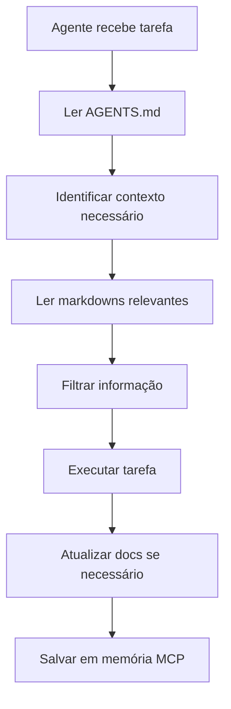

# 🚀 METODOLOGIA CONSOLIDADA - OpenCode + Bun + MCPs

**Data de Consolidação:** 2025-12-18  
**Sistema:** Pop!_OS 24.04 LTS  
**Status:** ✅ METODOLOGIA ATIVA E FUNCIONAL

---

## 📋 Resumo Executivo

Esta é a metodologia oficial e consolidada para desenvolvimento com IA no sistema do Deivisan. Representa a evolução de múltiplas tentativas e aprendizados.

### Decisões Finais

| Aspecto | Decisão | Razão |
|---------|---------|-------|
| **Runtime JS** | Bun 1.3.5 | Mais rápido, moderno, substitui Node completamente |
| **IDE/Editor** | OpenCode CLI | VSCode desinstalado, OpenCode é suficiente |
| **MCPs** | bunx/uvx | Docker arquivado por instabilidade |
| **Python** | uv 0.9.18 | Gerenciador moderno, rápido |
| **Metodologia** | Contexto Pleno Dinâmico | Leitura inteligente de markdowns |

---

## 🎯 Stack Tecnológico

### Core
- **Bun** 1.3.5 - Runtime JavaScript/TypeScript
- **Python** 3.12.3 - Com uv package manager
- **OpenCode CLI** - Única ferramenta de desenvolvimento
- **Pop!_OS** 24.04 LTS - Sistema operacional

### Ferramentas CLI
```bash
# Search & Navigation
rg 15.1.0         # ripgrep - busca ultra-rápida
fd 10.3.0         # find moderno
fzf 0.67.0        # fuzzy finder
zoxide 0.9.8      # cd inteligente

# Display & Output
bat 0.26.1        # cat com syntax highlighting
eza 0.23.4        # ls moderno
delta 0.18.2      # git diff viewer
starship 1.24.1   # prompt customizável

# Data Processing
jq 1.8.1          # JSON processor
yq 4.49.2         # YAML processor

# System Monitoring
btm 0.11.1        # bottom - monitor de sistema
```

---

## 🤖 MCPs Ativos (9 servidores)

### Via bunx (JavaScript/Bun)

```json
{
  "memory": {
    "command": ["bunx", "@modelcontextprotocol/server-memory"],
    "função": "Knowledge graph persistente",
    "uso": "Memória de longo prazo entre sessões"
  },
  "sequentialthinking": {
    "command": ["bunx", "@modelcontextprotocol/server-sequential-thinking"],
    "função": "Pensamento sequencial avançado",
    "uso": "Raciocínio complexo passo-a-passo"
  },
  "puppeteer": {
    "command": ["bunx", "@modelcontextprotocol/server-puppeteer"],
    "função": "Browser automation",
    "uso": "Automação web, scraping, testes"
  },
  "github": {
    "command": ["bunx", "github:exa-labs/exa-mcp-server"],
    "função": "GitHub integration",
    "uso": "Gerenciar repos, issues, PRs"
  },
  "context7": {
    "command": ["bunx", "@upstash/context7-mcp"],
    "função": "Documentação de bibliotecas",
    "uso": "Buscar docs atualizadas"
  },
  "tavily": {
    "command": ["bunx", "tavily-mcp"],
    "função": "Web search avançado",
    "uso": "Pesquisar web com contexto IA"
  },
  "exa": {
    "command": ["bunx", "exa-mcp-server"],
    "função": "Exa AI search",
    "uso": "Busca semântica e code context"
  },
  "firecrawl": {
    "command": ["bunx", "firecrawl-mcp"],
    "função": "Web scraping",
    "uso": "Extrair dados estruturados de sites"
  }
}
```

### Via uvx (Python)
- Disponíveis mas não todos habilitados
- `uvx mcp-server-filesystem`, `mcp-server-git`, `mcp-server-bash`, `mcp-server-fetch`

---

## 📂 Estrutura de Repositórios

```
/home/deivi/Projetos/
├── contexto-pleno/          # Repo principal
│   ├── PC/                  # Configs PC (alguns docs Windows legado)
│   ├── Android/             # Configs Android/Termux
│   ├── mcp/                 # MCPs npm/bunx (padrão)
│   ├── Shared/              # Arquivos universais
│   ├── DevSan001/           # Projeto DevSan
│   └── README.md
│
└── Prompts/                 # Prompts dinâmicos
    ├── .kiro/               # Histórico Kiro (legado)
    ├── Prompts/             # Prompts específicos
    ├── Docs/                # Documentação
    └── Esquema-Mcps.md      # Metodologia MCPs
```

---

## 🧠 Metodologia de Contexto Pleno

### Princípios

1. **Leitura Dinâmica** - Agentes leem markdowns relevantes antes de agir
2. **Filtro Inteligente** - Só usa info relevante para o contexto atual
3. **Atualização Ativa** - Agentes atualizam docs quando necessário
4. **Histórico Preservado** - Decisões arquivadas ficam documentadas

### Fluxo de Trabalho



### Arquivos Chave para Leitura

**Sempre ler:**
- `/home/deivi/AGENTS.md` - Contexto consolidado atual

**Ler conforme necessário:**
- `Projetos/contexto-pleno/PC/CONFIGURACAO-OPENCODE-FINAL.md` - Setup OpenCode (legado Windows)
- `Projetos/contexto-pleno/PC/ROADMAP-MCP-UNIVERSAL.md` - Roadmap MCPs (histórico)
- `Projetos/Prompts/.kiro/docker-mcp-analysis.md` - Análise Docker (arquivado)
- `Projetos/Prompts/Esquema-Mcps.md` - Metodologia MCPs

---

## 🚫 O Que NÃO Fazer

### ❌ Tecnologias Arquivadas

1. **Docker para MCPs**
   - Tentado extensivamente
   - Problemas de instabilidade no Windows
   - Mantido apenas como histórico/referência
   - **Nunca sugerir Docker para MCPs**

2. **npm/npx**
   - Substituído por bun/bunx
   - **Sempre use bunx, nunca npx**

3. **VSCode**
   - Desinstalado
   - OpenCode CLI é suficiente
   - **Não mencionar VSCode**

### ✅ O Que Fazer

1. **Sempre preferir bunx** ao invés de npx
2. **Consultar AGENTS.md** antes de sugerir ferramentas
3. **Ler contexto pleno** antes de grandes mudanças
4. **Documentar decisões** em markdowns
5. **Atualizar memória MCP** com aprendizados

---

## 🔧 Configuração OpenCode

### Localização
- Config principal: `/home/deivi/.config/opencode/opencode.json`
- State: `/home/deivi/.local/state/opencode/`
- Kiro legado: `/home/deivi/.kiro/mcp.json` (referência histórica)

### Modelos Usados
- **Claude Sonnet 4.5** - Raciocínio principal
- **Grok Code** - Código especializado
- **Gemini 3 Flash** - Respostas rápidas
- **Gemini 3 Pro** - Análise profunda

### MCPs Configurados
Ver seção "MCPs Ativos" acima para lista completa.

---

## 📝 Comandos Essenciais

### Bun
```bash
bun install                    # Instalar dependências
bunx <package>                 # Executar package
bun add <package>              # Adicionar dependência
bun run <script>               # Executar script
```

### Python/UV
```bash
uv run <script>                # Executar script
uv add <package>               # Adicionar pacote
uvx <command>                  # Executar ferramenta
```

### OpenCode
```bash
opencode                       # Sessão interativa
opencode --continue            # Continuar última sessão
opencode "mensagem"            # Modo single message
```

### Git
```bash
git status                     # Ver status
git add .                      # Adicionar tudo
git commit -m "msg"            # Commit
git push                       # Push para remote
```

---

## 🎓 Para Novos Agentes

### Primeiro Acesso
1. Ler este documento completo
2. Ler `/home/deivi/AGENTS.md`
3. Consultar memória MCP existente
4. Entender que Docker MCP é legado

### Perguntas Frequentes

**Q: Posso usar npm?**  
A: Não, use `bun` e `bunx`.

**Q: Docker é uma opção para MCPs?**  
A: Não, foi arquivado. Use bunx/uvx.

**Q: VSCode está instalado?**  
A: Não, foi desinstalado. Use OpenCode CLI apenas.

**Q: Onde ficam os markdowns de contexto?**  
A: Em `/home/deivi/Projetos/contexto-pleno/` e `/home/deivi/Projetos/Prompts/`

**Q: Como sei se um doc é legado?**  
A: Docs mencionando Windows ou Docker para MCPs são legado/histórico.

---

## 🚀 Próximos Passos

### Sempre Fazer
- ✅ Ler AGENTS.md antes de começar
- ✅ Consultar memória MCP
- ✅ Usar bunx/uvx para MCPs
- ✅ Atualizar docs quando necessário
- ✅ Documentar decisões importantes

### Nunca Fazer
- ❌ Sugerir npm/npx
- ❌ Sugerir Docker para MCPs
- ❌ Mencionar VSCode
- ❌ Ignorar contexto pleno
- ❌ Criar docs sem ler existentes

---

## 📊 Estatísticas

| Métrica | Valor |
|---------|-------|
| **MCPs Ativos** | 9 |
| **Modelos IA** | 4 |
| **Repos Principais** | 2 |
| **Ferramentas CLI** | 12 |
| **Linguagens** | 5 (JS/TS, Python, Rust, Go, Java) |
| **Status** | ✅ 100% Operacional |

---

## ✨ Conclusão

Esta metodologia representa a evolução e consolidação de múltiplas tentativas e aprendizados. É o padrão oficial e deve ser seguida por todos os agentes.

**Princípio fundamental:** Simplicidade e eficiência. Use Bun, OpenCode e MCPs via bunx/uvx. Tudo mais é legado.

---

**Documento:** METODOLOGIA-CONSOLIDADA.md  
**Versão:** 1.0  
**Status:** ✅ ATIVA  
**Última Atualização:** 2025-12-18  
**Gerado por:** OpenCode AI (Claude Sonnet 4.5)
